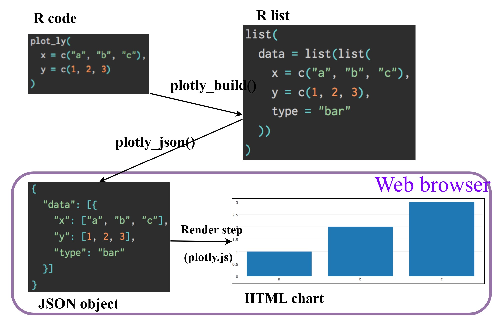

## Overview

In this chapter, we use functions from **ggiraph** and **plotlyr** packages to create interactive graphics.

## Getting Started

### Installing and Loading the Required Libraries

There are five packages that will be used in this exercise.

| Package | Description |
|-------------------|-----------------------------------------------------|
| [tidyverse](https://www.tidyverse.org/) | A collection of R packages for data importing, cleaning, transformation, and visualisation (e.g., [readr](https://readr.tidyverse.org/), dplyr, tidyr, [ggplot2](https://ggplot2.tidyverse.org/)). |
| [ggiraph](https://davidgohel.github.io/ggiraph/) | Turns ggplot charts interactive with tooltips and clicks etc., and works smoothly with Shiny. |
| [DT](https://rstudio.github.io/DT/) | Displays data frames as interactive HTML tables with sorting, filtering, and pagination. |
| [plotly](https://plotly.com/r/) | Creates interactive and publication-ready graphs. |
| [patchwork](https://cran.r-project.org/web/packages/patchwork/refman/patchwork.html) | Extends ggplot2 by letting user combine plots easily using operators. |

The code below installs and loads the required packages into R environment.

```{r}
pacman::p_load(tidyverse, ggiraph, plotly, DT, patchwork)
```

### Importing the Data

A CSV file containing the final exam results of 322 local Primary 3 students has been imported into the R environment by using function [`read_csv()`](https://readr.tidyverse.org/reference/read_delim.html) from [**readr**](https://readr.tidyverse.org/) package, one of tidyverse family. The dataset includes variables such as student ID, class, gender, race, and grades for English, Maths, and Science.

```{r}
exam_data <- read_csv("data/Exam_data.csv")
```

## Interactive Data Visualisation: ggiraph methods

[**ggiraph**](https://davidgohel.github.io/ggiraph/index.html) is an htmlwidget and ggplot2 extension that makes ggplot graphics interactive using [geoms](https://davidgohel.github.io/ggiraph/reference/index.html#section-interactive-geometries) that support:

-   **tooltip** displays text when the cursor hovers over an element
-   **onclick** triggers a JavaScript action when an element is clicked
-   **data_id** links elements to the same cohort so they highlight together

In [Shiny](https://www.ardata.fr/ggiraph-book/shiny.html), data_id lets users select plot elements and interact with them on both the client and server side.

::: callout-tip
#### Key Argument in `girafe()` from **ggiraph**

-   `ggobj`: the ggplot plot created

-   `code`: an alternative way to provide the plot using code instead of `ggobj`

-   `pointsize` controls the base text size

-   `width_svg / height_svg` sets the size of the SVG canvas (the drawing area). If `NULL`, auto-size will be applied.

-   `options`: a set of interactive widgets e.g. hover effects, tooltip style, zoom etc, `options = list(opts_hoever(), opt_tooltip(), opt_zoom())`

-   `check_fonts_registered` checks whether the font families are in `systemfonts`

\-`check_fonts_dependencies`checks whether the font families used in the ggplot are in the widget’s dependency list.
:::

### Tooltip Effect

::: panel-tabset
#### Basic tooltip Aesthetic

Below is a typical code chunk for creating an interactive statistical chart using **ggiraph**. The process has **two main steps**.

First, we build a normal **ggplot** object, then an *interactive* geometry ( i.e. `geom_zzz_interactive()` e.g.`geom_dotplot_interactive()`) is used instead of the standard ggplot geom. As mentioned above, in the function, we define interactive features such as **tooltips**, **id** and **click behaviour**.

Next, we wrap the ggplot object with [**`girafe()`**](https://davidgohel.github.io/ggiraph/reference/girafe.html), which converts the plot into an interactive **SVG** output.

**SVG (Scalable Vector Graphics)** is a web-friendly graphic format that stays sharp when zoomed in or resized, making it ideal for interactive plots on **HTML pages** (such as in R Markdown or Shiny).

By hovering the mouse pointer on an data point of interest, the student’s ID will be displayed.

```{r}

p <- ggplot(data = exam_data, aes(x = MATHS)) +
              geom_dotplot_interactive(aes(tooltip =  ID),
                      stackgroups = TRUE,  #stacks dots into groups
                      binwidth = 1,  #groups scores into bins of size 1.5
                      method = "histodot") + #uses histogram-style binning for the dotplot
              scale_y_continuous(NULL, breaks = NULL) +  #removes the y-axis label and ticks
  ggtitle("MATH SCORES FOR PRIMARY 3")
girafe(
  ggobj = p,
  width_svg = 6,
  height_svg = 6 * 0.618) #using a golden-ratio style proportion
```

#### Multiple information on Tooltip

In this plot, we for each data point by creating a new varaible called `tooltip` in the dataframe. When the mouse hovers over a dot, it displays the student's ID, class and Maths score.

```{r}
exam_data$tooltip <- c(paste0("ID = ", exam_data$ID,
                              "\n Class = ", exam_data$CLASS,
                              "\n Maths Score = ", exam_data$MATHS))

knitr::kable(head(exam_data, 3),"html")
```

```{r}
p <- ggplot(data= exam_data,
            aes(x = MATHS)) +
  geom_dotplot_interactive(
    aes(tooltip = exam_data$tooltip), #applying the new variable for tooltip
    stackgroups = TRUE,
    binwidth =1, 
    method = "histodot") +
  scale_y_continuous(NULL, breaks = NULL) +
  ggtitle("MATH SCORES FOR PRIMARY 3")

girafe(
  ggobj = p,
  width_svg = 6,
  height_svg = 6 * 0.618
)

```

#### Customising tooltip style

The background of tooltip is black and text is bold and in white. Note we need to use American English spelling here. On top of that, tooltip position is set to 20 horizontally and vertically while the [default](https://www.ardata.fr/ggiraph-book/customize.html) is 10 and 0.

```{r}
tooltip_css <- "background-color:black;
font-style:bold;color:white;"  #<< tooltip css style(background + text); must use American English spelling

p <- ggplot(data = exam_data, aes(x = MATHS)) +
  geom_dotplot_interactive(
    aes(tooltip = ID),
    stackgroups = TRUE,
    binwidth = 1,
    method = "histodot") +
  scale_y_continuous(NULL, breaks = NULL) +
    ggtitle("MATH SCORES FOR PRIMARY 3")

girafe(
  ggobj = p,
  width_svg = 6,
  height_svg = 6 * 0.618,
  options = list(         #<< add interactivity options
    opts_tooltip(         #<< enable tooltips for interactive elements
      css = tooltip_css,  #<< apply the styling defined above
      opacity = 0.7, use_fill = TRUE,   #<< transparency (0,1), autofill
      offx = 20, offy = 20), # move tooltip 20px to right and 20 downward
    opts_sizing(width = 1))  #size of tooltip
)
```

#### Tooltip displaying statistics

`scales::number()` formats a numeric value into a rounding string. `after_stat()` tells ggplot to use values after the summary/statistics are calculated (not the raw data).

```{r}
tooltip <- function(y, ymax, accuracy = .01) {     
  mean <- scales::number(y, accuracy = accuracy)   # Mean value
  sem <- scales::number(ymax - y, accuracy = accuracy)  # Standard error (SEM)
  paste("Mean maths scores:", mean, "+/-", sem)    # Tooltip text
}

gg_point <- ggplot(exam_data, aes(x = RACE)) +     # Plot mean Maths by Race
  stat_summary(
    aes(y = MATHS,
        tooltip = after_stat(tooltip(y, ymax))),   # Tooltip shows mean ± SEM
    fun.data = "mean_se",
    geom = GeomInteractiveCol,
    fill = "light blue"
  ) +
  stat_summary(aes(y = MATHS),                     # Add error bars (SEM)
    fun.data = mean_se,
    geom = "errorbar", width = 0.2, size = 0.2
  ) +
  ggtitle("Primary 3 Math Scores by Ethnic Background")

girafe(ggobj = gg_point,                           # Make the plot interactive
       width_svg = 8,
       height_svg = 8 * 0.618)
```
:::

### Hover Effect

:::: panel-tabset
#### with data_id Aesthetic

The code chunk below creates an interactive effect that highlights plot elements by **CLASS**. Each dot is assigned a `data_id` using `CLASS`, so when we hover over one dot, all dots from the same class are highlighted together. If requirement is each dot to be uniquely identified and selectable, we could use a unique field such as `ID` instead.

```{r}
p <- ggplot(data=exam_data, 
       aes(x = MATHS)) +
  geom_dotplot_interactive(           
    aes(data_id = CLASS),   #<< assigns each dot an ID based on CLASS.           
    stackgroups = TRUE,               
    binwidth = 1,                        
    method = "histodot") +               
  scale_y_continuous(NULL,               
                     breaks = NULL) +
   labs(title = "MATH SCORES FOR PRIMARY 3") +
  theme(plot.title = element_text(size = 12))
girafe(                                  
  ggobj = p,                             
  width_svg = 6,                         
  height_svg = 6*0.618                      
)                                        
```

#### Styling hover Effect

The code below creates a hover effect that when the mouse hovers over an element, it will be filled with dark grey and non-hovered elements fade to 20% opacity so the hovered elements stand out.

```{r}
p <- ggplot(data=exam_data, 
       aes(x = MATHS)) +
  geom_dotplot_interactive(              
    aes(data_id = CLASS),              
    stackgroups = TRUE,                  
    binwidth = 1,                        
    method = "histodot") +               
  scale_y_continuous(NULL,               
                     breaks = NULL) +
   labs(title = "Primary 3 Maths Scores By Class") +
  theme(plot.title = element_text(size = 14))
girafe(                                  
  ggobj = p,                             
  width_svg = 6,                         
  height_svg = 6*0.618,
  options = list(                        
    opts_hover(css = "fill: #202020;"),      # dark grey for hovered elements
    opts_hover_inv(css = "opacity:0.2;"))     # fade non-hovered elements                       
  )                                        
```

::: callout:note
Unlike the previous example, this version defines the CSS customisation directly inside `girafe()`. CSS styles can be written either outside `girafe()` (as a separate variable) or directly inside the options settings.
:::

#### Combining tooltip and hover effects

We could combine both tooltips and hover effects in an interactive statistical graph. In the code chunk above, elements sharing the same data_id (for example, `CLASS`) are highlighted when the mouse moves over them, and the tooltip also displays the corresponding CLASS value. Here, we create a bicolour hover CSS style `girafe_css_bicolor()` and apply it using`opts_hover()`.

```{r}
css_default_hover <- girafe_css_bicolor(
  primary = "orange",
  secondary = "purple")

p <- ggplot(data=exam_data, 
       aes(x = MATHS)) +
  geom_dotplot_interactive(              
    aes(tooltip = CLASS, 
        data_id = CLASS),              
    stackgroups = TRUE,                  
    binwidth = 1,                        
    method = "histodot") +               
  scale_y_continuous(NULL,               
                     breaks = NULL) +
   labs(title = "Primary 3 Maths Scores By Class") +
  theme(plot.title = element_text(size = 14))

girafe(                                  
  ggobj = p,                             
  width_svg = 6,                         
  height_svg = 6*0.618,
  options = list(                        
    opts_hover(css = css_default_hover),  
    opts_hover_inv(css = "opacity:0.2;")))                                        
```
::::

### Click Effect

`onclick` argument of ggiraph provides hotlink interactivity on the web.

:::: panel-tabset
#### onclick

The code chunk below first creates a new column called `onclick` in *exam_data* that stores a JavaScript click action for each row.

Inside `aes()`, we could write column names only or `data$column`.

```{r}
exam_data$onclick <- sprintf("window.open(\"%s%s\")",
"https://www.moe.gov.sg/schoolfinder?journey=Primary%20school",
as.character(exam_data$ID))

p <- ggplot(data=exam_data, 
       aes(x = MATHS)) +
  geom_dotplot_interactive(              
    aes(onclick = onclick),              
    stackgroups = TRUE,                  
    binwidth = 1,                        
    method = "histodot") +               
  scale_y_continuous(NULL,               
                     breaks = NULL) +
  labs(caption= "Demo Only")
girafe(                                  
  ggobj = p,                             
  width_svg = 6,                         
  height_svg = 6*0.618)
```

::: callout-warning
`window.open("URL")` opens a new browser tab to that URL when the plot element is clicked.

`sprintf()` combines the URL text and the student ID (converted to text) into one clickable link string, just like: window.open("URL" + "studentID").

Note that click actions must be a string column in the dataset containing valid JavaScript instructions.

The link might not work because it depends on what parameters the website accepts.
:::

#### Combining 4 effects

Here, since `data_id = CLASS` groups dots by class, hovering over one dot highlights all dots from the same class and shows the class name in the tooltip.

The `tooltip_css` sets a black tooltip background with bold white text, while `css_default_hover` applies a two-color hover effect (orange fill with a purple outline).

If `onclick` contains valid JavaScript links, clicking a dot will trigger the associated action.

The `girafe()` options then enable the tooltip styling and positioning, fade non-hovered dots, and add zoom controls with a toolbar in the top-right corner.

```{r}
tooltip_css <- "background-color:black;
font-style:bold;color:white;"  #<< tooltip css style(background + text); must use American English spelling

css_default_hover <- girafe_css_bicolor(
  primary = "orange",
  secondary = "purple")

p <- ggplot(data=exam_data, 
       aes(x = MATHS)) +
  geom_dotplot_interactive(              
    aes(tooltip = CLASS, 
        data_id = CLASS,
        onclick = onclick),              
    stackgroups = TRUE,                  
    binwidth = 1,                        
    method = "histodot") +               
  scale_y_continuous(NULL,               
                     breaks = NULL) +
  labs(title = "MATH SCORES FOR PRIMARY 3", 
  subtitle = "Distribution of scores across classes",
  caption = "Demo Only")+
  theme(plot.title = element_text(size = 14))
girafe(
  ggobj = p,
  width_svg = 4,
  height_svg = 4 * 0.618,
options = list(
    opts_tooltip(css = tooltip_css, offx = 20, offy = 20, use_fill = TRUE),
    opts_hover(css = css_default_hover),
    opts_hover_inv(css = "opacity:0.2;"),
    opts_zoom(min = 0.5, max = 6),
    opts_toolbar(position = "topright")))
```
::::

### Coordinated Multiple Views

We can use `girafe()` together with **patchwork** operators to create coordinated multiple-view ggplot graphics. First, we set `data_id = ID` so each selected point is uniquely identified across all plots. Then, instead of passing a single `ggobj`, we use the `code` argument to combine the plots with patchwork and apply interactive options such as fading effects.

The `data_id` aesthetic is essential for linking points across plots, while `tooltip` is optional but useful for displaying details on hover.

```{r}
tooltip_css <- "background-color:white;
color:black;
padding:6px;
border:1px solid #ccc;"

exam_data$tooltip2 <- paste0(
  "ID = ", exam_data$ID,
  "\nClass = ", exam_data$CLASS,
   "\nMaths = ", exam_data$MATHS,
  "\nEnglish = ", exam_data$ENGLISH)
            

css_default_hover <- girafe_css_bicolor(
  primary = "orange",
  secondary = "purple")

p1 <- ggplot(data=exam_data, aes(x=MATHS)) +
  geom_dotplot_interactive(aes(data_id = ID, tooltip = tooltip2),
  stackgroups = TRUE, binwidth = 1, method = "histodot") +
  coord_cartesian(xlim = c(0,100)) +
  scale_y_continuous(NULL, breaks = NULL) +
  labs(title = "Maths Scores Distribution")

p2 <- ggplot(data=exam_data, aes(x=ENGLISH)) +
  geom_dotplot_interactive(aes(data_id = ID, tooltip = tooltip2),
  stackgroups = TRUE, binwidth = 1, method = "histodot") +
  coord_cartesian(xlim = c(0,100)) +
  scale_y_continuous(NULL, breaks = NULL) +
  labs(title = "English Scores Distribution")


girafe(
  code = print(p1 + p2),
  width_svg = 6,
  height_svg = 3,
  options = list(
    opts_tooltip(css = tooltip_css),
    opts_hover(css = css_default_hover),
    opts_hover_inv(css = "opacity: 0.2;"),
    opts_zoom(min = 0.5, max = 6),
    opts_toolbar(position = "topright")))
```

## Interactive Data Visualisation: plotly Methods

Plotly’s R graphing library supports interactive web visualisations by converting ggplot2 charts or by building plots directly through its interface to the MIT-licensed JavaScript library [plotly.js](https://plotly.com/javascript/), which follows the grammar of graphics. Unlike some other Plotly platforms, plotly for R is free and open source.

There are two main ways to build interactive graphs in Plotly:

-   using `plot_ly()`, and
-   using `ggplotly()`

In our geospatial visualisation applications, We learned that ggplotly() is versatile and simpler than many other interactive graphing approaches because it builds directly on the **ggplot2** grammar.

In the next examples, the scatterplot data starts around 20, which is realistic, but we still want **0** to be visible on the plot. The zeros on the x and y axes look cleaner than when they are strictly enforced in `plot_ly()`. When `range = c(0, 100)` is applied, `plot_ly()` keeps the data tight to the axes, causing the two zeros at the origin to appear cramped. This can be improved by extending the canvas, for example to `c(-5, 105)`. By contrast, `ggplotly()` inherits settings from `ggplot()` such as `coord_cartesian()`, which automatically produces a more balanced and elegant display.



::: panel-tabset
### Interactive scatter plot: plot_ly()

```{r}
plot_ly(data = exam_data, 
        x = ~MATHS, 
        y = ~ENGLISH,
        type = 'scatter',    
        mode = 'markers',    
        marker = list(size = 6, opacity = 1),
        text = ~paste("ID:", ID,
                      "Class:", CLASS,
                      "Maths:", MATHS,
                      "English:", ENGLISH),
        hoverinfo = 'text',
        hoverlabel = list(
          bgcolor = "black",
          font = list(color = "white", size = 12))) %>%
  layout(title = list(
      text = "Maths vs English Scores for Primary 3",
      font = list(size = 18),
      x = 0.5,   # center the title (0=left, 0.5=center, 1=right)
      xanchor = 'center',
      y = 0.95,  # adjust vertical position (lower value = lower position)
      yanchor = 'top'),
    xaxis = list(title = "Maths",range = c(-5, 105), dtick = 20, tick0 = 0),
    yaxis = list(title = "English",range = c(-5, 105), dtick = 20, tick0 = 0),
    margin = list(t= 90))
```

### Visual variable: plot_ly()

In the code chunk below, the **colour** argument is mapped to a qualitative visual variable RACE.

Clicking the legend toggles the display of the corresponding race on or off.

```{r}
plot_ly(data = exam_data, 
        x = ~ENGLISH, 
        y = ~MATHS,
        color = ~RACE,
        type = 'scatter',    
        mode = 'markers',    
        marker = list(size = 6, opacity = 1),
        text = ~paste("ID:", ID,
                      "RACE:", RACE,
                      "Maths:", MATHS,
                      "English:", ENGLISH),
        hoverinfo = 'text',
        hoverlabel = list(
          bgcolor = "black",
          font = list(color = "white", size = 12))) %>%
  layout(title = list(
      text = "English vs Maths Scores for Primary 3",
      font = list(size = 18),
      x = 0.5,   # center the title (0=left, 0.5=center, 1=right)
      xanchor = 'center',
      y = 0.95,  # adjust vertical position (lower value = lower position)
      yanchor = 'top'),
    xaxis = list(title = "English",range = c(0, 100), automargin = TRUE),
    yaxis = list(title = "Maths",range = c(0, 100),automargin = TRUE),
    margin = list(t= 90))
```

### Interactive scatter plot: ggplotly()

The code chunk below creates an interactive scatter plot using `ggplotly()`. The only additional step required is calling `ggplotly()` to convert the ggplot into an interactive Plotly graph. The `labs()` function is used for ggplot2 settings, while `layout()` controls Plotly-specific options. When using `ggplotly()`, most ggplot2 elements are carried over unless they are explicitly overridden in `layout()`.

```{r}
p <- ggplot(data = exam_data, 
            aes(x = MATHS,
                y = ENGLISH,
                text = paste("ID:", ID,      
                             "CLASS:", CLASS,
                             "Maths:", MATHS,
                             "English:", ENGLISH))) +
  geom_point(size = 1) +
  coord_cartesian(xlim = c(0, 100),
                  ylim = c(0, 100)) +
  labs(title = "English vs Maths Scores for Primary 3",  
       x = "Maths",
       y = "English") +
  theme(plot.title = element_text(hjust = 0.5, size = 14))  

ggplotly(p, tooltip = "text")

```

### Visual variable: ggplotly()

Similarly, we can assign colour hues by **Race** in `ggplotly()`, and each cohort can be toggled on or off by clicking the legend.

```{r}

p <- ggplot(data = exam_data, 
            aes(x = MATHS,
                y = ENGLISH,
                colour = RACE,
                text = paste("ID:", ID,      
                             "RACE:", RACE,
                             "MATHS:", MATHS,
                             "ENGLISH:", ENGLISH))) +
  geom_point(size = 1) +
  coord_cartesian(xlim = c(0, 100),
                  ylim = c(0, 100)) +
  labs(title = "English vs Maths Scores for Primary 3",  
       x = "Maths",
       y = "English") +
  theme(plot.title = element_text( size = 14))  

ggplotly(p, tooltip = "text")

```

### Coordinated Multiple Views

The creation of a coordinated linked plot using Plotly involves three main steps.

First, [`highlight_key()`](https://www.rdocumentation.org/packages/plotly/versions/4.9.2/topics/highlight_key) from the **plotly** package is used to define shared data. `highlight_key()` creates an object of class `crosstalk::SharedData`, which enables linked interactions across multiple plots. **Crosstalk** is an R framework that allows multiple HTML widgets (such as Plotly charts, tables, and maps) to share the same data and respond together to user interactions like hovering, selecting, or filtering.

Next, two scatter plots are created using **ggplot2** functions.

Finally, [`subplot()`](https://plotly.com/r/subplots/) from the **plotly** package is used to arrange the plots side by side.

```{r, fig.width=16, fig.height=10}
d <- highlight_key(exam_data)
p1 <- ggplot(data=d, 
            aes(x = MATHS,
                y = ENGLISH,
                colour = RACE)) +
  geom_point(size=1) +
  coord_cartesian(xlim=c(0,100),
                  ylim=c(0,100)) 

p2 <- ggplot(data=d, 
            aes(x = MATHS,
                y = SCIENCE,
                  colour = RACE))+
  geom_point(size=1) +
  coord_cartesian(xlim=c(0,100),
                  ylim=c(0,100)) 

subplot(
  ggplotly(p1),
  ggplotly(p2) %>% style(showlegend = FALSE),  
  titleX = TRUE,      
  titleY = TRUE,     
  shareX = TRUE,      # share X axis scale 
  shareY = FALSE,     # don't share Y axis
  margin = 0.05,      # space between plots (0-1)
  nrows = 1           # arrange in 1 row
)
```
:::

## Interactive Data Visualisation - crosstalk methods

[Crosstalk](https://rstudio.github.io/crosstalk/index.html) is an extension of the **htmlwidgets** package that provides classes, functions, and conventions to enable cross-widget interactions, such as linked brushing and filtering, across multiple interactive widgets.

::: panel-tabset
### Interactive Data Table: DT package

DT is a wrapper for the JavaScript library [DataTables](https://datatables.net/), allowing R data objects to be rendered as interactive HTML tables, typically in R Markdown or Shiny.

```{r}
datatable(
  exam_data[, 1:6],                 # show only the first 6 columns of the data
  class = "hover",                  # row highlight effect on mouse hover (display, compact)
  filter = "top",                   # add column filters at the top of the table
  extensions = c("Buttons", "Scroller"),  # enable extra features:
                                          # Buttons = export buttons
                                          # Scroller = smooth scrolling for large tables
  options = list(
    pageLength = 10,                # number of rows shown per page by default
    lengthMenu = c(5, 10, 25, 50, 100),  
                                         # Ddopdown options for rows per page
    dom = "Blfrtip",                # layout of table controls:
                                         # B = Buttons
                                         # l = Page length menu
                                         # f = Search box
                                         # r = Processing indicator
                                         # t = Table
                                         # i = Table information
                                         # p = Pagination
    buttons = c("copy", "csv", "pdf", "print"),  
                                      # export options available to users
    scrollX = TRUE,                 # enable horizontal scrolling (useful for many columns)
    scrollY = "350px",              # fix table height and enable vertical scrolling
    searchHighlight = TRUE,         # highlight matching text when searching
    columnDefs = list(
      list(
        className = "dt-center", 
        targets = "_all"            # Centre-align all columns
      ),
      list(
        width = "100px", 
        targets = 0                 # Set width for the first column
        ))),
  selection = "single"              # Allow selecting only one row at a time
)

```

### Linked brushing: crosstalk method

The code uses `highlight()` from Plotly to control brushing and linking across plots, mainly for Plotly graphs. It also uses `bscols()` from Crosstalk to arrange widgets side by side in R Markdown, noting that it loads Bootstrap.

```{r}
d <- highlight_key(exam_data[,c(1, 5, 6)]) 

p <- ggplot(d, aes(ENGLISH, MATHS)) + 
  geom_point(size = 1) +
  coord_cartesian(xlim = c(0, 100), ylim = c(0, 100))

gg <- highlight(
  ggplotly(p),
  on = "plotly_selected",
  off = "plotly_deselect") %>%
  layout(hoverlabel = list(bgcolor = "white"))  

dt <- datatable(d,rownames = FALSE,
  options = list(paging = FALSE, scrollY = "450px",dom = "ft"))

crosstalk::bscols(gg, dt, widths = c(6, 6))    
```
:::

## Reference

Kam, Tin Seong (2026). [3 Programming Interactive Data Visualisation with R](https://r4va.netlify.app/chap03) R for Visual Analytics.

[How to Plot With Ggiraph](https://www.r-bloggers.com/2018/04/how-to-plot-with-ggiraph/)

[Interactive map of France with ggiraph](https://rstudio-pubs-static.s3.amazonaws.com/152833_56a4917734204de7b37881d164cf8051.html)

[Custom interactive sunbursts with ggplot in R](https://www.pipinghotdata.com/posts/2021-06-01-custom-interactive-sunbursts-with-ggplot-in-r/)

[Swiss Olympians - the solo specialists](https://github.com/d-qn/2016_08_02_rioOlympicsAthletes)

[**Carson Sievert (2020) Interactive web-based data visualization with R, plotly, and shiny, Chapman and Hall/CRC**](https://plotly-r.com/)

[Plotly R Figure Reference](https://plotly.com/r/reference/index/)

[gganimate: Getting Started](https://gganimate.com/articles/gganimate.html)

[Building an animation step-by-step with gganimate](https://www.alexcookson.com/post/2020-10-18-building-an-animation-step-by-step-with-gganimate/)

[Creating a composite gif with multiple gganimate panels](https://solarchemist.se/2021/08/02/composite-gif-gganimate/)

[Implementation of gganimate by Senior Student](https://rpubs.com/raymondteo/dataviz8)
