## Overview

Animated graphics often engage audiences more effectively than static visuals. In this exercise, we will create animated visualisations using **gganimate** and **plotly**, and practise data reshaping with **tidyr** and data wrangling with **dplyr**.

### Basic Concepts of Animation

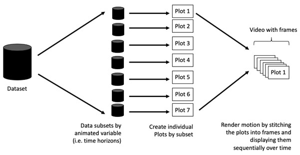

Animations do not involve a moving plot. They are created by stitching together many static plots, each built from a different subset of the data, to create the illusion of motion.

### Terminology

Before creating an animated graph, it helps to understand two basics.

A **frame** is a single snapshot of data at a given time or category.

**Animation attributes** control how the frames transition and how long they appear.

::: callout-tip
Use animation thoughtfully. It is often unnecessary for exploration, but can be powerful in presentations when used sparingly. As seen in Hans Rosling’s [TED talks](https://www.ted.com/talks/hans_rosling_the_best_stats_you_ve_ever_seen?referrer=playlist-the_best_hans_rosling_talks_yo), animation makes patterns clearer and more memorable.
:::

## Getting Started

### Installing and Loading the Required Libraries

There are five packages that will be used in this exercise.

| Package | Description |
|---------------------|---------------------------------------------------|
| [tidyverse](https://www.tidyverse.org/) | A collection of R packages for data importing, cleaning, transformation, and visualisation (e.g., [readr](https://readr.tidyverse.org/), dplyr, tidyr, [ggplot2](https://ggplot2.tidyverse.org/)). |
| [gganimate](https://gganimate.com/) | The ggplot2 extension used to create animated statistical graphs. |
| [gifski](https://cran.r-project.org/web/packages/gifski/index.html) | A rendering engine used by gganimate to turn animation frames into high quality GIFs. It handles the final export, not the animation logic itself. |
| [plotly](https://plotly.com/r/) | Creates interactive and publication-ready graphs. |
| [gapminder](https://cran.r-project.org/web/packages/gapminder/index.html) | A dataset and visualisation concept popularised by Hans Rosling. In ggplot and gganimate, Gapminder data is often used as an example to demonstrate animated plots over time, such as countries moving across income and life expectancy.Used here solely to apply its country color scheme. |

The code below installs and loads the required packages into R environment.

```{r}
pacman::p_load(readxl, gifski, gapminder,
               plotly, gganimate, tidyverse)
```

### Importing the Data

In this exercise, we use the Data worksheet from the *GlobalPopulation* Excel workbook. The code below imports the excel file using function from **readxl** package of tidyverse family.

```{r}
globalPop <- read_xls("data/GlobalPopulation.xls", sheet = "Data")
```

The head table displays the first five records of the data table.

```{r}
knitr::kable(head(globalPop), "html")
```

The code below creates the categorical variables and the time variable required for animation.

```{r}
col <- c("Country", "Continent")  #for grouping, colouring, and faceting
globalPop <- globalPop %>%
  mutate(across(col, as.factor)) %>% #to create categorical variables
  mutate(Year = as.integer(Year)) #to create a time variable for animation
```

The code chunk below calls `str()` to verify the data structure, including column names, data types, and example values. It confirms that the data types have been modified as required.

```{r}
str(globalPop)
```

::: callout-tip
-   The [`read_xls()`](https://readxl.tidyverse.org/reference/read_excel.html) function from the **readxl** package is used to import the Excel worksheet.

-   In the original approach, `mutate_each()` was used to convert all character variables to factors. However, `mutate_each_()` was deprecated in dplyr 0.7.0 and `funs()` was deprecated in dplyr 0.8.0. As a result, the code was rewritten using `mutate_at()`. In more recent versions of dplyr, the same outcome can be achieved using [`across()`](https://dplyr.tidyverse.org/reference/across.html), which is now the recommended and more commonly used approach, its syntax: `across(.cols, .fns)`.

-   `mutate()` is used to convert the Year field to an integer.
:::

## Animated Data Visualisation: gganimate Methods

[**gganimate**](https://gganimate.com/) builds on ggplot2’s grammar of graphics by adding animation specific components that describe how a plot evolves over time. These components are added to a ggplot object to control different animation behaviours.

-   `transition_*()` controls how data is mapped across time and how observations relate between frames.

-   `view_*()` specifies how positional scales change during the animation.

-   `shadow_*()` defines how data from other time points is shown in the current frame.

-   `enter_*()` and `exit_*()` control how new data appears and old data disappears.

-   `ease_aes()` determines how aesthetic changes are smoothed between transitions.

### Building a Static Population Bubble Plot

This code builds a bubble scatter plot that is designed to be animated.

```{r}
ggplot(globalPop, aes(x = Old, y = Young, size = Population, color = Country)) +
  geom_point(alpha = 0.7, show.legend = FALSE) +
  scale_colour_manual(values = country_colors) +
  scale_size(range = c(2, 12)) + #controls the minimum and maximum sizes of the bubbles
  labs(title = 'Year: {frame_time}',
       x = '% Aged', y = '% Young')
```

### Building the Animated Bubble Plot

In the code chunk below, [`transition_time()`](https://gganimate.com/reference/transition_time.html) from **gganimate** is used to create transitions across distinct time states, in this case the `Year` variable. The `ease_aes()` function controls how aesthetic changes are smoothed between frames. While the default easing is linear, other options include quadratic, cubic, quartic, quintic, sine, circular, exponential, elastic, back, and bounce.

In the animated bubble plot, the bubbles show how countries move over time, shifting from a higher percentage of young population toward a higher percentage of aged population.

```{r}
ggplot(globalPop, aes(x = Old, y = Young, size = Population, color = Country)) +
  geom_point(alpha = 0.7, show.legend = FALSE) +
  scale_colour_manual(values = country_colors) +
  scale_size(range = c(2, 12)) + #controls the minimum and maximum sizes of the bubbles
  labs(title = 'Year: {frame_time}',
       x = '% Aged', y = '% Young')+
  transition_time(Year) +
  ease_aes('linear')
```

## Animated Data Visualisation: plotly

In the Plotly R package, both `ggplotly()` and `plot_ly()` allow key frame animations using the `frame` argument or aesthetic. They also provide an `ids` argument or aesthetic to maintain object constancy, ensuring smoother transitions for elements with the same identifier across frames.

### Building an Animated Bubble plot: ggplotly()

In this subsection, we learn how to create an animated bubble plot using the `ggplotly()` method. Appropriate **ggplot2** functions are first used to create a static bubble plot, and the output is saved as an R object called `gg`. The `ggplotly()` function is then applied to convert this R graphic object into an animated SVG object.

Unlike **gganimate**, which uses `transition_time(Year)`, Plotly creates animations by specifying `frame = Year`. The animated bubble plot includes play and pause controls as well as a slider for controlling the animation. Note that even when `show.legend = FALSE` is specified, the legend may still appear. To fully remove it, `theme(legend.position = "none")` should be used, as shown in the plot and code chunk below.

`ggplotly()` is not a native animation solution, it is a conversion layer with partial animation support.

```{r}
gg <- ggplot(globalPop, 
       aes(x = Old, 
           y = Young, 
           size = Population, 
           colour = Country)) +
  geom_point(aes(size = Population,
                 frame = Year),
             alpha = 0.7) +
  scale_colour_manual(values = country_colors) +
  scale_size(range = c(2, 12)) +
  labs(x = '% Aged', 
       y = '% Young') + 
  theme(legend.position='none')

ggplotly(gg)
```

### Building an Animated Bubble Plot: plot_ly()

It's not that plot_ly "always" uses \~, but it's strongly recommended when working with data frames.

```{r}

bp <- plot_ly(
  data = globalPop,
  x = ~Old, y = ~Young,
  frame = ~Year,
  ids = ~Country,
  type = "scatter", mode = "markers",
  size = ~Population,
  sizes = c(2, 100),
  color = ~Continent,
  text = ~Country,
  hoverinfo = "text",
  marker = list(line = list(width = 0))
) %>%
  layout(
    xaxis = list(title = "% Aged"),
    yaxis = list(title = "% Young"),
    showlegend = FALSE)


bp

```

## Cherry Blossom Front

**Sakura zensen** is a Japanese term referring to the “front line” of cherry blossom blooming. Each spring, when cherry blossoms reach their peak bloom, known as **mankai**, people gather to enjoy **hanami**, the tradition of flower viewing. Here, we present a animated visualisation of the timing of flowering and full bloom across Japan, following the guide [Building an animation step-by-step with gganimate](https://www.alexcookson.com/post/2020-10-18-building-an-animation-step-by-step-with-gganimate/).

### Loading the R Packages

```{r}
pacman::p_load(tidyverse, # data manipulation
               gganimate, # animation
               lubridate, # processing date
               ggthemes,   # map themes
               ggimage,   # images
               extrafont, # custom fonts
               ggtext,    # customising text colour in titles
               kableExtra) # table formatting
```

### Importing Data

```{r}
sakura <- read_csv("https://raw.githubusercontent.com/tacookson/data/master/sakura-flowering/sakura-modern.csv")
```

```{r}
sakura_overall <- sakura %>%
  filter(!is.na(flower_doy),  #remove missing values
         !is.na(full_bloom_doy)) %>%
  group_by(station_id, station_name, latitude, longitude) %>%
  summarise(flower_doy = mean(flower_doy),
            full_bloom_doy = mean(full_bloom_doy), #computes the mean day of year
            .groups = "drop")

sakura_overall %>%
  head() %>%
  kable(format = "html") %>%
  kable_styling()
```

### Creating Animation 

:::{.panel-tabset}

#### 1. Plot a static graph

```{r}
#| code-fold: true
#| code-summary: CODE
ggplot() +
  geom_point(data = sakura_overall,
             aes(longitude, latitude))
```


####  2. Create the simplest animation

`aes()` specifies where points appear on the map and how they are grouped so **gganimate** knows how to animate them smoothly over time.

We can control the output size and timing of the animation directly in `animate()`.

```{r}
#| eval: false
#| code-fold: true
#| code-summary: CODE
p <- ggplot() +
  geom_point(data = sakura_overall,
             aes(x = longitude, y = latitude, group = station_id)) +
  transition_reveal(along = flower_doy) #animates the plot by revealing data along a time like variable

animate(p, height = 715, width = 600) 
```
```{r}
#| eval: false
#| echo: false
anim_save("sakura1.gif", p)
```

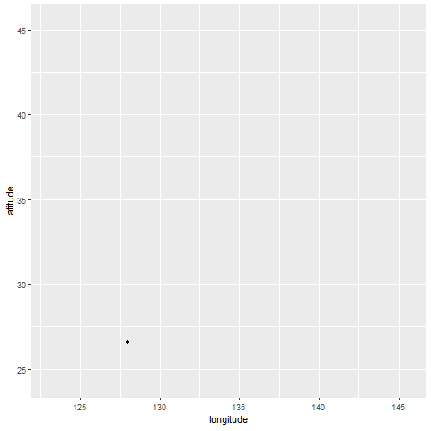


####  3. Refine the transition

```{r}
#| eval: false
#| code-fold: true
#| code-summary: CODE
p <- ggplot() +
  geom_point(data = sakura_overall,
             aes(longitude, latitude)) +
  transition_events(start = flower_doy,   # time when a point appears (flowering day)
                    end = full_bloom_doy, # time when a point disappears (full bloom day)
                    enter_length = 1,      # duration of the entering 1 animation frame
                    exit_length = 1)       # duration of the exiting transition

animate(p, height = 715, width = 600)
```


```{r}
#| eval: false
#| echo: false
anim_save("anime/sakura2.gif", p)
```

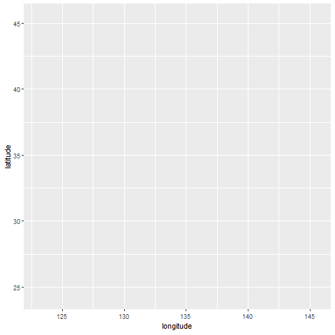

#### 4. Add a dynamic title


```{r}
#| eval: false
#| code-fold: true
#| code-summary: CODE
p <- ggplot() +
  geom_point(data = sakura_overall,
             aes(longitude, latitude)) +
  transition_events(start = flower_doy,
                    end = full_bloom_doy,
                    enter_length = 1,
                    exit_length = 1) +
  labs(caption = "Day of year: {round(frame_time)}") #show the current day of year

animate(p, height = 715, width = 600)
```


```{r}
#| eval: false
#| echo: false
anim_save("anime/sakura3.gif", p)
```


#### 5. Add start and end pauses

```{r}
#| eval: false
#| code-fold: true
#| code-summary: CODE
p <- ggplot() +
  geom_point(data = sakura_overall,
             aes(longitude, latitude)) +
  transition_events(start = flower_doy,
                    end = full_bloom_doy,
                    enter_length = 1,
                    exit_length = 1) +
  labs(caption = "Day of year: {round(frame_time)}") 

animate(p, height = 715, width = 600, start_pause  = 15, end_pause = 15)  #pause the animation for 15 frames
```

```{r}
#| eval: false
#| echo: false
anim_save("anime/sakura4.gif", p)
```

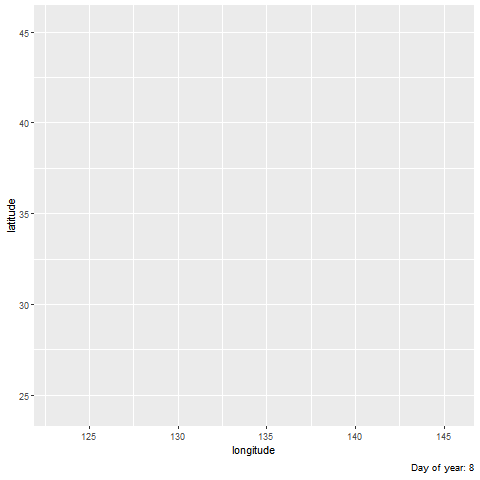


#### 6. Add Japan country borders


```{r}
#| eval: false
#| code-fold: true
#| code-summary: CODE
p <- ggplot() +
  annotation_borders(regions = "Japan", fill = "grey95", colour = "grey50") + # predefined map datasets
  geom_point(data = sakura_overall,
             aes(longitude, latitude)) +
  transition_events(start = flower_doy,
                    end = full_bloom_doy,
                    enter_length = 1,
                    exit_length = 1) +
  labs(caption = "Day of year: {round(frame_time)}")

animate(p, height = 715, width = 600, start_pause  = 15, end_pause = 15)
```


```{r}
#| eval: false
#| echo: false
anim_save("anime/sakura5.gif", p)
```

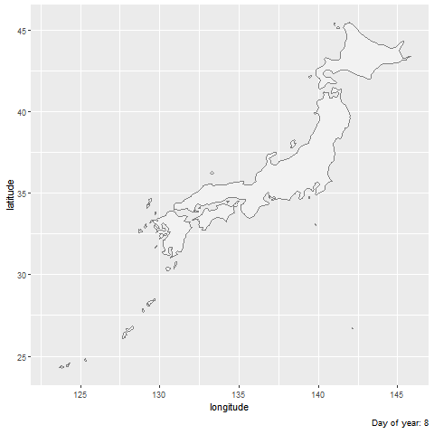


#### 7. Use map theming

```{r}
#| eval: false
#| code-fold: true
#| code-summary: CODE

p <- ggplot() +
  borders(regions = "Japan", fill = "grey95", colour = "grey50") +
  geom_point(data = sakura_overall,
             aes(longitude, latitude)) +
  coord_map(projection = "mercator") + #Mercator map projection
  theme_map() + #Removes axes, grids, and background elements to look like map
  transition_events(start = flower_doy,
                    end = full_bloom_doy,
                    enter_length = 1,
                    exit_length = 1) +
  labs(caption = "Day of year: {round(frame_time)}")

animate(p, height = 715, width = 600, start_pause  = 15, end_pause = 15)
```


```{r}
#| eval: false
#| echo: false
anim_save("anime/sakura6.gif", p)
```

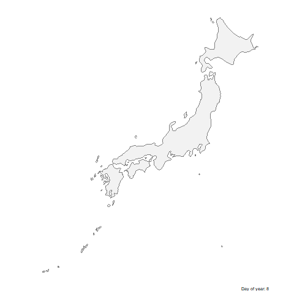

#### 8. Add major cities as reference points


```{r}
#| code-fold: true
#| code-summary: CODE
sakura_labels <- sakura_overall %>%
  filter(station_name %in% c("Sapporo", "Tokyo", "Kyoto",
                             "Hiroshima", "Niigata", "Naha",
                             "Nagasaki", "Sendai", "Hakodate")) %>%
  select(station_name, longitude, latitude)

sakura_labels %>%
  kable(format = "html") %>%
  kable_styling()
```


```{r}
#| eval: false
#| code-fold: true
#| code-summary: CODE
p <- ggplot() +
  borders(regions = "Japan",
          fill = "grey95",
          colour = "grey50") +
  geom_point(data = sakura_labels,                          #visual anchors
             aes(longitude, latitude),                      
             size = 1) +                                    
  geom_text(data = sakura_labels,                           
            aes(longitude, latitude, label = station_name), #text labels
            hjust = -0.2,                                   
            vjust = 1) +                                    
  geom_point(data = sakura_overall,
             aes(longitude, latitude)) +
  coord_map(projection = "mercator") +
  theme_map() +
  transition_events(start = flower_doy,
                    end = full_bloom_doy,
                    enter_length = 1,
                    exit_length = 1) +
  labs(caption = "Day of year: {round(frame_time, 0)}")

animate(p, start_pause = 15, end_pause = 15, height = 715, width = 600)
```


```{r}
#| eval: false
#| echo: false
anim_save("anime/sakura7.gif", p)
```


####  9. Replace default points with sakura icon

```{r}
#| eval: false
#| code-fold: true
#| code-summary: CODE

sakura_icon_url <- "https://raw.githubusercontent.com/tacookson/data/master/sakura-flowering/ref/sakura-no-border.svg" ### #URL of an external SVG image of a cherry blossom icon

p <- ggplot() +
  borders(regions = "Japan",
          fill = "grey95",
          colour = "grey50") +
  geom_point(data = sakura_labels,
             aes(longitude, latitude),
             size = 1) +
  geom_text(data = sakura_labels,
            aes(longitude, latitude, label = station_name),
            hjust = -0.2,
            vjust = 1) +
  geom_image(data = sakura_overall,      #plots an image at each coordinate; geom_point replaced
             aes(longitude, latitude, image = sakura_icon_url), 
             size = 0.03) +                                     
  coord_map(projection = "mercator") +
  theme_map() +
  transition_events(start = flower_doy,
                    end = full_bloom_doy,
                    enter_length = 1,
                    exit_length = 1) +
  labs(caption = "Day of year: {round(frame_time, 0)}")

animate(p, start_pause = 15, end_pause = 15, height = 715, width = 600)
```


```{r}
#| eval: false
#| echo: false
anim_save("anime/sakura8.gif", p)
```

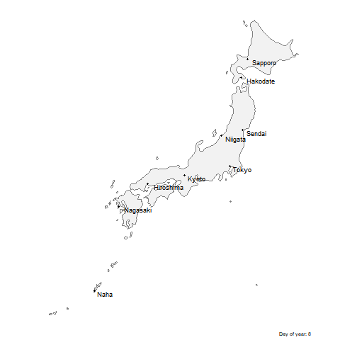


#### 10.Convert dynamic day-of-year to calendar date

```{r}
#| eval: false
#| code-fold: true
#| code-summary: CODE
sakura_icon_url <- "https://raw.githubusercontent.com/tacookson/data/master/sakura-flowering/ref/sakura-no-border.svg" 

p <- ggplot() +
  borders(regions = "Japan",
          fill = "grey95",
          colour = "grey50") +
  geom_point(data = sakura_labels,
             aes(longitude, latitude),
             size = 1) +
  geom_text(data = sakura_labels,
            aes(longitude, latitude, label = station_name),
            hjust = -0.2,
            vjust = 1) +
  geom_image(data = sakura_overall,     
             aes(longitude, latitude, image = sakura_icon_url), 
             size = 0.03) +                                     
  coord_map(projection = "mercator") +
  theme_map() +
  transition_events(start = flower_doy,
                    end = full_bloom_doy,
                    enter_length = 1,
                    exit_length = 1) +
  labs(caption = "{ymd(\"2019-01-01\") + frame_time}") ### YMD format ymd() from lubridate

animate(p, start_pause = 15, end_pause = 15, height = 715, width = 600)
```


```{r}
#| eval: false
#| echo: false
anim_save("anime/sakura9a.gif", p)
```


```{r}
#| eval: false
#| code-fold: true
#| code-summary: CODE
p <- ggplot() +
  borders(regions = "Japan",
          fill = "grey95",
          colour = "grey50") +
  geom_point(data = sakura_labels,
             aes(longitude, latitude),
             size = 1) +
  geom_text(data = sakura_labels,
            aes(longitude, latitude, label = station_name),
            hjust = -0.2,
            vjust = 1) +
  geom_image(data = sakura_overall,
             aes(longitude, latitude, image = sakura_icon_url),
             size = 0.03) +
  coord_map(projection = "mercator") +
  theme_map() +
  transition_events(start = flower_doy,
                    end = full_bloom_doy,
                    enter_length = 1,
                    exit_length = 1) +
  labs(caption = "{paste(month(ymd(\"2019-01-01\") + frame_time, label = TRUE, abbr = FALSE), day(ymd(\"2019-01-01\") + frame_time))}") ### month-day format

animate(p, start_pause = 15, end_pause = 15, height = 715, width = 600)
```


```{r}
#| eval: false
#| echo: false
anim_save("anime/sakura9.gif", p)
```


#### 11. Change font

[`setup instruction for extrafont`](https://github.com/fbertran/extrafont?tab=readme-ov-file) 

```{r}
#| eval: false
#| code-fold: true
#| code-summary: CODE
p <- ggplot() +
  borders(regions = "Japan",
          fill = "grey95",
          colour = "grey50") +
  geom_point(data = sakura_labels,
             aes(longitude, latitude),
             size = 1) +
  geom_text(data = sakura_labels,
            aes(longitude, latitude, label = station_name),
            family = "Amiri", ### font
            hjust = -0.2,
            vjust = 1, fontface = "bold") +
  geom_image(data = sakura_overall,
             aes(longitude, latitude, image = sakura_icon_url),
             size = 0.03) +
  coord_map(projection = "mercator") +
  theme_map() +
  transition_events(start = flower_doy,
                    end = full_bloom_doy,
                    enter_length = 1,
                    exit_length = 1) +
  labs(caption = "{paste(month(ymd(\"2019-01-01\") + frame_time, label = TRUE, abbr = FALSE),
                  day(ymd(\"2019-01-01\") + frame_time))}") +
  theme(text = element_text(family = "Amiri"))  +
  theme(plot.caption = element_text(face = "bold"))  # Make caption bold too


animate(p, start_pause = 15, end_pause = 15, height = 715, width = 600)
```


```{r}
#| eval: false
#| echo: false
anim_save("anime/sakura10.gif", p)
```

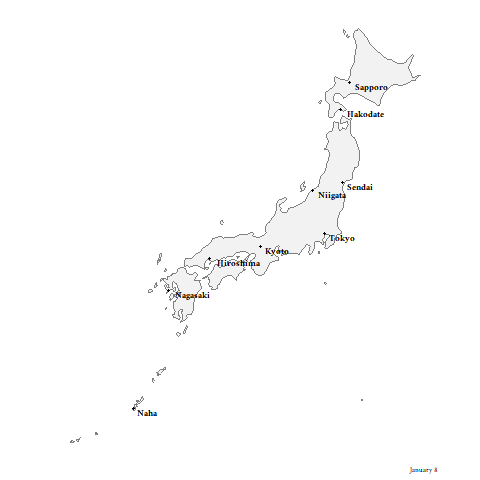

#### 12. Change colour palette


```{r}
#| eval: false
#| code-fold: true
#| code-summary: CODE
p <- ggplot() +
  annotation_borders(regions = "Japan",
          fill = "#AA9C8F", ### Light brown fill
          colour = "#3D1308", ### Dark brown border 
          linewidth  = 0.5) + ### Add border thickness
  geom_point(data = sakura_labels,
             aes(longitude, latitude),
             size = 1,
             colour = "#3D1308") + ### Dark brown points
  geom_text(data = sakura_labels,
            aes(longitude, latitude, label = station_name),
            colour = "#3D1308", ### Dark brown text
            family = "Amiri",
            hjust = -0.2,
            vjust = 1,
            fontface = "bold")
  geom_image(data = sakura_overall,
             aes(longitude, latitude, image = sakura_icon_url),
             size = 0.03) +
  coord_map(projection = "mercator") +
  theme_map() +
  transition_events(start = flower_doy,
                    end = full_bloom_doy,
                    enter_length = 1,
                    exit_length = 1) +
  labs(caption = "{paste(month(ymd(\"2019-01-01\") + frame_time, label = TRUE, abbr = FALSE),
                  day(ymd(\"2019-01-01\") + frame_time))}") +
  theme(
    text = element_text(family = "Amiri", colour = "#3D1308"),
    plot.background = element_rect(fill = "#FFF9F3", colour = NA),
    plot.caption = element_text(colour = "#3D1308", face = "bold")
  )

animate(p, start_pause = 15, end_pause = 15, height = 715, width = 600)
```


```{r}
#| eval: false
#| echo: false
anim_save("anime/sakura11.gif", p)
```

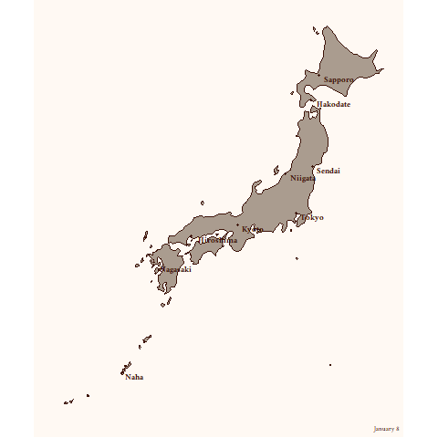

#### 13. Tweak enter and exit animations

```{r}
#| eval: false
#| code-fold: true
#| code-summary: CODE
p <- ggplot() +
  annotation_borders(regions = "Japan",
          fill = "#AA9C8F", 
          colour = "#3D1308", 
          linewidth  = 0.5) + 
  geom_point(data = sakura_labels,
             aes(longitude, latitude),
             size = 1,
             colour = "#3D1308") + 
  geom_text(data = sakura_labels,
            aes(longitude, latitude, label = station_name),
            colour = "#3D1308",
            family = "Amiri",
            hjust = -0.2,
            vjust = 1,
            fontface = "bold") + 
  geom_image(data = sakura_overall,
             aes(longitude, latitude, image = sakura_icon_url),
             size = 0.03) +
  coord_map(projection = "mercator") +
  theme_map() +
  transition_events(start = flower_doy - 3, # appears 3 days before flowering.
                    end = full_bloom_doy,   # disappears once full bloom day is reached
                    range(0, 151),          # Frames represent days from day 0 to day 151
                    enter_length = 6,       # take 6 frames to fully appear
                    exit_length = 6) +      # take 6 frames to fully disappear
  enter_grow() +                            # it grows from nothing to full size
  exit_drift(y_mod = -1) +                  # drifts downward before disappearing
  exit_shrink() +                           # shrinks to zero size
  labs(caption = "{paste(month(ymd(\"2019-01-01\") + frame_time, label = TRUE, abbr = FALSE),
                  day(ymd(\"2019-01-01\") + frame_time))}") +
  theme(
    text = element_text(family = "Amiri", colour = "#3D1308"),
    plot.background = element_rect(fill = "#FFF9F3", colour = NA),
    plot.caption = element_text(colour = "#3D1308", face = "bold")
  )

animate(p, start_pause = 15, end_pause = 15, height = 715, width = 600)
```

```{r}
#| eval: false
#| echo: false
anim_save("anime/sakura12.gif", p)
```


#### 14. Slow overall animation speed

```{r}
#| eval: false
#| code-fold: true
#| code-summary: CODE
p <- ggplot() +
  annotation_borders(regions = "Japan",
          fill = "#AA9C8F", 
          colour = "#3D1308", 
          linewidth  = 0.5) + 
  geom_point(data = sakura_labels,
             aes(longitude, latitude),
             size = 1,
             colour = "#3D1308") + 
  geom_text(data = sakura_labels,
            aes(longitude, latitude, label = station_name),
            colour = "#3D1308",
            family = "Amiri",
            hjust = -0.2,
            vjust = 1,
            fontface = "bold") + 
  geom_image(data = sakura_overall,
             aes(longitude, latitude, image = sakura_icon_url),
             size = 0.03) +
  coord_map(projection = "mercator") +
  theme_map() +
  transition_events(start = flower_doy - 3,
                    end = full_bloom_doy,  
                    range(0, 151),         
                    enter_length = 6,      
                    exit_length = 6) +      
  enter_grow() +  
  exit_drift(y_mod = -1) +   
  exit_shrink() +                          
  labs(caption = "{paste(month(ymd(\"2019-01-01\") + frame_time, label = TRUE, abbr = FALSE),
                  day(ymd(\"2019-01-01\") + frame_time))}") +
  theme(
    text = element_text(family = "Amiri", colour = "#3D1308"),
    plot.background = element_rect(fill = "#FFF9F3", colour = NA),
    plot.caption = element_text(colour = "#3D1308", face = "bold")
  )

animate(p,nframes = 152 * 2, start_pause = 15, end_pause = 15, height = 715, width = 600)
#each day lasts 2 frames
```

```{r}
#| eval: false
#| echo: false
anim_save("anime/sakura13.gif", p)
```


#### 15. Add title and explanation blurb


```{r}
#| eval: false
#| code-fold: true
#| code-summary: CODE
p <- ggplot() +
  annotation_borders(regions = "Japan",
          fill = "#AA9C8F", 
          colour = "#3D1308", 
          linewidth  = 0.5) + 
  geom_point(data = sakura_labels,
             aes(longitude, latitude),
             size = 1,
             colour = "#3D1308") + 
  geom_text(data = sakura_labels,
            aes(longitude, latitude, label = station_name),
            colour = "#3D1308",
            family = "Amiri",
            hjust = -0.2,
            vjust = 1,
            fontface = "bold") + 
  geom_image(data = sakura_overall,
             aes(longitude, latitude, image = sakura_icon_url),
             size = 0.03) +
  coord_map(projection = "mercator") +
  theme_map() +
  transition_events(start = flower_doy - 3,
                    end = full_bloom_doy,  
                    range(0, 151),         
                    enter_length = 6,      
                    exit_length = 6) +      
  enter_grow() +
  exit_drift(y_mod = -1) +   
  exit_shrink() +                          
labs(title = "Sakura Zensen: When do cherry blossoms bloom in Japan?",           #add text 
       caption = "{paste(month(ymd(\"2019-01-01\") + frame_time, label = TRUE, abbr = FALSE),
                  day(ymd(\"2019-01-01\") + frame_time))}") +
  theme(text = element_text(family = "Amiri", colour = "#3D1308"),
        panel.border = element_blank(),
        panel.background = element_blank(),
        plot.background = element_rect(fill = "#FFF9F3", colour = NA))

animate(p,nframes = 152 * 2, start_pause = 15, end_pause = 15, height = 715, width = 600)
```

```{r}
#| eval: false
#| echo: false
anim_save("anime/sakura14.gif", p)
```

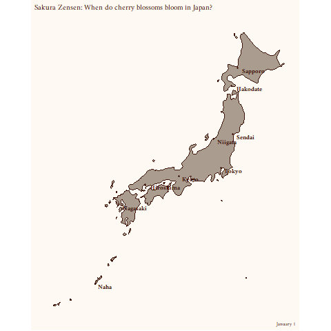


#### 16. Adjust title size and location

```{r}
#| eval: false
#| code-fold: true
#| code-summary: CODE
p <- ggplot() +
  annotation_borders(regions = "Japan",
          fill = "#AA9C8F", 
          colour = "#3D1308", 
          linewidth  = 0.5) + 
  geom_point(data = sakura_labels,
             aes(longitude, latitude),
             size = 1,
             colour = "#3D1308") + 
  geom_text(data = sakura_labels,
            aes(longitude, latitude, label = station_name),
            colour = "#3D1308",
            family = "Amiri",
            hjust = -0.2,
            vjust = 1,
            fontface = "bold") + 
  geom_image(data = sakura_overall,
             aes(longitude, latitude, image = sakura_icon_url),
             size = 0.03) +
  coord_map(projection = "mercator") +
  theme_map() +
  transition_events(start = flower_doy - 3,
                    end = full_bloom_doy,  
                    range(0, 151),         
                    enter_length = 6,      
                    exit_length = 6) +      
  enter_grow() +      
  exit_drift(y_mod = -1) +   
  exit_shrink() +                          
  labs(title = "Sakura Zensen: When do cherry blossoms bloom in Japan?",            
       caption = "{paste(month(ymd(\"2019-01-01\") + frame_time, label = TRUE, abbr = FALSE),
                  day(ymd(\"2019-01-01\") + frame_time))}") +
  theme(text = element_text(family = "Amiri", colour = "#3D1308"),
        panel.border = element_blank(),
        panel.background = element_blank(),
        plot.background = element_rect(fill = "#FFF9F3", colour = NA),
        plot.margin = margin(10, 50, 10, 50), #sets empty space around the entire plot        
        plot.title = element_text(size = 16, hjust = 0.5, margin = margin(10, 10, 10, 10)), 
        plot.caption = element_text(size = 14))                                            

animate(p,nframes = 152 * 2, start_pause = 15, end_pause = 15, height = 715, width = 600)
```

```{r}
#| eval: false
#| echo: false
anim_save("anime/sakura15.gif", p)
```

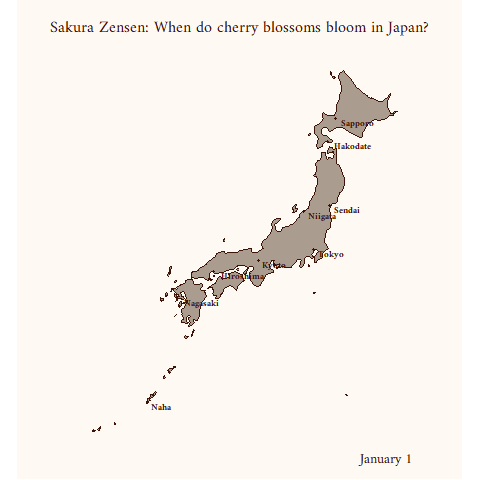

#### 17. Add colour to title with ggtext


```{r}
#| eval: false
#| code-fold: true
#| code-summary: CODE
p <- ggplot() +
  annotation_borders(regions = "Japan",
          fill = "#AA9C8F", 
          colour = "#3D1308", 
          linewidth  = 0.5) + 
  geom_point(data = sakura_labels,
             aes(longitude, latitude),
             size = 1,
             colour = "#3D1308") + 
  geom_text(data = sakura_labels,
            aes(longitude, latitude, label = station_name),
            colour = "#3D1308",
            family = "Amiri",
            hjust = -0.2,
            vjust = 1,
            fontface = "bold") + 
  geom_image(data = sakura_overall,
             aes(longitude, latitude, image = sakura_icon_url),
             size = 0.03) +
  coord_map(projection = "mercator") +
  theme_map() +
  transition_events(start = flower_doy - 3,
                    end = full_bloom_doy,  
                    range(0, 151),         
                    enter_length = 6,      
                    exit_length = 6) +      
  enter_grow() +    
  exit_drift(y_mod = -1) +   
  exit_shrink() +                          
  labs( title = "<span style = 'color:#D47FA8'>**Sakura Zensen**</span> ",   #sets colours
        subtitle = "*When do <span style = 'color:#D47FA8'>**cherry blossoms**</span> bloom in Japan?*",
       caption = "{paste(month(ymd(\"2019-01-01\") + frame_time, label = TRUE, abbr = FALSE),
                  day(ymd(\"2019-01-01\") + frame_time))}") +
  theme(text = element_text(family = "Amiri", colour = "#3D1308"),
        panel.border = element_blank(),
        panel.background = element_blank(),
        plot.background = element_rect(fill = "#FFF9F3", colour = NA),
        plot.margin = margin(10, 50, 10, 50),        
        plot.title = ggtext::element_markdown(size = 16, hjust = 0.5, margin = margin(10, 10, 10, 10)),
    plot.subtitle = ggtext::element_textbox_simple(size = 14, halign = 0.5),
        plot.caption = element_text(size = 14))                                            

animate(p,nframes = 152 * 2, start_pause = 15, end_pause = 15, height = 715, width = 600)
```

```{r}
#| eval: false
#| echo: false
anim_save("anime/sakura16.gif", p)
```

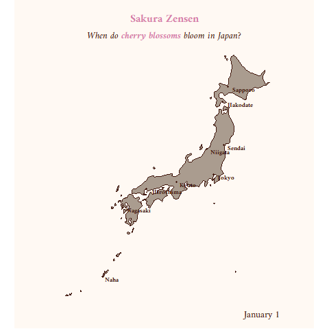

:::


## Reference

Kam, Tin Seong (2026). [4 Programming Animated Statistical Graphics with R R](https://r4va.netlify.app/chap04) R for Visual Analytics.

[gganimate: Getting Started](https://gganimate.com/articles/gganimate.html)

[Building an animation step-by-step with gganimate](https://www.alexcookson.com/post/2020-10-18-building-an-animation-step-by-step-with-gganimate/)

[Creating a composite gif with multiple gganimate panels](https://solarchemist.se/2021/08/02/composite-gif-gganimate/)

[Implementation of gganimate by Senior Student](https://rpubs.com/raymondteo/dataviz8)
