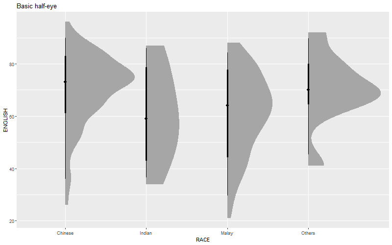

## Overview

Visualising distributions has long been central to statistical analysis. In Chapter 1, we introduced common methods such as histograms, probability density curves (PDFs), boxplots, notch plots and violin plots using ggplot2. This chapter extends that discussion by introducing two more recent techniques: the ridgeline plot and the raincloud plot. The **ridgeline plot**, popularised through data journalism and the **ggridges** package, uses stacked density curves to compare distributions across groups. The **raincloud plot**, developed within the open science community, combines a density plot, boxplot and raw data points to provide a concise yet informative view of distributional characteristics.

## Getting Started

### Installing and Loading the Required Libraries

There are five packages that will be used in this exercise.

| Package | Description |
|---------------------|---------------------------------------------------|
| [tidyverse](https://www.tidyverse.org/) | A collection of R packages for data importing, cleaning, transformation, and visualisation (e.g., [readr](https://readr.tidyverse.org/), dplyr, tidyr, [ggplot2](https://ggplot2.tidyverse.org/)). |
| [ggridges](https://cran.r-project.org/web/packages/ggridges/refman/ggridges.html) | A gglot extension that creates ridgeline plots to visualise the changes in distributions over time or space.  |
| [ggdist](https://mjskay.github.io/ggdist/) | An R package that extends ggplot2 with flexible geoms and stats for visualising distributions and uncertainty.|
| [ggthemes](https://cran.r-project.org/web/packages/ggthemes/refman/ggthemes.html) | Provides ggplot2 themes, geoms and scales that replicate the famous styles ( e.g. Tufte, Economist, WSJ etc |
| [colorspace](https://colorspace.r-forge.r-project.org/) | Provides tools for selecting, manipulating and applying colours and colour palettes in data visualisations.|

The code below installs and loads the required packages into R environment.

```{r}
pacman::p_load(tidyverse, ggridges, ggdist, ggthemes, colorspace)
```

### Importing the Data

A CSV file containing the final exam results of 322 local Primary 3 students has been imported into the R environment by using function [`read_csv()`](https://readr.tidyverse.org/reference/read_delim.html) from [**readr**](https://readr.tidyverse.org/) package, one of tidyverse family. The dataset includes variables such as student ID, class, gender, race, and grades for English, Maths, and Science.

```{r}
exam <- read_csv("data/Exam_data.csv")
```

## Visualising Distribution with Ridgeline Plot

A [ridgeline plot](https://www.data-to-viz.com/graph/ridgeline.html), or joyplot, visualises the distribution of a numeric variable across multiple groups using aligned, overlapping density curves or histograms.

The code below creates a basic ridgeline plot using `geom_density_ridges()` and`theme_ridges()` from **ggridges** package. 

```{r}
ggplot(exam, aes(x = ENGLISH, y = CLASS)) +
  geom_density_ridges() +
  theme_ridges()
```


::: callout-note

-   Ridgeline plots are well suited for visualising a **medium to large** number of groups, where traditional faceted plots would require too much space. The overlapping of distributions allows for more efficient use of the plotting area. When there are less than **5** groups, alternative distribution plots are often more appropriate.

-   These plots work best when there is a clear **pattern** or natural ordering among groups. Without such structure, overlapping distributions may appear cluttered and provide limited insight.


:::

There are several ways to create ridgeline plots in R. In this section, we learn how to produce ridgeline plots using the **ggridges** package.

The ggridges package provides three main geoms for ridgeline visualisation: [`geom_ridgeline()`](https://cran.r-project.org/web/packages/ggridges/refman/ggridges.html#geom_density_line), [`geom_density_ridges()`](https://cran.r-project.org/web/packages/ggridges/refman/ggridges.html#geom_density_ridges). The `geom_ridgeline()` function draws ridgelines using user supplied height values. In contrast, `geom_density_ridges()` first estimates the density of the data and then visualises these densities as ridgelines. The `geom_density_ridges2()` function is a newer variant that uses a different internal density calculation and stacking approach, making it more flexible and efficient when working with large datasets or when additional aesthetics such as quantile lines are required.


::: panel-tabset

####  Basic functions-ggridges method

The code chunk below plots a ridgeline plot with simple colour by using geom_density_ridges().

```{r}
#| code-fold: true
#| code-summary: SHOW
ggplot(exam, aes(x = ENGLISH, y = CLASS)) +
  geom_density_ridges(scale = 3,             # vertical spacing between ridgelines: how much overlap there is among the plots
                      rel_min_height = 0.01, # remove small density tails
                      bandwidth = 3.4,       # set bandwidth
                      fill = lighten("#7097BB",0.3),    # lighten blue colour
                      colour = "white") +    # border colour
  scale_x_continuous(         # customise x-axis scale
    name = "English Grades",  # title for x-axis
    expand = c(0, 0)          # remove padding, makes the data start exactly at the axis
  )+    
  scale_y_discrete(                          # customise the y-axis scale
    name = NULL,                             # remove "CLASS" label
    expand = expansion(add = c(0.2, 2.6))    # add extra space above the below the ridgelines
    ) +
  theme_ridges()                             # ridgeline specific theme

```

The code below uses `geom_density_ridges2()` to create the same chart and adds a title using the `labs()` function with the `title` argument.

```{r}
#| code-fold: true
#| code-summary: SHOW
ggplot(exam, aes(x = ENGLISH, y = CLASS)) +
  geom_density_ridges2(scale = 3,             # vertical spacing between ridgelines: how much overlap there is among the plots
                      rel_min_height = 0.01, # remove small density tails
                      bandwidth = 3.4,       # set bandwidth
                      fill = lighten("#7097BB",0.3),    # lighten blue colour
                      colour = "white") +    # border colour
  scale_x_continuous(         # customise x-axis scale
    name = "English Grades",  # title for x-axis
    expand = c(0, 0)          # remove padding, makes the data start exactly at the axis
  )+    
  scale_y_discrete(                          # customise the y-axis scale
    name = NULL,                             # remove "CLASS" label
    expand = expansion(add = c(0.2, 2.6))    # add extra space above the below the ridgelines
    ) +
  labs(
    title = "Distribution of English Grades by Class"  # add chart title
  ) +
  theme_ridges()                             # ridgeline specific theme

```
To use `geom_ridgeline()` to create a slimiar plot, we first manually calculate the ridge heights and pass the density values to the `height` arugment in the function. This approach is less straight-forward. 


```{r}
#| code-fold: true
#| code-summary: SHOW
density_data <- exam %>%
  group_by(CLASS) %>%                 # Group the data by class
  do({                                # Perform operations within each class
    d <- density(.$ENGLISH, bw = 3.4) # Estimate density of English scores
    data.frame(
      ENGLISH = d$x,                  # Density x values (English grades)
      height = d$y                   # Density y values used as ridge heights
    )})
ggplot(density_data,
       aes(x = ENGLISH,
           y = CLASS,
           height = height)) +     # Use precomputed density as ridge height
  geom_ridgeline(
    scale = 30,
    fill = lighten("#7097BB", .3),
    color = "white"
  ) +
  scale_x_continuous(
    name = "English grades",
    expand = c(0, 0)
  ) +
  scale_y_discrete(
    name = NULL,
    expand = expansion(add = c(0.2, 2.6))
  ) +
  labs(
    title = "Distribution of English Grades by Class"
  ) +
  theme_ridges()
```


#### Varying fill colours along the x-axis

Sometimes it is useful to apply a gradient fill to ridgeline plots so that colours vary along the x axis. This can be done using `geom_ridgeline_gradient()` or `geom_density_ridges_gradient()`, which work like their non gradient counterparts but allow changing fill colours. However, these geoms do not support alpha transparency, as gradient fills and transparency cannot be used together.

```{r}
#| code-fold: true
#| code-summary: SHOW
ggplot(exam, aes(x = ENGLISH, y = CLASS, fill = stat(x))) + #maps the fill colour to the x axis values computed by the statistical transformation
  geom_density_ridges_gradient(scale = 3, rel_min_height = 0.01) +
  scale_fill_viridis_c(name = "English Grades", option = "C") +
  scale_x_continuous(name = "English grades", expand = c(0, 0)) +
  scale_y_discrete(name = NULL, expand = expansion(add = c(0.2, 2.6)))+
  labs(title = "Distribution of English Grades by Class") +
  theme_ridges()
```
The code below use the `geom_ridgeline_graident()` to create a similar plot with the reversed Viridis colour scale by using arugment `direction = -1`.

```{r}
#| code-fold: true
#| code-summary: SHOW
ggplot(density_data,aes(x = ENGLISH,y = CLASS,height = height, fill = stat(x))) +  
  geom_ridgeline_gradient(scale = 30) +
  scale_fill_viridis_c(name = "English grades", option = "H", direction = -1) +
  scale_x_continuous( name = "English grades",expand = c(0, 0)) +
  scale_y_discrete(name = NULL,expand = expansion(add = c(0.2, 2.6))) +
  labs(title = "Distribution of English Grades by Class") +
  theme_ridges()
```

::: callout-tip

- scale_fill_viridis_c() maps values continuously

- scale_fill_viridis_b() maps categories

- scale_fill_viridis_b() maps continuous data after binning it into discrete intervals.

- option: indicates the 8 colour map option to use, which are: "magma" (or "A"), "inferno" (or "B"), "plasma" (or "C"), "viridis" (or "D"), "cividis" (or "E"), "rocket" (or "F"), "mako" (or "G"), "turbo" (or "H").

:::


#### Mapping the probabilities directly onto colour

In addition to providing specialised geoms for ridgeline plots, the **ggridges** package also includes a statistical function, `stat_density_ridges()`, which serves as an alternative to ggplot2’s `stat_density()`. The `stat_density()` function estimates the probability density function of a continuous variable from raw data using kernel density estimation.

The figure below is created by mapping probabilities computed using `stat(ecdf)`, which represent the empirical cumulative distribution function of English scores.


The code below create a ridgeline plot by using `stat_density_ridges()`.

When `stat(ecdf)` is close to 0 or 1, the observation lies in the tails of the distribution.
When `stat(ecdf)` is close to 0.5, the observation lies near the centre of the distribution.

The fill aesthetic, defined as `0.5 - abs(0.5 - stat(ecdf))`, assigns higher values to observations near the centre of the distribution and lower values toward the tails. The gradient colour emphasises how extreme values are distributed within each class.
```{r}
#| code-fold: true
#| code-summary: SHOW
ggplot(exam, aes(x = ENGLISH, y = CLASS, fill = 0.5 - abs(0.5 -stat(ecdf)))) +
  stat_density_ridges(geom = "density_ridges_gradient", calc_ecdf = TRUE)+
  scale_fill_viridis_c(name = "Tail probability", direction = -1) +
  scale_x_continuous(name = "English grades", expand = c(0, 0)) +
  scale_y_discrete(name = NULL, expand = expansion(add = c(0.2, 2.6)))+
  labs(title = "Distribution of English Grades by Class") +
  theme_ridges()
```

::: callout:important

It is important include the argument `calc_ecdf = TRUE` in `stat_density_ridges()`.

:::


#### Ridgeline plots with quantile lines

Using [`geom_density_ridges_gradient()`](https://wilkelab.org/ggridges/reference/geom_ridgeline_gradient.html), ridgeline plots can be coloured by **quantiles** through the calculated `stat(quantile)` aesthetic, as illustrated in the figure below. The `stat(quantile)` value indicates the quantile position of each x value within the distribution.

```{r}
#| code-fold: true
#| code-summary: SHOW
ggplot(exam, aes(x = ENGLISH, y = CLASS, 
                 fill = factor(stat(quantile)))) +  # colour ridgelines by quantile group
  stat_density_ridges(geom = "density_ridges_gradient", calc_ecdf = TRUE,
                      quantiles = 4, quantile_lines = TRUE)+ # four quantiles + vertical lines
  scale_fill_viridis_d(name = "Quartiles", direction = -1) + #_d for categorical data
  scale_x_continuous(name = "English grades", expand = c(0, 0)) +
  scale_y_discrete(name = NULL, expand = expansion(add = c(0.2, 2.6)))+
  labs(title = "Distribution of English Grades by Class") +
  theme_ridges()
```

Instead of defining quantiles by a fixed number, they can also be specified using cut points, such as the 2.5% and 97.5% tails, to colour the ridgeline plot, as shown in the figure below.


```{r}
#| code-fold: true
#| code-summary: SHOW
ggplot(exam, aes(x = ENGLISH, y = CLASS, 
                 fill = factor(stat(quantile)))) + 
  stat_density_ridges(geom = "density_ridges_gradient", calc_ecdf = TRUE,
                      quantiles = c(0.025, 0.975))+
  scale_fill_manual(name = "Probablity", 
                    values = c("#FF0000A0", "#A0A0A0A0", "#0000FFA0"),
                    # manual colours for lower tail, middle, upper tail
    labels = c("(0, 0.025]", "(0.025, 0.975]", "(0.975, 1]"))+# custom labels for thd regions
  scale_x_continuous(name = "English grades", expand = c(0, 0)) +
  scale_y_discrete(name = NULL, expand = expansion(add = c(0.2, 2.6)))+
  labs(title = "Distribution of English Grades by Class") +
  theme_ridges()
```

:::


## Visualising Distribution with Raincloud Plot

A raincloud plot visualises a distribution using a half density plot shaped like a “raincloud”. It extends the boxplot by revealing distributional features such as clustering and multiple modes that boxplots cannot show.

In this section, we learn how to create a raincloud plot to visualise the distribution of English scores by race using **ggdist** and ggplot2.


:::: panel-tabset

### Plotting a Half Eye graph

First, we plot a Half-Eye graph by using [`stat_halfeye()`](https://mjskay.github.io/ggdist/reference/stat_halfeye.html) of **ggdist** package.

This produces a Half Eye visualisation, which is contains a half-density and a slab-interval.

A **half-density** is one side of a density curve that shows the shape of a distribution in a compact form.

A **slab-interval** combines a density slab with an interval summary, such as a confidence or credible interval, to show both distribution and uncertainty together.

The code below creates an animated visualisation using **gifski** package showing how the half-eye plot changes as key features (density smoothness, position, interval, and summary point) are adjusted.

```{r}
#| code-fold: true
#| code-summary: SHOW
#| eval: false
# Load packages
library(gifski)

p1 <- ggplot(exam, aes(RACE, ENGLISH)) + 
  stat_halfeye() +
  ggtitle("Basic half-eye")

p2 <- ggplot(exam, aes(RACE, ENGLISH)) + 
  stat_halfeye(adjust = 0.5) +
  ggtitle("Detailed (adjust = 0.5)")

p3 <- ggplot(exam, aes(RACE, ENGLISH)) + 
  stat_halfeye(adjust = 0.5, justification = -0.2) +
  ggtitle("Shifted (justification = -0.2)")

p4 <- ggplot(exam, aes(RACE, ENGLISH)) + 
  stat_halfeye(adjust = 0.5, justification = -0.2, .width = 0) +
  ggtitle("No interval (.width = 0)")

p5 <- ggplot(exam, aes(RACE, ENGLISH)) + 
  stat_halfeye(adjust = 0.5, justification = -0.2, .width = 0, 
              point_colour = NA) +
  ggtitle("Density only")


plots <- list(p1, p2, p3, p4, p5)

# create temporary PNG file names
temp_png <- sapply(1:5, function(i) {
  tempfile(fileext = ".png")})

# save each plot as a PNG image
for (i in 1:5) {
  png(temp_png[i], width = 800, height = 500)
  print(plots[[i]])
  dev.off()}
# reads the list into gif (2 seconds per plot)
gifski(temp_png, "halfeye_demo.gif", delay = 2)
```



```{r}
#| eval: false
# basic half-eye
ggplot(exam, aes(x = RACE, y = ENGLISH))+ stat_halfeye() 
# reduce bandwidth of the density estimate to show more detailed
ggplot(exam, aes(x = RACE, y = ENGLISH))+ stat_halfeye(adjust = 0.5)
# shift the slab interval sideways
ggplot(exam, aes(x = RACE, y = ENGLISH))+ stat_halfeye(adjust = 0.5, justification= -0.2)
# remove the interval
ggplot(exam, aes(x = RACE, y = ENGLISH))+ stat_halfeye(adjust = 0.5, justification= -0.2,.width = 0)
# remove the summary point
ggplot(exam, aes(x = RACE, y = ENGLISH))+ stat_halfeye(adjust = 0.5, justification= -0.2,.width = 0, point_colour = NA)
```


### Adding the boxplot with geom_boxplot()

Next, we add a second geometry layer using [`geom_boxplot()`](https://ggplot2.tidyverse.org/reference/geom_boxplot.html) from ggplot2. This overlays a narrow boxplot, with its width reduced and opacity adjusted to keep the distribution visible underneath.


```{r}
#| code-fold: true
#| code-summary: SHOW
ggplot(exam, aes(x = RACE, y = ENGLISH))+
  stat_halfeye(adjust = 0.5, justification= -0.2,.width = 0, point_colour = NA) +
  geom_boxplot(width = 0.2, outlier.shape = NA, alpha = 0.4)
```


### Adding the Dot Plots with stat_dots()

Next, we add a third layer using[ `stat_dots()`](https://mjskay.github.io/ggdist/reference/stat_dots.html) from the **ggdist** package. This draws a half dot plot, which works like a histogram but uses dots instead of bars. Each dot represents data points in a bin. Setting `side = "left"` places the dots on the left side of the plot.


```{r}
#| code-fold: true
#| code-summary: SHOW
ggplot(exam, aes(x = RACE, y = ENGLISH))+
  stat_halfeye(adjust = 0.5, justification= -0.2,.width = 0, point_colour = NA) +
  geom_boxplot(width = 0.2, outlier.shape = NA, alpha = 0.4) +
  stat_dots(side = "left", justification = 1.2, binwidth = 0.5, dotsize = 2)
```

### Finishing touch

Lastly, we use `coord_flip()` from ggplot2 to turn the plot sideways, which gives the chart its **raincloud** look. We also apply `theme_economist()` from the **ggthemes** package to make the chart look clean and professional.

```{r}
#| code-fold: true
#| code-summary: SHOW
ggplot(exam, aes(x = RACE, y = ENGLISH))+
  stat_halfeye(adjust = 0.5, justification= -0.2,.width = 0, point_colour = NA) +
  geom_boxplot(width = 0.2, outlier.shape = NA, alpha = 0.4) +
  stat_dots(side = "left", justification = 1.2, binwidth = 0.5,
          dotsize = 1.5,
          overflow = "compress") +
  coord_flip() +
  labs(title = "Distribution of English Grades by Race",
    x = "Race",
    y = "English grades") +
  theme_economist() +
  theme(axis.title.x = element_text(margin = margin(t = 6)),
    axis.title.y = element_text(margin = margin(r = 6)))
```
We can also add a gradient colour to the raincloud plot by mapping the fill aesthetic to the data values using `aes(fill = stat(y))`.

```{r}
#| code-fold: true
#| code-summary: SHOW
ggplot(exam, aes(x = RACE, y = ENGLISH))+
  stat_halfeye(aes(fill = stat(y)),adjust = 0.5, justification= -0.2,.width = 0, point_colour = NA) + # gradient mapped to English scores
  geom_boxplot(width = 0.2, outlier.shape = NA, alpha = 0.4) +
  stat_dots(side = "left", justification = 1.2, binwidth = 0.5,
          dotsize = 1.5,
          overflow = "compress") +
  coord_flip() +
  scale_fill_viridis_c(name = "English grades",direction = -1) +
  labs(title = "Distribution of English Grades by Race",
    x = "Race",
    y = "English grades") +
  theme_economist() +
  theme(axis.title.x = element_text(margin = margin(t = 6)),
    axis.title.y = element_text(margin = margin(r = 6)))
```

::::


::: callout:note

- `adjust` in `stat_halfeye()` controls the smoothness of the density curve. Smaller values make the curve more detailed and wiggly. Larger values make it smoother.

- `justification = -0.2` in `stat_halfeye()` nudges the half-density slightly to the right

- `justification = 1.2` in `stat_dots()` pushes the dots further to the left (because `side = "left"`)

- `overflow` in `stat_dots()` control the overflows. when `compress` is stated, the dots are squeezed closer together so that they stay inside the plot area. Use `keep` if we do not mind dots spilling outside the plot area, which is rarely desirable in practice.

- Use `theme(axis.title.* = margin())` for label spacing. Specifically, t = top,r = right ,b = bottom,l = left


:::


## Reference

Kam, Tin Seong (2026). [9  Visualising Distribution](https://r4va.netlify.app/chap09) R for Visual Analytics.


Claus O. Wilke [Fundamentals of Data Visualization](https://clauswilke.com/dataviz/) especially Chapter 6, 7, 8, 9 and 10.

Allen M, Poggiali D, Whitaker K et al. [“Raincloud plots: a multi-platform tool for robust data. visualization”](https://wellcomeopenresearch.org/articles/4-63) [version 2; peer review: 2 approved]. Welcome Open Res 2021, pp. 4:63.

[Dots + interval stats and geoms](https://mjskay.github.io/ggdist/articles/dotsinterval.html)
