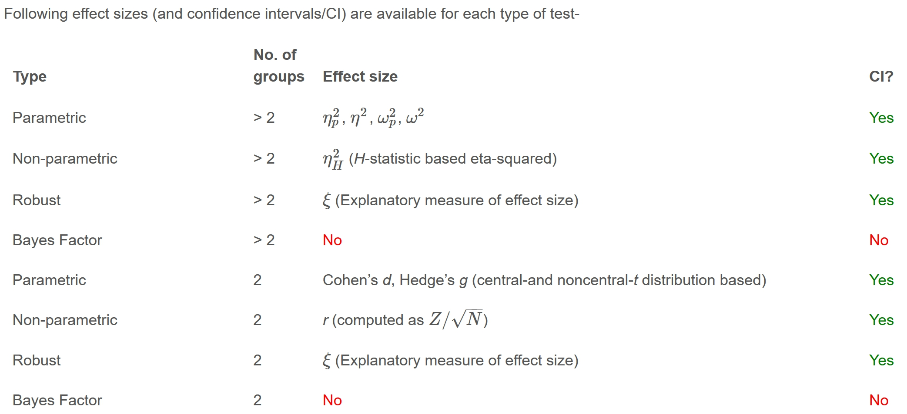
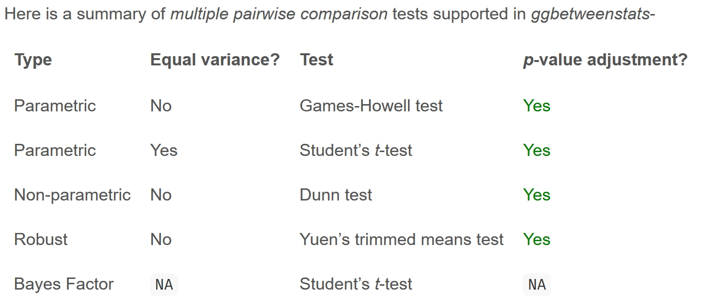

## Learning Outcome

In this hands-on exercise, we learn practical experience using the **ggstatsplot** package to create visualisations enriched with statistical information, the **performance** package to visualise and assess model diagnostics, and the **parameters** package to visualise and interpret model parameters.

**Assumption:**

All hypothesis tests in this exercise are conducted at the **5% significance level**, where the null hypothesis states that no significant difference or no relationship exists between the variables of interest.

## Getting Started

### Installing and Loading the Required Libraries

There are four packages that will be used in this exercise.

| Package | Description |
|-----------------------|-------------------------------------------------|
| [tidyverse](https://www.tidyverse.org/) | A collection of R packages for data importing, cleaning, transformation, and visualisation (e.g., [readr](https://readr.tidyverse.org/), dplyr, tidyr, [ggplot2](https://ggplot2.tidyverse.org/)). |
| [ggstatsplot](https://indrajeetpatil.github.io/ggstatsplot/index.html) | A gglot extension that creates graphics with statistical details. |
| [performance](https://easystats.github.io/performance/) | An R package that provides a streamlined workflow for assessing model quality, generating diagnostic plots, and evaluating overall model performance. |
| [parameters](https://easystats.github.io/parameters/) | Summarises and visualises model parameters and their uncertainty. |

The code below installs and loads the required packages into R environment.

```{r}
pacman::p_load(tidyverse, ggstatsplot, performance, parameters)
```

### Importing the Data

A CSV file containing the final exam results of 322 local Primary 3 students has been imported into the R environment by using function [`read_csv()`](https://readr.tidyverse.org/reference/read_delim.html) from [**readr**](https://readr.tidyverse.org/) package, one of tidyverse family. The dataset includes variables such as student ID, class, gender, race, and grades for English, Maths, and Science.

```{r}
exam <- read_csv("data/Exam_data.csv")
knitr::kable(head(exam), "html")
```

## Visual Statistical Analysis with ggstatsplot

[**ggstatsplot**](https://indrajeetpatil.github.io/ggstatsplot/index.html) is an extension of **ggplot2** that creates information-rich graphics by embedding statistical test results directly into plots. It provides alternative inference methods by default and follows APA best-practice standards for statistical reporting.


::: callout-tip
#### Markdown tips

-   \_ is for subscripts

-   {} groups text or numbers

-   \text{} keeps words readable in subscripts

-   Always wrap math in \$ ... \$
:::

### One-sample test: gghistostats() method

The code below displays a histogram for a one-sample test of the English score distribution using [`gghistostats()`](https://indrajeetpatil.github.io/ggstatsplot/reference/gghistostats.html), which runs the test automatically when `type = "bayes"` is selected. In this context, `test.value` specifies the reference value being tested, that is, the value the English scores are compared against. The plot itself displays the MAP (Maximum A Posteriori) estimate, which represents the most probable value of the parameter given the data and the prior.

The `type` argument supports four options: **parametric**, **nonparametric**, **robust**, and **bayes**. We can specify any option using just its first letter.

The `ggtheme` argument allows the user to apply a ggplot2 theme to the plot. The default is `theme_ggstatsplot()`, but any ggplot2 theme or themes from extension packages, such as `theme_bw()`, `theme_fivethirtyeight()` from **ggthemes** or `theme_ipsum_ps()` from **hrbrthemes** package , can be used.

```{r}
#| code-fold: true
#| code-summary: SHOW
set.seed(1234)

gghistostats(
  data = exam,
  x = ENGLISH,
  type = "bayes",
  test.value = 60,
  xlab = "English scores")
```

::: callout-tip
#### Posterior summary

-   **Posterior difference** = 7.16, estimated difference between the sample mean and the test.value. The English scores are estimated to be about 7.16 points higher than the value being tested.

-   **95% ETI** \[5.54, 8.75\], 95% credible interval for the difference. There is a 95% probability that the true difference lies between 5.54 and 8.75.

-   $\log_e(BF_{01})$ = −31.45, the log **Bayes Factor** comparing the null hypothesis to the alternative. A large negative value indicates extremely strong evidence against the null hypothesis.

-   $r_{\substack{\text{JZS} \\ \text{Cauchy}}}$ = 0.71, the scale of the **Cauchy prior** used in the Bayesian test.
:::

#### Unpacking the bayes factor

-   A Bayes factor compares how well two competing hypotheses explain the observed data. It is defined as the ratio of the likelihood of one hypothesis to that of another and is commonly interpreted as the strength of evidence in favour of one theory over the other.

-   Because the Bayes factor evaluates evidence for both the null hypothesis ($H_0$) and the alternative hypothesis ($H_1$), it allows direct comparison between them while also incorporating prior or external information. When comparing($H_1$) to ($H_0$), the Bayes factor is usually written as $BF_{01}$.

-   The [Schwarz criterion](https://www.statisticshowto.com/bayesian-information-criterion/) (also known as the Bayesian Information Criterion, BIC) provides a simple way to obtain a rough approximation of the Bayes factor.


#### How to interpret Bayes Factor

A Bayes factor can take any positive value. One widely used interpretation, first proposed by Harold Jeffreys (1961) and later refined by [Lee and Wagenmakers](https://www-tandfonline-com.libproxy.smu.edu.sg/doi/pdf/10.1080/00031305.1999.10474443?needAccess=true) (2012), categorises Bayes factors into ranges that indicate the strength of evidence for one hypothesis over another.


The table is written for $BF_{10}$ (evidence for $H_1$ over $H_0$).

-   Values greater than 1 favour $H_1$

-   Values less than 1 favour $H_0$

In **ggstatsplot** outputs, the reported quantity is: $log_e(BF_{01})$, where $BF_{01}$ represents evidence for $H_0$ relative to $H_1$, namely the inverse of $BF_{10}$.

Mathematically, $log_e(BF_{01})$ = - $log_e(BF_{10})$

**Interpretation**:

| Value of $log_e(BF_{01})$ | Implication                        |
|---------------------------|------------------------------------|
|  $= 0$                    | No evidence (BF = 1)               |
| \$\> 0 \$                 | Evidence for $H_0$                 |
| $<0$                      | Evidence for $H_01$                |
| Large positive            | Strong /extreme evidence for $H_0$ |
| Large negative            | Strong /extreme evidence for $H_1$ |

::: callout-important
Since `test.value` is 60, then:

$H_0$: The true mean English score is 60.

$H_1$: The true mean English score is not 60.

The data provide very **strong** Bayesian evidence that the true average English score is higher than the value being tested, with the most probable value around **75**.
:::

### Two-sample mean test: ggbetweenstats()

In the code chunk below, [`ggbetweenstats()`](https://indrajeetpatil.github.io/ggstatsplot/reference/ggbetweenstats.html) is used to create a visualisation for a two-sample mean test comparing Maths scores by gender.

```{r}
#| code-fold: true
#| code-summary: SHOW
ggbetweenstats(data = exam, x = GENDER, y = MATHS,
               type = "np", message = FALSE)+
  labs(title = "Two-sample mean test comparing Maths scores by gender") +
  hrbrthemes::theme_ipsum_rc(grid="Y")
```

::: callout-tip
#### What we learnt from the chart?

-   **Distributions**: each group (Female and Male) is shown using a violin plot, which displays the full distribution of Maths scores. The width of the violin indicates where scores are more concentrated. Both distributions are slightly left skewed.

-   **Boxplots**: inside each violin is a boxplot, summarising the median and interquartile range. This helps compare central tendency and spread between genders.

-   **Individual observations**: jittered dots represent individual students, making it easy to see sample size and score dispersion.

-   **Central tendency markers**: the red dot marks the estimated median for each group, labelled directly on the plot (Female = 74, Male = 75).

-   **Test statistic and p-value**: A Mann–Whitney U test (non-parametric two-sample test) is reported at the top of the chart. $W$=13011.00, $p$=0.91. The p-value (greater than 0.05) indicates no statistically significant difference in Maths scores between female and male students.

-   **Effect size** : the rank-biserial correlation 0.007 which is extremely small, with a 95% confidence interval of $[−0.12,0.13]$. This suggests a negligible effect size.

-   **Sample sizes** are shown below each group label: Female $n$=170, Male $n$=152, with a total $n_{obs}$=322.

-   **Summary**: Although male students have a slightly higher median score (75 vs 74), the distributions overlap heavily, the effect size is close to zero, and the statistical test provides no evidence of a meaningful difference.
:::

### One-way ANOVA Test: ggbetweenstats() method

In the code chunk below,[`ggbetweenstats()`](https://indrajeetpatil.github.io/ggstatsplot/reference/ggbetweenstats.html)is used to build a visual for One-way ANOVA test on English score by race.

```{r}
#| code-fold: true
#| code-summary: SHOW

ggbetweenstats(data = exam, x = RACE, y = MATHS,
               type = "p", mean.ci = TRUE,
               pairwise.display = "s",
               p.adjust.method = "fdr",
               messages = FALSE)
```

::: callout-tip
#### What we learnt from the example?

-   `pairwise.display`: “s”: only significant, shows only statistically significant pairwise comparisons between groups. Others like “ns”: only non-significant; “all”: everything

-   `type = "p"` requests a parametric test. Since there are more than two groups, this results in a Welch one-way ANOVA, which does not assume equal variances across groups.

-   `p.adjust.method = "fdr"`applies False Discovery Rate (FDR) correction to adjust p-values for multiple pairwise comparisons.

-   **Welch ANOVA** result $p$ = 3.35e-7. This indicates a statistically significant difference in mean Maths scores among the race groups.

-   The plot also includes Bayesian summaries: $log_e(BF_{01})$ = −11.63, indicating strong evidence against the null hypothesis

-   Bayesian $R^2$ 0.09 means about 9% of variance is explained

-   Summary: Chinese students show higher mean Maths scores (around 76), while Malay students have lowest means (around57). Both the overall Bayesian test and the pairwise comparisons indicate statistically significant differences in average Maths scores.
:::

#### ggbetweenstats - Summary of tests

  

### Significant Test of Correlation: ggscatterstats()

In the code chunk below, [`ggscatterstats()`](https://indrajeetpatil.github.io/ggstatsplot/reference/ggscatterstats.html) is used to create a visualisation for a **significance test of correlation** between Maths and English scores, which assesses whether the observed relationship between the two variables is statistically different from zero.

```{r}
#| code-fold: true
#| code-summary: SHOW
ggscatterstats(exam, x= MATHS, y=ENGLISH, marginal = TRUE) +
  ggthemes::theme_solarized()
```

::: callout-tip
-   If `marginal = TRUE`, marginal histograms or density plots would be added to show the individual distributions of each variable.

-   **Summary:** The Pearson correlation coefficient is 0.83 with a p-value of ($1.70e-83$), and the Bayesian result shows $log_e(BF_{01})$ = -183.55. Both results confirm that Maths and English scores are **strongly and positively correlated**.
:::

### Significant Test of Association (Depedence) : ggbarstats() methods

A significant test of association (or dependence) examines whether two categorical variables are related, rather than independent of each other.

The test evaluates:

-   $H_0$ (null hypothesis): the two variables are independent (no association)

-   $H_1$ (alternative hypothesis): the two variables are associated (dependent)

[`ggbarstats()`](https://indrajeetpatil.github.io/ggstatsplot/reference/ggbarstats.html) creates a bar chart for two categorical variables and automatically performs a statistical test of association, typically a chi-square test of independence (or Fisher’s exact test when appropriate).

First, the Maths scores is binned into a 4-class variable by using [`cut()`](https://www.rdocumentation.org/packages/base/versions/3.6.2/topics/cut). `cut()` divides the range of a numeric variable into intervals and assigns each value to the interval it falls into. The leftmost interval is coded as the first level, the next as the second level, and so on.

```{r}
#| code-fold: true
#| code-summary: SHOW
exam1 <- exam%>%
  mutate(MATHS_bins = (cut(MATHS, breaks = c(0, 60,75,85, 100))))
```

Then`ggbarstats()` is used to build a visual for Significant Test of Association

```{r}
ggbarstats(exam1, x= MATHS_bins, y = GENDER) +
  ggthemes::theme_excel()
```

::: callout-tip
-   **Chi-square test of independence**: $p$ value (0.79) indicates **no** statistically significant association between gender and Maths score.

-   $log_e(BF_{01})$ = 4.73, indicating moderate evidence in favour of the null hypothesis (independence).

-   **Summary**: the chart shows that Maths score categories are independent of gender with both visual patterns and statistical evidence supporting the conclusion of no association.
:::

## Reference

Kam, Tin Seong (2026). [10 Visual Statistical Analysis](https://r4va.netlify.app/chap10) R for Visual Analytics.
