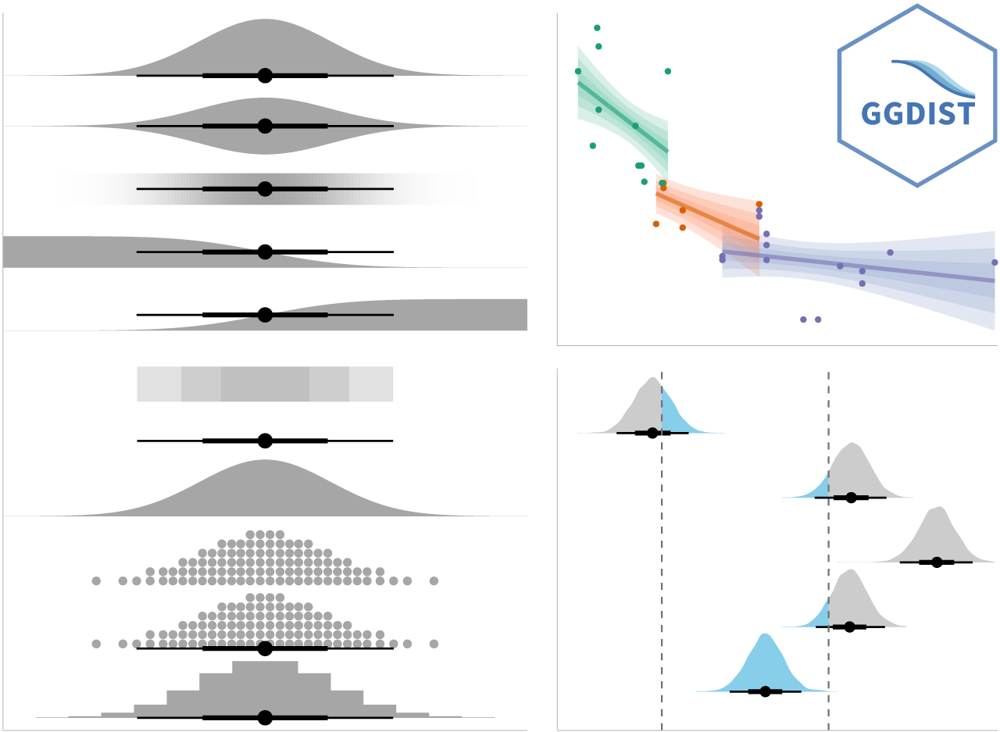

## Learning Outcome

Visualising uncertainty is a relatively recent development in statistical graphics. In this chapter, we learn how to create uncertainty visualisations, including error bars with **ggplot2**, interactive plots with **plotly** and **DT**, advanced graphics with **ggdist**, and hypothetical outcome plots (HOPs) using **ungeviz**.

**Assumption:**

All hypothesis tests in this exercise are conducted at the **5% significance level**, where the null hypothesis states that no significant difference or no relationship exists between the variables of interest.

## Getting Started

### Installing and Loading the Required Libraries

There are four packages that will be used in this exercise.

| Package | Description |
|----|----|
| [tidyverse](https://www.tidyverse.org/) | A collection of R packages for data importing, cleaning, transformation, and visualisation (e.g., [readr](https://readr.tidyverse.org/), dplyr, tidyr, [ggplot2](https://ggplot2.tidyverse.org/)). |
| [ggdist](https://mjskay.github.io/ggdist/) | An R package that extends ggplot2 with flexible geoms and stats for visualising distributions and uncertainty. |
| [gganimate](https://gganimate.com/) | The ggplot2 extension used to create animated statistical graphs. |
| [plotly](https://plotly.com/r/) | Creates interactive and publication-ready graphs. |
| [DT](https://rstudio.github.io/DT/) | Displays data frames as interactive HTML tables with sorting, filtering, and pagination. |
| [crosstalk](https://rstudio.github.io/crosstalk/index.html) | An extension of the **htmlwidgets** package that provides classes, functions, and conventions to enable cross-widget interactions, such as linked brushing and filtering, across multiple interactive widgets. |
| [colorspace](https://colorspace.r-forge.r-project.org/) | Provides tools for selecting, manipulating and applying colours and colour palettes in data visualisations. |
| [ggridges](https://cran.r-project.org/web/packages/ggridges/refman/ggridges.html) | A gglot extension that creates ridgeline plots to visualise the changes in distributions over time or space. |

The code below installs and loads the required packages into R environment.

```{r}
pacman::p_load(tidyverse, ggdist, gganimate, plotly, DT, crosstalk, colorspace, ggridges)
```

### Importing the Data

A CSV file containing the final exam results of 322 local Primary 3 students has been imported into the R environment by using function [`read_csv()`](https://readr.tidyverse.org/reference/read_delim.html) from [**readr**](https://readr.tidyverse.org/) package, one of tidyverse family. The dataset includes variables such as student ID, class, gender, race, and grades for English, Maths, and Science.

```{r}
exam <- read_csv("data/Exam_data.csv")
knitr::kable(head(exam), "html")
```

## Visualising the Uncertainty of Point Estimates: ggplot2 Methods

A point estimate is a single value, such as a mean, whereas uncertainty is expressed using measures like the standard error, confidence interval, or credible interval.

::: callout-important
Do not confuse the uncertainty of a point estimate with the variability in the sample.
:::

In this section, we will learn how to plot error bars for Maths scores by race using the `exam` tibble. First, the code chunk below is used to compute the required summary statistics.

```{r}
my_sum <- exam %>%
  group_by(RACE) %>%
  summarise(n= n(),             # compute the sample size for each race group
            mean = mean(MATHS), # calculate the mean Maths score for each group
            sd = sd(MATHS)) %>% # calculate the standard deviation
  mutate(se = sd/sqrt(n-1))     # compute the standard error of the mean
```

::: callout-tip
### Things to learn from the code chunk above

The `group_by()` function from **dplyr** groups observations by race, `summarise()` computes the sample size, mean, and standard deviation of Maths scores, and `mutate()` derives the standard error for each race group. The results are stored in a tibble called `my_sum`.
:::

::: callout-note
For the mathematical explanation, please refer to Slide 20 of Lesson 4.
:::

The table below displays **my_sum** tibble data frame in an html format.

```{r}
knitr::kable(head(my_sum), format = 'html')
```

### Plotting Standard Error Bars of Point Estimates

The chart below shows the standard error bars for mean Maths scores by race, using [`geom_errorbar()`](https://ggplot2.tidyverse.org/reference/geom_linerange.html) of **ggplot2** to display the error bars and [`geom_point()`](https://ggplot2.tidyverse.org/reference/geom_point.html) to plot the mean values.

Standard deviation describes **variability** in the data while standard error describes **precision** of the estimated mean.

```{r}
#| code-fold: true
#| code-summary: SHOW

offset <- 1.5

ggplot(my_sum) +
  geom_errorbar(                #draw error bars ( +- SE)
    aes(x = RACE,
        ymin = mean - se,
        ymax = mean + se),
    width = 0.2,
    colour = "black",
    alpha = 0.9,
    linewidth = 0.5) +
  geom_point(                  # plot mean points
    aes(x = RACE,
        y = mean),
    stat = "identity",
    colour = "red",
    size = 1.5,
    alpha = 1) +
  geom_text(                          #add mean values
    aes(x = RACE,
        y = mean,
        label = round(mean, 1)),
    hjust = -1,                        #move to the right or vjust
    colour = "blue",
    fontface = "bold",
    alpha = 0.8,
    size = 3) +
  geom_text(
    aes(x = RACE,
        y = mean + se + offset,
        label = round(mean + se, 1)),
    colour = "brown",
    size = 3) +
  geom_text(
    aes(x = RACE,
        y = mean - se - offset,
        label = round(mean - se, 1)),
    colour = "brown",
    size = 3)+
  ggtitle("Standard Error of Mean Maths Scores By Race") +
  coord_cartesian(ylim = c(0,100)) 
```

::: callout-tip
#### Things to learn from the code chunk above

-   The error bars are computed by using the formula mean+/-se.

-   In `geom_point()` `stat="identity"` means to use the data exactly as provided, which is default setting for the function. This is also default to `geom_line()` and `geom_errorbar()`, while `geom_bar()` has default `"Count"`.

-   A `geom_text()` layer is added to label each point of mean values on the plot.
:::

### Plotting Confidence Interval of Point Estimates

In this section we create a plot to show confidence intervals of mean maths score by race. CI shows uncertainty in the estimate of the population parameter and implies the plausible range of values for the true mean. That if we repeated the study many times, 95% of those intervals would contain the true mean.

The wider the confidence interval, the greater the uncertainty in the estimate of the population mean.

```{r}
#| code-fold: true
#| code-summary: SHOW
offset <- 2

ggplot(my_sum) +
  geom_errorbar(                #draw error bars ( +- CI)
    aes(x = RACE,
        ymin = mean - 1.96 * se,
        ymax = mean + 1.96 * se),
    width = 0.2,
    colour = "black",
    alpha = 0.9,
    linewidth = 0.5) +
  geom_point(                  # plot mean points
    aes(x = RACE,
        y = mean),
    stat = "identity",
    colour = "red",
    size = 1.5,
    alpha = 1) +
  geom_text(                          #add mean values
    aes(x = RACE,
        y = mean,
        label = round(mean, 1)),
    hjust = -1,                        #move to the right or vjust
    colour = "blue",
    fontface = "bold",
    alpha = 0.8,
    size = 3
  ) +
  geom_text(
    aes(x = RACE,
        y = mean + 1.96 * se + offset,
        label = paste("Upper CI:", round(mean + 1.96 * se, 1))),
    colour = "darkgreen",
    size = 3) +
  geom_text(
    aes(x = RACE,
        y = mean - 1.96 * se - offset,
        label = paste("Lower CI:", round(mean - 1.96 * se, 1))),
    colour = "darkgreen",
    size = 3)+
  ggtitle("95% Confidence Interval of Mean Maths Scores By Race") +
  coord_cartesian(ylim = c(0,100)) 
```

::: callout-tip
#### Things to learn from the code chunk above

-   The confidence intervals are computed by using the formula mean+/-1.96\*se.

-   The error bars is sorted by using the average maths scores.

-   labs() argument of ggplot2 is used to change the x-axis label.
:::

### Interactive Error Bars

Instead of using `geom_text()` to label the mean and confidence intervals, we create an interactive visualisation of the **99% confidence interval** for mean maths score by race by converting a `ggplot2` error-bar chart to an interactive plot with [`ggplotly()`](https://www.rdocumentation.org/packages/plotly/versions/4.11.0/topics/ggplotly) from the **plotly** package. We also present the corresponding summary statistics in an interactive table using [`datatable()`](https://rstudio.github.io/DT/) from the **DT** package, and combine the plot and table using [`bscols()`](https://www.rdocumentation.org/packages/crosstalk/versions/1.2.2/topics/bscols) from the **crosstalk** package.

The code is slightly amended so that the ggplotly output and the DT table are less cramped.

```{r}
#| code-fold: true
#| code-summary: SHOW

shared_df = SharedData$new(my_sum, key = ~RACE)

htmltools::tagList(
  htmltools::div(
    style = "margin-bottom: 20px;",
    ggplotly(
      ggplot(shared_df) +
        geom_errorbar(
          aes(
            x = reorder(RACE, -mean), # reorder race categories by descending mean score
            ymin = mean - 2.58 * se,
            ymax = mean + 2.58 * se),
          width = 0.2,
          colour = "black",
          alpha = 0.9,
          size = 0.5) +
        geom_point(
          aes(
            x = RACE,
            y = mean,
            text = paste(
              "Race:", RACE,
              "<br>N:", n,
              "<br>Avg. Scores:", round(mean, 2),
              "<br>99% CI:[",
              round(mean - 2.58 * se, 2), ",",
              round(mean + 2.58 * se, 2), "]")),
          stat = "identity",
          color = "red",
          size = 1.5,
          alpha = 1) +
        xlab("Race") +
        ylab("Average Scores") +
        theme_minimal() +
        theme(axis.text.x = element_text(  # rotate x-axis labels to avoid overlap
            angle = 45,
            vjust = 0.5,
            hjust = 1,
            size = 9 ),
          axis.text.y = element_text(size = 9),
          axis.title = element_text(size = 10),
          plot.title = element_text(size = 14, margin = margin(b = 10)),
          plot.margin = margin(5, 10, 5, 10)  # reduce plot margins
        ) +
        coord_cartesian(ylim = c(0,100)) +
        ggtitle("99% CI of Average Maths Scores by Race"),  
      tooltip = "text",
      height = 350)),
  
  htmltools::div(
    htmltools::tags$h3(
      "Statistic summary",
      style = "margin-bottom:5px; font-size: 14px;"  
    ),
    DT::datatable(
      shared_df,
      rownames = FALSE,
      class = "compact stripe hover",
      width = "100%",
      options = list(
        paging = FALSE,
        searching = FALSE,
        info = FALSE,
        dom = "t",
        scrollY = "200px"),
      colnames = c(
        "No. of Pupils",
        "Avg Scores",
        "Std Dev",
        "Std Error")) %>%
      formatRound(
        columns = c("mean", "sd", "se"),
        digits = 2))) 
```

::: callout-important
-   Error bars show the 99% confidence interval (z = 2.58).

-   `SharedData$new()`: `SharedData` is a class from the crosstalk package that enables linked interaction between HTML widgets such as plotly, DT, and leaflet. `SharedData$new()` creates a new **instance** of this class using the R6 object system, which supports reference based objects with mutable state. An R6 class allows objects to be modified without copying, unlike standard R objects that use copy on modify behaviour. The data frame is **wrapped** inside this crosstalk enabled container so it can be shared across multiple widgets for coordinated interaction.

-   `htmltools::div()` creates an HTML `<div>` container used to group and style UI elements, often with inline CSS such as margins or widths.

-   `htmltools::tagList()` combines multiple HTML or widget elements into a single UI object so they render together in order.

-   `htmltools::tags` provides helper functions like `tags$h3()` or `tags$p()` to generate standard HTML elements directly in R.

-   In `DT::datatable()`, `scrollY` sets a fixed vertical height for the table and enables vertical scrolling when the content exceeds that height.
:::

## Visualising Uncertainty: ggdist package

[**ggdist**](https://mjskay.github.io/ggdist/index.html) is an R package that provides ggplot2 based geoms and stats for visualising distributions and uncertainty. It supports both frequentist and Bayesian approaches by framing uncertainty as distribution visualisation, using confidence or bootstrap distributions for frequentist models and posterior distributions for Bayesian models, often via the **tidybayes** package.



### Basic Use of stat_pointinterval()

Next [`stat_pointinterval()`](https://mjskay.github.io/ggdist/reference/stat_pointinterval.html) from the **ggdist** package is used to visualise the distribution of maths scores by race.

```{r}
exam %>%
  ggplot(aes(x = RACE, y = MATHS)) +
  stat_pointinterval() +
   labs(
    title = "Visualising confidence intervals of mean math score",
    subtitle = "Mean Point + Multiple-interval plot") + 
  coord_cartesian(ylim = c(0,100))
```

::: callout-tip
#### Key argument

-   `geom`: controls the geometric object used to draw the statistic. The default `"pointinterval"` displays a point with an interval.

-   `point_interval`: determines how the point and interval are computed from the distribution, effectively equivalent to specifying `.point` and `.interval` together. Common options include `median_qi`, `mean_qi`, and `mode_qi`.

-   `.width`: sets the width of the uncertainty intervals. For example, `c(0.66, 0.95)` draws both 66% and 95% intervals.

-   `position`: specifies how the layer is positioned, typically `"identity"` unless jittering or dodging is required.

-   `orientation`: controls whether the statistic is drawn horizontally or vertically.

-   `na.rm`: indicates whether missing values should be removed before computation.

-   `inherit.aes`: determines whether aesthetics are inherited from the main ggplot call.
:::

### Visualising confidence intervals

For example, in the code chunk below the following arguments are used:

-   `.width = 0.95` draws a 95% uncertainty interval.
-   `.point = median` specifies the summary statistic used for the central point.
-   `.interval = qi` specifies the method used to compute the interval around the point.`qi` (quantile interval) defines an uncertainty interval using distribution quantiles that contain a specified proportion of the probability mass.

```{r}
exam %>%
  ggplot(aes(x = RACE, y = MATHS)) +
  stat_pointinterval(.width = 0.95, point_interval = median_qi) +
   labs(
    title = "Visualising confidence intervals of mean math score",
    subtitle = "Mean Point + 95% Confidence Interval") + 
  coord_cartesian(ylim = c(0,100))
```

::: callout-note
Makeover the plot on previous slide by showing 99% confidence intervals.
:::

```{r}
exam %>%
  ggplot(aes(x = RACE, y = MATHS)) +
  stat_pointinterval(.width = 0.99, point_interval = median_qi) +
   labs(
    title = "Visualising confidence intervals of mean math score",
    subtitle = "Mean Point + 99% Confidence Interval") +
  coord_cartesian(ylim = c(0,100))
```

### Gradient display by stat_gradientinterval()

[`stat_gradientinterval()`](https://mjskay.github.io/ggdist/reference/stat_gradientinterval.html) of ggdist is used to build a visual for displaying distribution of maths scores by race.

```{r}
#| code-fold: true
#| code-summary: SHOW
exam %>%
  ggplot(aes(x = RACE, 
             y = MATHS)) +
  stat_gradientinterval(   
    fill_type = "segments", fill = "lightblue",      
    show.legend = TRUE) +                        
  labs(
    title = "Visualising confidence intervals of mean math score",
    subtitle = "Gradient + interval plot")
```

::: callout-tip
`fill_type = "gradient"` displays uncertainty using a smooth colour gradient that represents the density of the distribution, requiring graphics device support for gradients.

`fill_type = "segments"` displays uncertainty using discrete line segments, ensuring compatibility when gradient rendering is not supported.
:::

## Visualising Uncertainty with Hypothetical Outcome Plots (HOPs)

**ungeviz** is an R package that extends ggplot2 with geoms and scales designed for visualising uncertainty and variation, especially through techniques like jittering, dot plots, and interval based displays.

### Installing and loading ungeviz package

First we install the [**ungeviz**](https://github.com/wilkelab/ungeviz) package from github then launch the application in R.

```{r}
devtools::install_github("wilkelab/ungeviz")
```

```{r}
library(ungeviz)
```

### Visualising Uncertainty

The code below creates an animated visualisation of a hypothetical outcome plot. In this setup, each frame represents a hypothetical outcome generated from the same data-generating process. In each frame, 25 observations per race are randomly resampled, and the orange horizontal bar shows the corresponding sample mean, drawn using `geom_hpline()` from the **ungeviz** package.

```{r}
#| eval: false
#| code-fold: true
#| code-summary: SHOW
p <- ggplot(
  data = exam,
  aes(x = factor(RACE),   # treat RACE as a categorical variable
    y = MATHS)) +
    geom_point(
    position = position_jitter(  #jitter to reduce overplotting
      height = 0.3,width = 0.05),
    size = 0.4,         # small point size for dense data
    color = "#0072B2",  # blue points
    alpha = 1/2) +
  geom_hpline(
    data = sampler(25,group = RACE),
    height = 0.6,       # thickness of the horizontal line slab
    color = "#D55E00") + 
  theme_bw() + 
  # animation
  transition_states(.draw,2,5) +#different random draws, transition length, pause length between states
  labs(title = "Hypothetical Outcome Plot for distribution of maths scores by race",
  subtitle = "Each frame shows a random sample of 25 observations per race")

animate(p)

```

```{r}
#| eval: false
#| echo: false
anim_save("Hop.gif", p)
```


::: callout-tip
-   The jittered points show the raw distribution of individual maths scores by race, reducing overlap so dense regions are visible.

-   `geom_hpline()` from ungeviz overlays distribution summaries based on repeated random sampling within each race group.

-   `sampler(25, group = RACE)` repeatedly resamples the data, allowing uncertainty and variability in the distribution to be visualised.

-   `transition_states(.draw, …)` animates these repeated samples, showing how the estimated distribution changes across draws rather than presenting a single fixed summary.
:::

## Reference

Kam, Tin Seong (2026). [11 Visualising Uncertainty](https://r4va.netlify.app/chap11) R for Visual Analytics.
