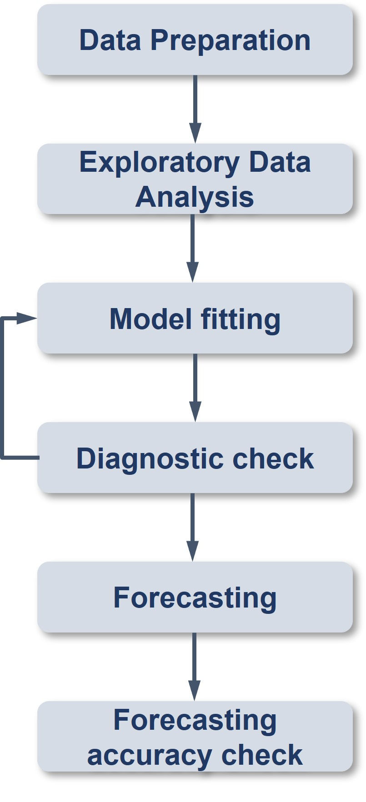

## Learning Outcome

[tidyverts](https://tidyverts.org/) is a collection of R packages built for working with time series data (data recorded over time, such as monthly sales, daily temperature, or yearly population). It follows the same design style as the tidyverse, so if users already know packages like dplyr and ggplot2, it will feel familiar.

The tidyverts ecosystem was created by Professor [**Rob Hyndman**](https://tidyverts.org/) from Monash University and his research team. It is meant to replace the previous version and widely used [**forecast**](https://pkg.robjhyndman.com/forecast/) package, using more modern and consistent tools. The project is still actively being improved.

The main learning resource is the book Forecasting: [Principles and Practice (3rd Edition)](https://otexts.com/fpp3/) by Hyndman and Athanasopoulos.Studying it alongside practical exercises greatly improved my understanding of the concepts during my final project in the Data Analytics Lab course.

After completing this session, we should learn to:

• import and clean time series data using tidyverse style tools 

• explore and visualise patterns in time series data 

• build forecasting models using methods such as exponential smoothing and ARIMA

• compare different models and decide which one predicts best

**Assumption:**

All hypothesis tests in this exercise are conducted at the **5% significance level**, where the null hypothesis states that no significant difference or no relationship exists between the variables of interest.

## Getting Started

### Installing and Loading the Required Libraries

There are **5** packages that will be used in this exercise.

| Package | Description |
|------------------------------------|------------------------------------|
| [tidyverse](https://www.tidyverse.org/) | A collection of R packages for data importing, cleaning, transformation, and visualisation (e.g., [readr](https://readr.tidyverse.org/), dplyr, tidyr, [ggplot2](https://ggplot2.tidyverse.org/)). |
| [tsibble](https://tsibble.tidyverts.org/) | Provides a data structure for tidy time series data together with tools for data wrangling. |
| [knitr](https://cran.r-project.org/web/packages/knitr/index.html/) | Provides a general-purpose tool for dynamic report generation in R using Literate Programming techniques. |
| [feasts](https://feasts.tidyverts.org/) | The R package for time series analysis. The name stands for Feature Extraction And Statistics for Time Series. It works with **tsibble** data and provides tools for feature extraction, decomposition, statistical summaries, and visualisation, and integrates with the tidy forecasting workflow in the **fable** package. |
| [lubridate](https://cran.r-project.org/web/packages/lubridate/index.html) | A Tidyverse package that handles date-time objects |
| [seasonal](https://cran.r-project.org/web/packages/seasonal/vignettes/seas.pdf) | An R interface to X 13 ARIMA SEATS, the seasonal adjustment software developed by the US Census Bureau. |
| [ggthemes](https://cran.r-project.org/web/packages/ggthemes/index.html) | Provides 'ggplot2' themes and scales that replicate some of the famous looks. |
| [fable](https://fable.tidyverts.org/) | Provides a collection of commonly used univariate and multivariate time series forecasting models (e.g exponential smoothing and automatic ARIMA), equivalent to **forecast** package |
| [fabletools](https://fabletools.tidyverts.org/) | Extends fable package that allows users to create ingeratable additonal time series models |
| [readxl](https://cran.r-project.org/web/packages/readxl/readxl.pdf) | Imports excel files into R. |

The code below installs and loads the required packages into R environment.

```{r}
pacman::p_load(tidyverse, tsibble,readxl, feasts, fable, seasonal, ggthemes,knitr, fabletools)
```

### Importing the Data

For this hands-on exercise, the **visitor_arrivals_by_air.csv** file will be used. It contains time series records of visitor arrivals by air across selective countries from 2000 to 2019.

We use `read_excel()` from the **readxl** package to import the dataset into the R environment as a tibble named `ts_data`. We then preview the dataset using `kable()` and `str()`.

```{r}
ts_data <- read_excel("data/visitor_arrivals_by_air.xlsx")
kable(head(ts_data), "html")
```

The dataset contains 2 types of data: visit counts across 35 countries, and one "Month-Year" column in **POSIXct** format.

```{r}
str(ts_data)
```

We convert the "Month-Year" variable to *Date* class to ensure consistency, as POSIXct objects internally store date and time values, even when only the date component is displayed.

```{r}
ts_data$`Month-Year` <- ymd(ts_data$`Month-Year`)
```

```{r}
class(ts_data$`Month-Year`)
```

### Conventional Base `ts` Object versus `tibble` Object

The `ts_data` table is currently a tibble. We convert it to a **tsibble** to define a proper time index and enable time series analysis using tidyverts functions (for example, modelling in `fable` and feature extraction in `feasts`).

It is important to note that `ts()` creates a base R time series object and is primarily used with the **forecast** package. It does not integrate with the **tidyverts** workflow, which requires a `tsibble` object instead.

```{r}
class(ts_data)
```

```{r}
ts_data_ts <- ts(ts_data)
class(ts_data_ts)
class(ts_data_ts[,"Canada"])
```

```{r}
glimpse(ts_data_ts)
```

In a `ts` object, dates are not stored directly but inferred from an internal time index. As a result, time points have no row names, and the "Month-Year" information is represented numerically rather than as an actual date column.

### Converting `tibble` Object to `tsibble` Object

A **tsibble** is an extension of a tibble designed for time series data. Unlike traditional R time series objects such as `ts`, `zoo`, and `xts`, it keeps the time variable as a normal column and allows multiple series to be stored in one table.

It also uses a **key** (one or more variables) to identify each series across time.

The code chunk below converts `ts_data` from a tibble into a `tsibble` using the [`as_tsibble()`](https://tsibble.tidyverts.org/reference/as-tibble.html) function from the **tsibble** package.

```{r}
ts_tsibble <- ts_data %>%
  mutate(`Year-Month` = yearmonth(`Month-Year`)) %>%
  relocate(`Year-Month`, .before = 1) %>%
  select(-`Month-Year`) %>%
  as_tsibble(index = `Year-Month`)
```

::: callout-tip
-   `mutate()` from the **dplyr** package is used to create a new variable by transforming the values in the "Month-Year" column into a proper month year format. This conversion is done using [`yearmonth()`](https://tsibble.tidyverts.org/reference/year-month.html) from the **tsibble** package.

-   `as_tsibble` is then used to convert the `tibble` `data.frame` into a `tsibble` by defining the time index so we can use it for time series analysis.
:::

```{r}
ts_tsibble
```

```{r}
class(ts_tsibble$`Year-Month`)
is_yearmonth(ts_tsibble$`Year-Month`)
```

A new **Month-Year** variable is derived from the original *Month-Year* field and converted into a `yearmonth` object, allowing it to serve as the time index for the `tsibble`.

## Visualising Time-series Data

The original dataset is a very wide table containing many columns, each representing a different country. To perform time series analysis, the data is reshaped from wide to long format using a pivot operation. Each row now represents a country, a specific time point, and the corresponding vistor arrival count.

```{r}
ts_longer <- ts_data %>%
  pivot_longer(cols = c(2:36),
               names_to = "Country",
               values_to = "Arrival")
```

### Visualising Single Time-series: ggplot2 Methods

The [`filter()`](https://dplyr.tidyverse.org/reference/filter.html) function from **dplyr** is used to extract observations for Vietam from the long format dataset. The resulting data is visualised with `ggplot2` using a line chart [geom_line()](https://ggplot2.tidyverse.org/reference/geom_path.html) to show how visitor arrivals change over time. High arrivals every July every year.

```{r}
ts_longer %>%
  filter(Country == "Vietnam") %>%
  ggplot(aes(x = `Month-Year`, y = `Arrival`)) +
  geom_line(linewidth = 0.5)
```

### Plotting Multiple Time-series Data with ggplot2 Methods

The code below produces a multiple line chart showing monthly visitor arrivals over time for different countries. Each coloured line represents the trend for one country.

The legend is enabled and positioned at the bottom of the chart for clearer presentation.

```{r, fig.height=12,fig.width=12}
ggplot(data = ts_longer, aes(x = `Month-Year`, y = Arrival, color = Country)) +
  geom_line(linewidth = 0.5) + 
  theme(legend.position = "bottom", legend.box.spacing = unit(0.5, "cm"))
```

The code creates a set of line charts showing monthly visitor arrivals over time for each country. The `facet_wrap()` function separates the plot into small panels by country, with five panels per row to present the data neatly. The `scales = "free_y"` option allows each country to have its own vertical scale so patterns are easier to see. The `theme_bw()` function applies a clean black and white theme for better readability.

```{r, fig.height=12,fig.width=14}
ggplot(ts_longer, aes(x=`Month-Year`, y = Arrival)) +
  geom_line(linewidth = 0.5) +
  facet_wrap(~Country, ncol = 5, scales = "free_y") +
  theme_bw()
```

## Visual Analysis of Time-series Data

Seasonality refers to a pattern that repeats a regular intervals such as monthly or yearly cycles. These repeating movements can influence a time series, and if not account for, may introduce noise that affects model fitting and forecasting accuracy. In this session we learn how to detect seasonality in time series data using functions from the **feasts** package. Before applying these functions, the data set needs to be organised into suitable structure. Specifically we prepare the data as a `tsibble` which is required data format for **tidyverts** tools. Because **tidyverts**follows tidyverse style conventions, we can use **tidyr** function such as `pivot_longer()` to reshape data into long format before converting it into a tsibble for analysis.

```{r}
tsibble_longer <- ts_tsibble %>%
  pivot_longer(-`Year-Month`, names_to = "Country", values_to = "Arrivals")
```

### Visual Analysis of Seasonality with Seasonal Plot

A seasonal plot is similar to a time plot, but the observations are arranged by season (for example, month) rather than chronological order. This helps reveal repeating patterns within each year. The plot is created using the `gg_season()` function from the feasts package. In this example, the data for Italy, Vietnam, the United Kingdom, and Germany are selected to compare their seasonal visitor arrival patterns. Visitor arrivals from Germany and the United Kingdom tend to peak in March, while Italy peaks in August and Vietnam peaks in July annually.

```{r, fig.height=12,fig.width=10}
tsibble_longer%>%
  filter(Country == "Italy" | Country == "Vietnam" | Country == "United Kingdom"| Country == "Germany")%>%
  gg_season(Arrivals)
```

Here we create time plot chart using `autoplot()` from tidyverts.

```{r, fig.height=6,fig.width=8}
tsibble_longer %>%
  filter(Country %in% c("Italy","Vietnam","United Kingdom","Germany")) %>%
  autoplot(Arrivals)
```

We can also achieve the similar charts using ggplot2.

```{r}
tsibble_longer %>%
  filter(Country %in% c("Italy","Vietnam","United Kingdom","Germany")) %>%
  ggplot(aes(x = `Year-Month`, y = Arrivals, colour = Country)) +
  geom_line()
```

The [`gg_subseries()`](https://rdrr.io/cran/ggtime/man/gg_subseries.html) function from the **feasts** package is used to visualise monthly visitor arrivals. The plot groups observations by month and hows how arrivals in each month vary across different years. In this example, data for Vietnam and Italy are selected for comparison.

```{r, fig.height=8,fig.width=12}
tsibble_longer %>%
  filter(Country == "Vietnam" |
         Country == "Italy") %>% 
  gg_subseries(Arrivals)
```

## Time Series Decomposition

Time series decomposition allows us to isolate structural components such as trend and seasonality from the time-series data.

-   Trend shows the long term direction (for example, tourism gradually increasing over years)
-   Seasonality shows predictable cycles (for example, peaks during holidays or summer months)
-   Remainder/noise shows irregular random variation

If we don't isolate them seasonal peak might be mistaken for real growth, random noise may destroy distort modern fitting, forecasting models may over or under predict. So isolating these components helps us interpret the behaviour series more clearly and improve forecasting accuracy.


In ARIMA modelling:
- **AR (autoregressive) terms (p)** are identified using the PACF.
- **MA (moving average) terms (q)** are identified using the ACF.
- **d** represents the number of non seasonal differences required to remove the trend; the first difference measures the change from one month to the next.

-For seasonal time series, we include both non seasonal **(p, d, q)** and seasonal **(P, D, Q)** components in the model.


### Single Time Series Decomposition

In feasts package, time series decomposition is supported by (Partial) Autocorrelation and Cross-Correlation Function Estimation [ACF()](https://feasts.tidyverts.org/reference/ACF.html), PACF(), CCF(), Autocorrelation-based features [feat_acf()](https://feasts.tidyverts.org/reference/feat_acf.html), and Autocorrelation-based features [feat_pacf()](https://feasts.tidyverts.org/reference/feat_acf.html). The output can then be plotted by using `autoplot()` of feasts package.

In the code chunk below, `ACF()` and `PACF()` of feasts package is used to plot the ACF and PACF curve of visitor arrival from Vietnam.

```{r, fig.height=4,fig.width=8}
tsibble_longer %>%
  filter(`Country` == "Vietnam") %>%
  ACF(Arrivals) %>% 
  autoplot()

tsibble_longer %>%
  filter(`Country` == "Vietnam") %>%
  PACF(Arrivals) %>% 
  autoplot()

```

`feat_acf()` and `feat_pacf()` provide summary statistics of autocorrelation and partial autocorrelation.

The Vietnam visitor arrival series exhibits strong persistence and clear annual seasonality. The high lag 1 autocorrelation indicates non stationarity, while first differencing substantially reduces dependence, suggesting a first order difference is sufficient. The strong seasonal autocorrelation confirms repeating yearly patterns, which should be incorporated into the forecasting model (for example, seasonal ARIMA).

While `feat_acf` tells about overall dependence, PACF helps identify the AR (autoregressive) behaviour of the series.The very high PACF5 value indicates strong autoregressive behaviour,that current arrivals depend directly on recent past arrivals.After first differencing, the PACF remains strong but stabilised. This supports ARIMA(p,1,q) rather than a simple random walk.`season_pacf` measures direct dependence with the same month last year. PACF shows no direct seasonal lag relationship while ACF showed strong seasonality.

```{r}
tsibble_longer %>%
  filter(Country == "Vietnam") %>%
  features(Arrivals, feat_acf)

tsibble_longer %>%
  filter(Country == "Vietnam") %>%
  features(Arrivals, feat_pacf)
```


Cross-correlation CCF() compares data for Germany with United Kingdom.

`autoplot()` visualises the `CCF()` results and we save the summary statistics in a tbl_cf caled `ccf_germany_uk`.

```{r}
tsibble_longer %>%
  filter(Country == "Germany"| Country == "United Kingdom") %>%
  select(`Year-Month`, Country, Arrivals) %>%
  pivot_wider(names_from = Country, values_from = Arrivals) %>%
  CCF(Germany,`United Kingdom`) %>%
  autoplot()
```

```{r}
ccf_germany_uk <- tsibble_longer %>%
  filter(Country == "Germany"| Country == "United Kingdom") %>%
  select(`Year-Month`, Country, Arrivals) %>%
  pivot_wider(names_from = Country, values_from = Arrivals) %>%
  CCF(Germany,`United Kingdom`)
```


- Lag 0M = 0.64: Germany and United Kingdom visitor arrivals have a strong positive correlation in the same month.

- Lag 12M = 0.535: Germany this month is positively correlated with UK arrivals 12 months later.

- Lag −12M = 0.502: UK this month is positively correlated with Germany arrivals 12 months later.


```{r}
# maximum correlation
ccf_germany_uk %>%
  filter(abs(ccf) == max(abs(ccf)))
# correlation at lag 0 (same month)
ccf_germany_uk %>%
  filter(lag == 0)
# check yearly seasonality
ccf_germany_uk %>%
  filter(lag == 12 | lag == -12)
```


### Multiple Time-series Decomposition


The code chunk below are used to prepare a trellis plot of ACFs & PACFs for visitor arrivals from Vietnam, Italy, United Kingdom and China.


```{r}
tsibble_longer %>%
  filter(`Country` == "Vietnam" |
         `Country` == "Italy" |
         `Country` == "United Kingdom" |
         `Country` == "China") %>%
  ACF(Arrivals) %>%
  autoplot()
```


```{r}
tsibble_longer %>%
  filter(`Country` == "Vietnam" |
         `Country` == "Italy" |
         `Country` == "United Kingdom" |
         `Country` == "China") %>%
  PACF(Arrivals) %>%
  autoplot()
```


### Composite Plot of Time Series Decomposition (VERY Convenient)

One useful function in the **feasts** package for time series analysis is [`gg_tsdisplay()`](https://feasts.tidyverts.org/reference/reexports.html). It produces a composite display with the original time series plot in the top panel, the ACF plot in the bottom left panel, and a seasonal plot in the bottom right panel.


```{r, fig.height= 10, fig.width=12}
tsibble_longer %>%
  filter(`Country` == "Vietnam") %>%
  gg_tsdisplay(Arrivals)
```

## Visual STL Diagnostics


**STL (Seasonal and Trend decomposition using Loess)** is a time series decomposition method developed by Cleveland et al. (1990). It uses LOESS smoothing (locally weighted regression) to separate a time series into three components: **trend**, **seasonal**, and **remainder (irregular noise)**.

The algorithm works iteratively. In the inner loop, it estimates the seasonal component and then the trend component. In the outer loop, it reduces the influence of outliers. The remainder is obtained after removing both the trend and seasonal parts from the original series.

**Advantages of STL:**

- Works with any seasonal frequency, not only monthly or quarterly data

- Seasonal patterns can change over time

- Trend smoothness can be controlled by the user

- Robust to outliers, which mainly affect only the remainder component


### Visual STL Diagnostics with feasts

In the code chunk below, [`STL(`)](https://feasts.tidyverts.org/reference/STL.html) of feasts package is used to decomposite visitor arrivals from Vietnam data.

```{r, fig.height= 10, fig.width=12}
tsibble_longer %>%
  filter(`Country` == "Vietnam") %>%
  model(stl = STL(Arrivals)) %>%
  components() %>%
  autoplot()
```

 The grey bars on the left of each panel help compare how much variation each component has. The bars are drawn with the same length, but they appear different sizes because each panel uses a different scale. The large grey bar in the bottom panel indicates that the remainder component varies much less than the original data. If all panels were shown on the same scale, the bottom three panels would appear much smaller than the data panel. It means most of the movement in the time series comes from the trend and seasonal patterns, not from random noise.


### Classical Decomposition with feasts

In the code chunk below, `classical_decomposition()` from the **feasts** package is used to decompose the time series into seasonal, trend, and irregular components using moving averages. The method supports both additive and multiplicative seasonality. In an additive model, the seasonal effect is constant over time, while in a multiplicative model the seasonal effect changes in proportion to the level of the series.

Classical decomposition assumes the seasonal pattern is fixed (for example, January behaves similarly every year) and works best when the seasonal cycle is stable. However, it is sensitive to outliers and missing values. For instance, the warning “Removed 24 rows containing missing values or values outside the scale range (`geom_line()`)” occurs because the moving average calculation cannot be computed at the beginning and end of the series, resulting in missing observations in the decomposition plot.

STL is more accurate and robust and compatible with ARIMA/ETS modelling workflows.


```{r, fig.height= 10, fig.width=12}
tsibble_longer %>%
  filter(`Country` == "Vietnam") %>%
  model(
    classical_decomposition(
      Arrivals, type = "additive")) %>%
  components() %>%
  autoplot()
```


##  Visual Forecasting

In this section, we learn how to use **fable** and **fabletools** from [**tidyverts**](https://tidyverts.org/) family to build the forecasting models.

Here is the workflow:


### Time Series Data Sampling

 In forecasting, it is standard practice to divide the dataset into a training set and a hold out set. The training set (estimation sample) is used to fit the model and estimate its parameters, and usually includes about 75 to 80 percent of the observations, although a smaller share may be used for longer series.

The remaining observations form the hold out set, which is reserved for evaluating forecast performance. After the model is fitted on the training data, its forecasts are compared with these unseen observations to assess how well it predicts new values.


In this example, the last 12 months of observations are reserved as the hold out sample, while the remaining data are used for training.

First, an additional column named `Type` is created using the `mutate()` function from the **dplyr** package to label each observation as either training or hold out. This will be useful for subsequent data visualisation.


```{r}
vietnam_ts <- tsibble_longer %>%
  filter(Country == "Vietnam") %>%
  mutate(Type = if_else(`Year-Month`>= yearmonth("2019 Jan"), "Hold-out", "Training"))
```


Next, a training data set is extracted from the original data set by using `filter()` of **dplyr** package.

```{r}
vietnam_train <- vietnam_ts %>%
  filter(`Year-Month` < yearmonth("2019 Jan"))
```


### Exploratory Data Analysis (EDA): Time Series Data

Before fitting forecasting models, it is a good practice to analysis the time series data by using EDA methods.
The `season_year` plot reveals a seasonal pattern that repeats every 12 months with consistent peaks and troughs occurring at the same months each year. This indicates strong annual seasonality in visitor arrivals. Arrivals looks messy because trend and seasonality mixed together. Trend shows long term growth in tourism. Remainder part is small.

```{r}
vietnam_train %>%
  model(stl = STL(Arrivals)) %>%
  components() %>%
  autoplot()
```


### Fitting Forecasting Models

####  Fitting Exponential Smoothing State Space (ETS) Models: fable methods


In fable, [`ETS()`](https://fable.tidyverts.org/reference/ETS.html) is used to build Exponential Smoothing State Space Models. The sample formula is below:

```{r}
#| eval: false

ETS(y ~ error(c("A", "M"))  
    + trend(c("N", "A", "Ad")) 
    + season(c("N", "A", "M")) 
```


#### Fitting a simple exponential smoothing (SES)


SES assumes upward trend and strong yearly seasonality neither exists. This model is intentionally a very simple baseline model as naive/simple benchmark for comparison.

```{r}
fit_ses <- vietnam_train %>%
  model(ETS(Arrivals ~ error("A") # error("A") Additive errors
            + trend("N")  #trend("N") No trend
            + season("N"))) # season("N") No seasonality
fit_ses
```

#### Examine Model Assumptions

`gg_tsresiduals()` from feasts package is used to check the model assumptions with residuals plots.

```{r}
gg_tsresiduals(fit_ses)
```

#### The model Details

We use [`report()`](https://fabletools.tidyverts.org/reference/report.html) of **fabletools** reveal the model details.

```{r}
fit_ses%>% report()
```

### Fitting ETS Methods with Trend: Holt’s Linear

##### Trend methods

```{r}
vietnam_H <- vietnam_train %>%
  model(`Holt's method` = 
          ETS(Arrivals ~ error("A") +
                trend("A") + 
                season("N")))
vietnam_H %>% report()
```
#### Damped trend methods

```{r}
vietnam_HAd <- vietnam_train %>%
  model(`Holt's method` = 
          ETS(Arrivals ~ error("A") +
                trend("Ad") + 
                season("N")))
vietnam_HAd %>% report()
```

#### Checking for results

Check the model assumptions with residuals plots.

```{r}
gg_tsresiduals(vietnam_H)
gg_tsresiduals(vietnam_HAd)
```
### Fitting ETS Methods with Season: Holt-Winters


```{r}
Vietnam_WH <- vietnam_train %>%
  model(
    Additive = ETS(Arrivals ~ error("A") 
                   + trend("A") 
                   + season("A")),
    Multiplicative = ETS(Arrivals ~ error("M") 
                         + trend("A") 
                         + season("M"))
    )

Vietnam_WH %>% report()
```

###  Fitting multiple ETS Models

```{r}
fit_ETS <- vietnam_train %>%
  model(`SES` = ETS(Arrivals ~ error("A") + 
                      trend("N") + 
                      season("N")),
        `Holt`= ETS(Arrivals ~ error("A") +
                      trend("A") +
                      season("N")),
        `damped Holt` = 
          ETS(Arrivals ~ error("A") +
                trend("Ad") + 
                season("N")),
        `WH_A` = ETS(
          Arrivals ~ error("A") + 
            trend("A") + 
            season("A")),
        `WH_M` = ETS(Arrivals ~ error("M") 
                         + trend("A") 
                         + season("M"))
  )
```

### The model Coefficient

[`tidy()`](https://github.com/tidyverts/fabletools) of fabletools is be used to extract model coefficients from a mable.

```{r}
fit_ETS %>%
  tidy()
```

### Step 4: Model Comparison

glance() of fabletool

```{r}
fit_ETS %>%
  glance()
```

### Step 5: Forecasting Future Values

To forecast the future values, `forecast()` of fable will be used. Notice that the forecast period is 12 months.

```{r}
fit_ETS %>%
  forecast(h = "12 months") %>%
  autoplot(vietnam_ts, 
           level = NULL)
```
### Fitting ETS Automatically

```{r}
fit_autoETS <- vietnam_train %>%
  model(ETS(Arrivals))
fit_autoETS %>% report()
```

### Fitting Fitting ETS Automatically

Next, we will check the model assumptions with residuals plots by using gg_tsresiduals() of feasts package

```{r}
gg_tsresiduals(fit_autoETS)
```
### Forecast the Future Values

In the code chunk below, forecast() of fable package is used to forecast the future values. Then, autoplot() of feasts package is used to see the training data along with the forecast values.

```{r}
fit_autoETS %>%
  forecast(h = "12 months") %>%
  autoplot(vietnam_train)
```
### Visualising AutoETS model with ggplot2

There are time that we are interested to visualise relationship between training data and fit data and forecasted values versus the hold-out data.


```{r}
fc_autoETS <- fit_autoETS %>%
  forecast(h = "12 months")

vietnam_ts %>%
  ggplot(aes(x=`Year-Month`, 
             y=Arrivals)) +
  autolayer(fc_autoETS, 
            alpha = 0.6) +
  geom_line(aes(
    color = Type), 
    alpha = 0.8) + 
  geom_line(aes(
    y = .mean, 
    colour = "Forecast"), 
    data = fc_autoETS) +
  geom_line(aes(
    y = .fitted, 
    colour = "Fitted"), 
    data = augment(fit_autoETS))
```

## AutoRegressive Integrated Moving Average(ARIMA) Methods for Time Series Forecasting: fable (tidyverts) methods

### Visualising Autocorrelations: feasts methods

**feasts** package provides a very handy function for visualising ACF and PACF of a time series called `gg_tsdiaply()`.

```{r}
vietnam_train %>%
  gg_tsdisplay(plot_type='partial')
```


## NOTE

We can begin with horizon plot (ggHoriPlot), time plot, seasonal plot and STL decomposition, ACF and PACF from **feasts** for time series EDA, After exploratory analysis, we conduct clustering to group CPI components by behaviour (seasonal, trendy, and volatile). Then confirmatory analysis is conducted to statistically validate the observed patterns.

Next, we start modelling with **fable** and then extend to **fable.prophet**. Prophet can be viewed as a hybrid approach: it incorporates automated and flexible modelling techniques that resemble machine learning, but it is still fundamentally a regression based time series model rather than a pure machine learning algorithm. After that, we can further extend to machine learning workflows using **timetk** and **modeltime** as a benchmark for verification and confirmation of the forecasting results. In the take-home exercise, we will focus on exploring these methods first, and then design the dashboard. For the dashboard, we can use **tsibblecrosstalk** to build coordinated views across plots and tables, which enhances interactivity and supports clearer visual comparisons.

**EDA**

1. horizon plot

2. time plot

3. seasonal plot

4. STL decomposition

5. ACF/PACF plots (initial diagnosis of trend and seasonality) (ACF() and FACF() + autoplot, feat_acf() and feat_pacf())


**Clustering**

1. feature based clustering (feasts)


**CDA (confirmation)**

1. seasonal strength test SARIMA, feat_stl()

2. ARIMA seasonal terms

3. regression & ANOVA across components


**Forecasting**

1. fable ((ETS / ARIMA / SARIMA))

2. fable.prophet (hybrid)

3. timetk + modeltime (ML benchmark)

Dashboard 

1. tsibblecrosstalk coordinated views


## Reference

Kam, Tin Seong (2026), 19 Visualising, Analysing and Forecasting Time-series Data: tidyverts methods, https://r4va.netlify.app/chap19


