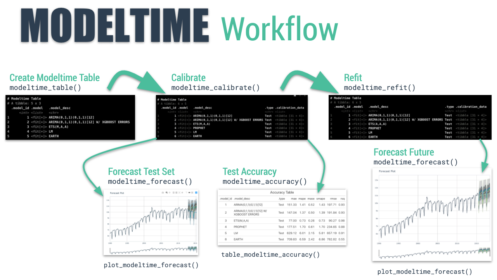

## Learning Outcome

This hands-on Excerise introduces how to work with time series data using the **timetk** and **modeltime** ecosystems.

**timetk** offers tools for preparing, exploring, and visualising time series datasets, while **modeltime** focuses on forecasting. It supports both traditional statistical approaches and modern machine learning techniques, including deep learning and nested forecasting workflows.

The material applies a **tidymodels-based workflow** to time series forecasting.

We will learn to:

- import and tidy time series datasets using suitable tidyverse workflows
- explore, visualise, and interpret time-based patterns
- train and calibrate forecasting models with exponential smoothing and ARIMA methods
- compare models and assess forecasting accuracy to select the most reliable approach


**Assumption:**

All hypothesis tests in this exercise are conducted at the **5% significance level**, where the null hypothesis states that no significant difference or no relationship exists between the variables of interest.


## Setting Up R Environment

There are **5** packages that will be used in this exercise.

| Package | Description |
|------------------------------------|------------------------------------|
| [tidyverse](https://www.tidyverse.org/) | A collection of R packages for data importing, cleaning, transformation, and visualisation (e.g., [readr](https://readr.tidyverse.org/), dplyr, tidyr, [ggplot2](https://ggplot2.tidyverse.org/)). |
| [tidymodels](https://www.tidymodels.org/) | A unified modelling framework for machine learning in R |
| [timetk](https://github.com/business-science/timetk) | A cutting-edge toolkit for time series preparation and exploration. |
| [modeltime](https://business-science.github.io/modeltime/index.html) | A new forecasting framework that simplifies the full workflow of building time series models (such as ARIMA, exponential smoothing, and machine learning models) |
| [lubridate](https://cran.r-project.org/web/packages/lubridate/index.html) | A Tidyverse package that handles date-time objects |
| [ggthemes](https://cran.r-project.org/web/packages/ggthemes/index.html) | Provides 'ggplot2' themes and scales that replicate some of the famous looks. |

The code below installs and loads the required packages into R environment.


```{r}
pacman::p_load(tidyverse, tidymodels,modeltime, timetk, lubridate, ggthemes, knitr)
```


## Introducing Modeltime Workflow

The figure below illustrates the Modeltime workflow after the initial models have been trained. It shows the process of organising models into a model table, calibrating them using test data, and then refitting the selected models on the full dataset to produce final forecasts.




## The Data


In this sharing session, we will use the Kaggle competition [*Store Sales – Time Series Forecasting*](https://www.kaggle.com/competitions/store-sales-time-series-forecasting/overview), which aims to predict grocery sales using machine learning techniques. For this sharing, the primary dataset used is **train.csv**, which contains six columns:

1. **id**: A unique identifier for each record.
2. **date**: The date of the sales transaction.
3. **store_nbr**: The store number where the products were sold.
4. **family**: The product family (type of product) sold.
5. **sales**: Total sales for a product family at a specific store on a given date. Fractional values are possible because some products can be sold in fractional units (for example, 1.5 kg of cheese rather than one packaged item).
6. **onpromotion**: The number of items in a product family that were on promotion at a particular store on a given date.

We will focus on **grocery sales** rather than all product families. The code chunk below filters grocery-related records from **train.csv** and saves the resulting dataset as an **.rds** file for subsequent analysis.


```{r}
store_sales <- read_csv("data/store_sales/train.csv")
```


```{r}
summary(store_sales)
```


```{r}
store_sales <- store_sales%>%
  filter(family == "GROCERY I") %>%
  write_rds("data/store_sales/grocery.rds")
```

```{r}
str(store_sales)
```
The dataset records are reduced from 3000888 to 90936 after the extraction.


## Time Series Forecasting Process

- Collect data and split into training and test sets
- Create & Fit Multiple Models
- Add fitted models to a Model Table
- Calibrate the models to a testing set.
- Perform Testing Set Forecast & Accuracy Evaluation
- Refit the models to Full Dataset & Forecast Forward


### Step 1: Data Import and Sampling


In the code chunk below, `read_rds()` from the **readr** package is used to load the saved `.rds` file into the R environment. The variables *id*, *store_nbr*, and *family* are then converted into factors instead of numeric values. Next, the data is grouped by *family* and *date*, and the total sales for each product family on each date are calculated. After the summarisation step, the data is ungrouped.

During execution, R prints the message **“summarise() has grouped output by 'family'”**. This occurs because when `summarise()` is applied to a dataset grouped by multiple variables, dplyr removes only the last grouping variable (in this case *date*) and keeps the remaining grouping variable (*family*). Therefore, the resulting dataset is still grouped by *family*, and R displays this message to inform the user that grouping has not been completely removed.

We then apply `ungroup()` to remove the remaining grouping structure. This is necessary because subsequent operations, such as mutations, lags, or time series modelling, may otherwise be calculated separately within each family group, which can lead to unintended behaviour or incorrect results. Ungrouping ensures the dataset returns to a standard tibble format so later analysis and forecasting procedures work as expected.

```{r}
grocery <- read_rds(
  "data/store_sales/grocery.rds") %>%
  mutate(across(c(1, 3, 4), as.factor)) %>%
  group_by(family, date) %>%
  summarise(sum_sales = sum(sales)) %>%
  ungroup()
```
We can also import the rest of the data sets provided at Kaggle by using the code chunk below.

```{r}
holidays_events <- read_csv(
  "data/store_sales/holidays_events.csv")
oil <- read_csv(
  "data/store_sales/oil.csv")
stores <- read_csv(
  "data/store_sales/stores.csv")
transactions <- read_csv(
  "data/store_sales/transactions.csv")
```

```{r}
summary(grocery)
```

```{r}
difftime(max(grocery$date), min(grocery$date), unit = "days")
```
The code below use [`plot_time_series()`](https://business-science.github.io/timetk/reference/plot_time_series.html) from **timetk** to visualise the time series plot for grocery sales.

```{r}
grocery %>%
  plot_time_series(
    date,
    sum_sales,
    .interactive = FALSE, 
    .line_size = 0.5  
  )
```


grocery tibble data frame consists of 1684 days of daily sales data starts from 1st January 2013 to 15 August 2018. We will split the data set into training and hold-out data sets by using [`initial_time_split()`](https://rsample.tidymodels.org/reference/initial_split.html) of **rsample** package, a member of the tidymodels family.


```{r}
splits <- grocery %>%
  initial_time_split(prop = 0.955)
training <- training(splits)
holdout <- testing(splits)
```


- prop: the proportion of traing data for modeling/analysis. Here we have about 95.5% 1608 days for training and 76 days for testing. 

- *splits* is an `rsplit` object that stores row indices.

- `training()` and `testing()` from **rsample** are used to retrieve the spliting results from the *splits* object.

### Step 2: Create & Fit Multiple Models

In this step, we will build and fit four models using the code chunks below:

**Model 1: Exponential Smoothing (Modeltime)**

An Error-Trend-Season (ETS) model by using [`exp_smoothing()`](https://business-science.github.io/modeltime/reference/exp_smoothing.html).

```{r}
model_fit_ets <- exp_smoothing() %>%
  set_engine(engine = "ets") %>%
  fit(sum_sales ~ `date`,
      data = training)
```

Sales follow a weekly repeating pattern.


**Model 2: Auto ARIMA (Modeltime)**

An auto ARIMA model by using [`arima_reg()`](https://business-science.github.io/modeltime/reference/arima_reg.html).

`arima_reg()` is a way to generate a specification of an ARIMA model before fitting and allows the model to be created using different packages.

```{r}
model_fit_arima <- arima_reg() %>%
  set_engine(engine = "auto_arima") %>%
  fit(sum_sales ~ `date`,
      data = training)
```


**Model 3: Boosted Auto ARIMA (Modeltime)**

An Boosted auto ARIMA model by using [`arima_boost()`](https://business-science.github.io/modeltime/reference/arima_boost.html).

`arima_boost()` is a hybrid model that uses boosting to improve modeling errors (residuals) on Exogenous Regressors .It first uses ARIMA to capture the main time series structure (trend and seasonality), and then applies gradient boosting (XGBoost) to model the remaining errors that ARIMA cannot explain.

The main algorithms are:

- Auto ARIMA + XGBoost Errors (engine = auto_arima_xgboost, default)

- ARIMA + XGBoost Errors (engine = arima_xgboost)


The first algorithm performs automatic ARIMA parameter selection, which is convenient but can be slower because the model searches through many possible combinations. The second algorithm is more suitable when the time series behaviour is already understood, since the ARIMA structure can be specified directly (in p,d,q, P, D, Q). 

We can also apply time series cross validation to compare the forecasting performance of the two models and determine which produces more accurate predictions.


```{r}
library(tune)

start_time <- Sys.time()
cat("Starting modeling at:", format(Sys.time(), "%H:%M:%S"), "\n")

model_fit_arima_boosted <- arima_boost(
  min_n = 2,
  learn_rate = 0.015
) %>%
  set_engine(
    engine = "auto_arima_xgboost",
    trace = TRUE
  ) %>%
  fit(sum_sales ~ date,
      data = training)

end_time <- Sys.time()
duration <- end_time - start_time

cat("Model completed at:", format(end_time, "%Y-%m-%d %H:%M:%S"), 
    "\nDuration:", round(as.numeric(duration, units = "mins"), 2), "minutes\n")
```


- `min_n = 2` sets the minimum number of observations required in each boosting tree node.

- `learn_rate = 0.015` controls how aggressively the boosting model learns. A small value makes learning slower but usually improves stability and reduces overfitting.


**Model 4: prophet (Modeltime)**

A prophet model using [`prophet_reg()`](https://business-science.github.io/modeltime/reference/prophet_reg.html).

Prophet is a time series forecasting algorithm designed for business data such as: retail sales, web traffic, demand forecasting.

It works especially well when data has:
• trend changes
• strong seasonality
• holidays and events
• missing values or outliers

Unlike ARIMA, Prophet is not purely statistical and is a decomposable additive regression model.

```{r}
model_fit_prophet <- prophet_reg() %>%
  set_engine(engine = "prophet") %>%
  fit(sum_sales ~ `date`, 
      data = training)
```

Prophet can forecast CPI, but it should be treated as a complementary model, not a replacement.
CPI often favours ARIMA, while Prophet is valuable when inflation trends change or structural breaks occur.

[`prophet_boost()`](https://business-science.github.io/modeltime/reference/prophet_boost.html) might be good fit for CPI but suitable for grocery sales, similar to arima boost, it also create a hybrid model.

**Model 5: Linear Regression (Parsnip)**

We can model time series linear regression (TSLM) using the `linear_reg()` algorithm from **parsnip**.


```{r}
start_time <- Sys.time()
cat("Starting modeling at:", format(Sys.time(), "%H:%M:%S"), "\n")

model_fit_lm <- linear_reg() %>%
    set_engine("lm") %>%
    fit(sum_sales ~ as.numeric(date) + 
            factor(month(date, label = TRUE), ordered = FALSE) + # Add month
            factor(wday(date, label = TRUE), ordered = FALSE),  # Add day of week
        data = training(splits))

end_time <- Sys.time()
duration <- end_time - start_time
cat("Model completed at:", format(end_time, "%Y-%m-%d %H:%M:%S"), 
    "\nDuration:", round(as.numeric(duration, units = "mins"), 2), "minutes\n")
```
### Model 6: MARS (Workflow)
We can model a Multivariate Adaptive Regression Spline model using `mars()`. 

```{r}
library(earth)

model_spec_mars <- mars(mode = "regression") %>%
    set_engine("earth")

# Recipe with both month AND day-of-week for daily grocery data
recipe_spec_mars <- recipe(sum_sales ~ date, data = training(splits)) %>%
    # Date features
    step_date(date, features = c("month", "dow"), ordinal = FALSE) %>%
    step_mutate(
        date_num = as.numeric(date),
        # Optional: add day of month for month-end effects
        day_of_month = day(date)
    ) %>%
    step_normalize(date_num) %>%
    # Create dummy variables from factors
    step_dummy(all_nominal_predictors()) %>%
    step_rm(date)

# Fit the workflow
wflw_fit_mars <- workflow() %>%
    add_recipe(recipe_spec_mars) %>%
    add_model(model_spec_mars) %>%
    fit(training(splits))
```


### Step 3: Add Fitted Models to a Model Table

Next, [`modeltime_table()`](https://business-science.github.io/modeltime/reference/modeltime_table.html) of **modeltime** package is used to add each of the models to a Modeltime Table.


```{r}
models_tbl <- modeltime_table(
    model_fit_ets,
    model_fit_arima,
    model_fit_arima_boosted,
    model_fit_prophet,
    model_fit_lm,
    wflw_fit_mars
)

models_tbl
```


###  Step 4: Calibrate the Model to a Testing Set

[`modeltime_calibrate()`](https://business-science.github.io/modeltime/reference/modeltime_calibrate.html) adds a new column, `.calibration_data`, with the test predictions and residuals inside from the hold-out data.

```{r}
calibration_tbl <- models_tbl %>%
    modeltime_calibrate(new_data = testing(splits))

calibration_tbl
```

### Step 5: Model Accuracy Assessment

**5A: Visualising the Forecast Test**

[`plot_modeltime_forecast()`](https://business-science.github.io/modeltime/reference/plot_modeltime_forecast.html) from **timetk** is used.

```{r, fig.height=12, fig.width=20}
p <- calibration_tbl %>%
    modeltime_forecast(
        new_data = testing(splits),
        actual_data = grocery
    ) %>%
    plot_modeltime_forecast(
        .legend_max_width = 25,
        .interactive = FALSE
    ) +
    coord_cartesian(xlim = c(as.Date("2017-04-01"), as.Date("2017-08-01"))) +
    geom_vline(xintercept = as.Date("2017-06-01"), linetype = "dashed", alpha = 0.5)  # mark forecast start

p
```

```{r}
calibration_tbl %>%
  modeltime_forecast(
    new_data = testing(splits),
    actual_data = grocery) %>%
  plot_modeltime_forecast(
    .legend_max_width = 25, 
    .interactive = TRUE,
    .plotly_slider = TRUE)
```


**5B: Accuracy Metrics**

We can use [`modeltime_accuracy()`](https://business-science.github.io/modeltime/reference/modeltime_accuracy.html) to calculate common accuracy metrics and  [`table_modeltime_accuracy()`](https://business-science.github.io/modeltime/reference/table_modeltime_accuracy.html) to display the output. The table becomes similar to a **dt** table when `interactive` is enabled.

The winner model is ARIMA(1,0,3)(2,1,2)[7], as it achieves the lowest RMSE value (29,829) among all models. This indicates that its forecasts are closest to the actual observed sales overall. The RMSE also suggests that the model’s daily predictions typically deviate from the true grocery sales by approximately 29.8 thousand units on average.

```{r}
calibration_tbl %>%
  modeltime_accuracy %>%
  table_modeltime_accuracy(
    .interactive = FALSE)
```

### Step 6: Refit to Full Dataset & Forecast Forward

Finally we use [`modeltime_refit()`](https://business-science.github.io/modeltime/reference/modeltime_refit.html) to refit and forecast based on full data.

```{r}
refit_tbl <- calibration_tbl %>%
  modeltime_refit(data = grocery)
```

Next we forecast the sales for the next 6 week using [`modeltime_forecast()`]().

```{r}
forecast_tbl <- refit_tbl %>%
  modeltime_forecast(
    h = "6 weeks",
    actual_data = grocery,
    keep_data = TRUE
  )
```


A *forecast_tbl* with 1936 rows is created (1684 rows for the original grocery sales data plus 7 days x 6 weeks x 6 models forecasted data).

```{r}
forecast_tbl %>%
  plot_modeltime_forecast(
    .legend_max_width = 25, 
    .interactive = TRUE,
    .plotly_slider = TRUE)
```

After refitting the models, we reviewed the accuracy metrics again and observed that `ARIMA(1,0,3)(2,1,2)[7]` was replaced by `ARIMA(4,0,4)(1,1,2)[7] with drift`, with very similar forecasting accuracy. This occurs because the ARIMA parameters are re-estimated when additional observations are included. With more data, the automatic model selection process identified a slightly different lag structure that better represents the updated autocorrelation pattern. However, the forecasting accuracy remained almost unchanged

```{r}
refit_tbl %>%
  modeltime_accuracy() %>%
  table_modeltime_accuracy(
    .interactive = FALSE)
```


## Reference

Kam, Tin Seong (2026), 20 Visualising, Analysing and Forecasting Time-series Data: timetk + modeltime methods, https://r4va.netlify.app/chap19

Business Science. (2023). Getting started with Modeltime. CRAN R Project.
https://cran.r-project.org/web/packages/modeltime/vignettes/getting-started-with-modeltime.html


Business Science. (2023). Iterative forecasting with nested ensembles. CRAN R Project.
https://cran.r-project.org/web/packages/modeltime.ensemble/vignettes/nested-ensembles.html
