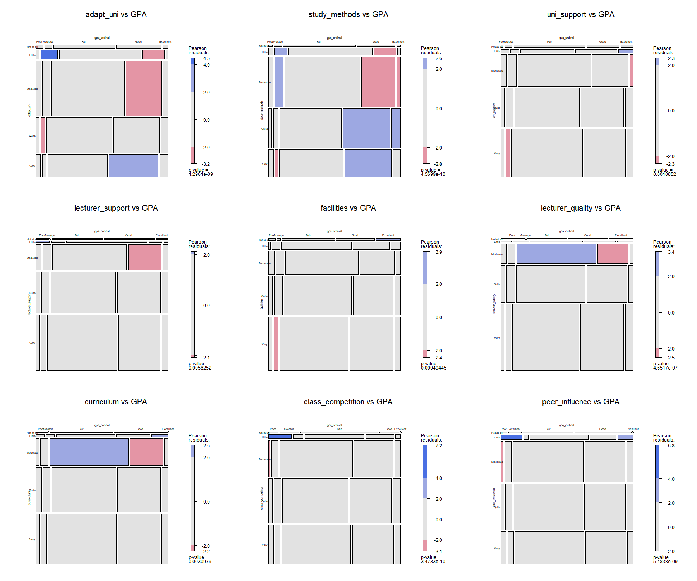

## Introduction

Survey analysis is the process of transforming raw survey data into decision-oriented insights by identifying patterns, trends, and relationships in responses using descriptive and inferential methods.

This study uses a survey dataset collected from students and alumni of Vietnam National University, Hanoi (VNU), originally published in the data article [*Dataset of factors affecting learning outcomes of students at the University of Education, Vietnam National University, Hanoi*](https://doi.org/10.1016/j.dib.2025.111438). A brief background: [VNU](https://en.wikipedia.org/wiki/Vietnam_National_University,_Hanoi) is one of the two national universities in Vietnam and considered as one of the most historic and prestigious institutions in the country. The questionnaire covers demographic characteristics, students’ behaviours and motivations, and external institutional factors that may influence learning outcomes. The survey was distributed to students in Google Form format between March and June 2023 and received **2,170 valid responses**. Personal identifying information was removed to protect privacy.

For the purpose of visual analysis, the variables used in the dataset were regrouped and recoded into factors to improve interpretability. Although the questionnaire inevitably has limitations, it provides a useful starting point for exploring factors associated with university learning outcomes.

Through this study, we aim to apply visually driven survey analysis methods to identify and communicate key patterns related to student academic performance.

**Assumption:**

All hypothesis tests in this exercise are conducted at the **5% significance level**, where the null hypothesis states that no significant difference or no relationship exists between the variables of interest.


## Getting Started

### Installing and Loading the Required Libraries

There are **12** packages that will be used in this exercise.

| Package | Description |
|------------------------------------|------------------------------------|
| [tidyverse](https://www.tidyverse.org/) | A collection of R packages for data importing, cleaning, transformation, and visualisation (e.g., [readr](https://readr.tidyverse.org/), dplyr, tidyr, [ggplot2](https://ggplot2.tidyverse.org/)). |
| [ggdist](https://mjskay.github.io/ggdist/) | An R package that extends ggplot2 with flexible geoms and stats for visualising distributions and uncertainty. |
| [knitr](https://cran.r-project.org/web/packages/knitr/index.html/) | Provides a general-purpose tool for dynamic report generation in R using Literate Programming techniques. |
| [ggstatsplot](https://indrajeetpatil.github.io/ggstatsplot/) | An extension of **ggplot2** package for creating graphics with enriched details from statistical tests|
| [DT](https://rstudio.github.io/DT/) | Displays data frames as interactive HTML tables with sorting, filtering, and pagination. |
| [patchwork](https://cran.r-project.org/web/packages/patchwork/index.html) | Simpily combine separate ggplots into the same graphic. |
| [scales](https://cran.r-project.org/web/packages/scales/index.html) | Provides graphical scales map data to aesthetics. |
| [vcd](https://cran.r-project.org/web/packages/vcd/index.html) | Provides visualisation techniques, data sets, summary and inference procedures aimed particularly at categorical data, such as mosaic plot.  |
| [rlang](https://cran.r-project.org/web/packages/rlang/index.html) | Tools for working with base types, expressions, environments, and especially "tidy evaluation. |
| [magick](https://cran.r-project.org/web/packages/magick/index.html) | Offer advanced graphics and image-Processing in R.|
| [ggthemes](https://cran.r-project.org/web/packages/ggthemes/index.html) | Provides 'ggplot2' themes and scales that replicate some of the famous looks. |
| [readxl](https://cran.r-project.org/web/packages/readxl/readxl.pdf) | Imports excel files into R. |

The code below installs and loads the required packages into R environment.

```{r}
pacman::p_load(tidyverse, ggdist, DT, readxl,
             ggridges, knitr, ggstatsplot, patchwork, scales, vcd, rlang, magick, ggthemes)
```

### Importing the Data

The *dataset* and *codebook* (published 23 December 2024, version 1) in English were downloaded from the [Mendeley Data](https://data.mendeley.com/datasets/23ppcdbmhc/1) open research repository.

We use [`read_excel()`](https://readxl.tidyverse.org/reference/read_excel.html) from the **readxl** package to import the dataset *Database paper.xlsx* into the R environment as a tibble named `df`. We then preview the dataset using `kable()`.

```{r}
df <- read_excel("data/Database paper.xlsx")
```

The questionnaire includes 12 items on **intrinsic factors**, 9 items on **external learning environment factors**, and 1 measuring students’ **GPA** as the target variable. Responses were collected using closed-ended questions with ordinal scales typically ranging from 1–5, depending on the question.

```{r}
kable(head(df), "html")
```

The output from `glimpse()` shows that the raw dataset initially contains numeric values for all variables. Therefore, data wrangling is required in the following section to correctly convert variables into their appropriate data types, such as categorical or ordered factors, before conducting further analysis.

```{r}
#| code-fold: true
#| code-summary: "SHOW"
glimpse(df)
```

## Data Wrangling

In this section, variable names are first standardised to follow tidyverse naming conventions. The variables are then recoded according to their respective data types. Finally, the cleaned dataset is saved as a separate file for subsequent analysis.

::: panel-tabset
### Standardise variable names

The variable names are slightly inconsistent due to the English translation of the *codebook*.

Therefore, the names are standardised to **lowercase** with **underscores** following the [**Tidyverse Style Guide**](https://style.tidyverse.org/syntax.html) to improve readability and reproducibility.

The code below uses the `rename()` function to standardise variable names.

```{r}
#| code-fold: true
#| code-summary: "SHOW"

df <- df %>% 
  rename(
  gpa_num = GPA,
  year = Year,
  gender = Gender,
  policy_student = Policy_Stu,
  minority_student = Minority_Stu,
  poor_household = Poor_Stu,
  
  father_education = Father_Edu,
  mother_education = Mother_Edu,
  father_occupation = Father_Occupation,
  mother_occupation = Mother_Occupation,
  
  time_friends = Time_Friends,
  time_social_media = Time_SocicalMedia,
  time_studying = Time_Studying,
  
  adapt_uni = Adapt_Learning_Uni,
  study_methods = Study_Methods,
  uni_support = SupportOf_Uni,
  lecturer_support = SupportOf_Lec,
  facilities = Facilitie_Uni,
  lecturer_quality = Quality_Lecturer,
  curriculum = TrainingCurriculum,
  class_competition = Competitive_Class,
  peer_influence = InfuenceF_Friends
)
```

A summary table is then constructed using the DT package to demonstrate the updated variable names alongside their descriptions and predefined values.

```{r}
#| code-fold: true
#| code-summary: "SHOW"

simple_table <- data.frame(
  old = c("GPA", "[Drived]", "Year", "Gender", "Policy_Stu", "Minority_Stu", "Poor_Stu",
          "Father_Edu", "Mother_Edu", "Father_Occupation", "Mother_Occupation",
          "Time_Friends", "Time_SocicalMedia", "Time_Studying",
          "Adapt_Learning_Uni", "Study_Methods", "SupportOf_Uni", "SupportOf_Lec",
          "Facilitie_Uni", "Quality_Lecturer", "TrainingCurriculum",
          "Competitive_Class", "InfuenceF_Friends"),
  new = c("gpa_num","gpa_ordinal","year", "gender", "policy_student", "minority_student", "poor_household",
          "father_education", "mother_education", "father_occupation", "mother_occupation",
          "time_friends", "time_social_media", "time_studying", 
          "adapt_uni", "study_methods", "uni_support", "lecturer_support",
          "facilities", "lecturer_quality", "curriculum", "class_competition",
          "peer_influence"),
  description = c(
        "Cumulative Grade Point Average (Poor (<2.0), Average (2.0-2.5), Fair (2.5-3.2), Good (3.2-3.6), Excellent (>3.6)","Drived from GPA",
    "Academic year (1=First-year, 2=Second-year, 3=Third-year, 4=Fourth-year, 5=Graduated)",
    "Gender identity (1=Male, 2=Female)",
    "Student on government policy support (1=Yes, 2=No)",
    "Minority student status (1=Yes, 2=No)",
    "Poor household status (1=Yes, 2=No)",
    "Father's education level (1=Primary, 2=Secondary, 3=High school, 4=College, 5=University, 6=Other)",
    "Mother's education level (1=Primary, 2=Secondary, 3=High school, 4=College, 5=University, 6=Other)",
    "Father's occupation (1=Government employee, 2=Self-employment, 3=Freelance, 4=Other, 5=Not public)",
    "Mother's occupation (1=Government employee, 2=Self-employment, 3=Freelance, 4=Other, 5=Not public)",
    "Time spent with friends daily (1=<1h, 2=1-2h, 3=2-3h, 4=3-4h, 5=>4h)",
    "Time on social media daily (1=<1h, 2=1-2h, 3=2-3h, 4=3-4h, 5=>4h)",
    "Study time daily (1=<2h, 2=2-4h, 3=4-6h, 4=6-8h, 5=>8h)",
    "Adaptation to university learning environment (1=Not at all to 5=Very)",
    "Study methods effectiveness (1=Not at all to 5=Very)",
    "University support perception (1=Not at all to 5=Very)",
    "Lecturer support perception (1=Not at all to 5=Very)",
    "University facilities responsiveness (1=Not at all to 5=Very)",
    "Lecturer quality (1=Not at all to 5=Very)",
    "Curriculum suitability (1=Not at all to 5=Very)",
    "Class competition effect (1=Not at all to 5=Very)",
    "Peer influence on academic outcomes (1=Not at all to 5=Very)"
  ),
  stringsAsFactors = FALSE
)

# Display 
datatable(
  simple_table,
  rownames = FALSE,
  colnames = c("Original Name", "New Name", "Description"),
  options = list(
    pageLength = 25,
    dom = "t",
    columnDefs = list(
      list(className = "dt-center", targets = c(0, 1)),  # Center: Original and New
      list(className = "dt-left", targets = 2)  # Left align: Description
    )
  ),
  caption = htmltools::tags$caption(
    style = "caption-side: top; text-align: center; color: black; font-size: 20px; font-weight: bold; padding: 10px;",
    "Student Variables: Renaming and Description"
  )
) 
```

### Recode variables

The summary statistics show that the variables take values ranging from 1 to 6; however, these numeric codes do not provide meaningful interpretation without recoding them into labelled categories.

```{r}
#| code-fold: true
#| code-summary: "SHOW"
summary(df$year)
summary(df$father_education)
```

The table below outlines how each variable is processed according to its data type. **Ordinal** variables with a natural order, such as study year or time spent studying, are converted using `factor()` with the order argument enabled. **Nominal** variables without inherent order, such as gender or parents’ occupation, are converted into categorical factors.

**Likert scale variables**, including lecturer quality and university support, are treated as categorical rather than continuous. Although measured on a five point scale, they represent ordered response categories rather than precise numerical distances. In some studies, Likert responses are grouped into negative (1 to 2), neutral (3), and positive (4 to 5) categories. When grouped in this way, the variable is treated as nominal because the focus is on sentiment categories rather than order intensity.

In this study, the scale ranges directionally from “not at all” to “very.” While the responses have a natural order, they are still treated as categorical variables to avoid assuming equal spacing between scale points.

The **GPA** variable is derived from grouped categories in the survey codebook rather than exact GPA values. While cumulative GPA is conceptually a continuous measure, it is recorded in five ordered categories: Poor (1), Average (2), Fair (3), Good (4), and Excellent (5). As such, the observed data are ordinal because they represent GPA ranges rather than precise scores, and equal spacing between categories cannot be directly verified.

However, GPA is also analysed as a numeric variable in parts of this study. This is justified because the categories reflect increasing levels of academic performance and are based on an underlying continuous construct. Treating GPA as numeric allows for the calculation of summary statistics such as the mean and the application of parametric tests. Given the large sample size, this approach is considered acceptable and statistically robust, despite the limitations associated with grouped data.

```{r}
#| code-fold: true
#| code-summary: "SHOW"

simple_table <- data.frame(
  new = c("gpa_num","gpa_ordinal","year", "gender", "policy_student", "minority_student", "poor_household",
          "father_education", "mother_education", "father_occupation", "mother_occupation",
          "time_friends", "time_social_media", "time_studying", 
          "adapt_uni", "study_methods", "uni_support", "lecturer_support",
          "facilities", "lecturer_quality", "curriculum", "class_competition",
          "peer_influence"),
  type = c("Numeric", "Ordinal", "Ordinal", "Nominal", "Nominal", "Nominal", "Nominal",
           "Nominal", "Nominal", "Nominal", "Nominal",
           "Ordinal", "Ordinal", "Ordinal", 
           "Ordinal(Likert Scale)", "Ordinal(Likert Scale)", "Ordinal(Likert Scale)", "Ordinal(Likert Scale)",
           "Ordinal(Likert Scale)", "Ordinal(Likert Scale)", "Ordinal(Likert Scale)", "Ordinal(Likert Scale)",
           "Ordinal(Likert Scale)"),
  action = c("Keep numeric", "factor(..., ordered = TRUE)","factor(..., ordered = TRUE)", "factor()", "factor()", "factor()", "factor()",
             "factor()", "factor())", "factor()", "factor()",
             "factor(..., ordered = TRUE)", "factor(..., ordered = TRUE)", "factor(..., ordered = TRUE)", 
             "factor(..., ordered = TRUE)", "factor(..., ordered = TRUE)", "factor(..., ordered = TRUE)", "factor(..., ordered = TRUE)",
             "factor(..., ordered = TRUE)", "factor(..., ordered = TRUE)", "factor(..., ordered = TRUE)", "factor(..., ordered = TRUE)",
             "factor(..., ordered = TRUE)"),
  stringsAsFactors = FALSE
)

# Display 
datatable(
  simple_table,
  rownames = FALSE,
  colnames = c("New Name", "Type", "Action"),
  options = list(
    pageLength = 25,
    dom = "t",
    columnDefs = list(
      list(className = "dt-center", targets = c(0, 1, 2))
    )
  ),
  caption = htmltools::tags$caption(
    style = "caption-side: top; text-align: center; color: black; font-size: 20px; font-weight: bold; padding: 10px;",
    "Student Variables: Data Types and Actions"
  )
) %>%
  formatStyle(
    "type",
    backgroundColor = DT::styleEqual(
      c("Numeric", "Nominal", "Ordinal","Ordinal(Likert Scale)"),
      c("#ccee2f", "#cce5ff", "#ffe5cc", "#d4edda")
    )
  )
```

The code below processes the data as described in the previous section.

#### Group A

```{r}

df_factored <- df%>%
    mutate(
      gpa_num = as.numeric(gpa_num),
      gpa_ordinal = factor(gpa_num,levels = 1:5,
                labels = c('Poor', 'Average', 'Fair', 'Good', 'Excellent'),ordered = TRUE),
      year = factor(year,levels = 1:5, labels = c('First-year','Second-year','Third-year', 'Fourth-year','Graduated'),ordered = TRUE),
      gender = factor(gender, levels = 1:2, labels = c('Male', 'Female')),
      policy_student = factor(policy_student, levels = 1:2, labels = c('Yes', 'No')),
      minority_student = factor(minority_student, levels = 1:2, labels = c('Yes', 'No')),
      poor_household = factor(poor_household, levels = 1:2, labels = c('Yes', 'No')),
      father_education = factor(father_education,levels = 1:6,
                              labels = c('Primary', 'Secondary', 'High school', 
                                       'College', 'University', 'Other')),
      mother_education = factor(mother_education,levels = 1:6,
                              labels = c('Primary', 'Secondary', 'High school', 
                                       'College', 'University', 'Other')),
      father_occupation = factor(father_occupation, levels = 1:5, labels = c('Government employee', 'Self-employment', 'Freelance', 'Other', 'Not public')),
      mother_occupation = factor(mother_occupation, levels = 1:5, labels = c('Government employee', 'Self-employment', 'Freelance', 'Other', 'Not public')),
      time_friends = factor(time_friends,levels = 1:5,
                      labels = c('<1 hour', '1-2 hours', '2-3 hours', '3-4 hours', '>4 hours'),
                         ordered = TRUE),
      time_social_media = factor(time_social_media, levels = 1:5,labels = c('<1 hour', '1-2 hours', '2-3 hours', '3-4 hours', '>4 hours'),ordered = TRUE),
      time_studying = factor(time_studying,levels = 1:5,labels = c('<2 hours', '2-4 hours', '4-6 hours', '6-8 hours', '>8 hours'),ordered = TRUE)
    )
```

#### Group B

```{r}

convert_b_vars <- function(df) {
  likert_labels <- c('Not at all', 'Little', 'Moderate', 'Quite', 'Very')
  
  b_vars <- c("adapt_uni","study_methods","uni_support","lecturer_support", "facilities",  
    "lecturer_quality", "curriculum", "class_competition","peer_influence")

  for(var in b_vars) {
      df[[var]] <- factor(df[[var]],
                          levels = 1:5,
                          labels = likert_labels)
      }
  
  return(df)
}

df_factored <- convert_b_vars(df_factored)
```

After the transformation, the `summary()` function and `dt table` are used to verify that variables have been correctly recoded and assigned meaningful labels. This step ensures that the data are properly structured according to their respective types and are ready for subsequent visualisation and statistical inference.

```{r}
summary(df_factored)
```

```{r}
var_summary <- tibble(
  variable = names(df_factored),
  class = sapply(df_factored, class)
)
datatable(var_summary)
```

### Rename the dataset

A cleaned copy of the dataset is created and named `vnu`.

```{r}
vnu <-df_factored
```

We also review the column names and check for missing values in the final dataset using `names()` and `sum(is.na())`. This step ensures that all variables are correctly labelled and confirms whether any missing data remain before proceeding with further analysis.

```{r}
names(vnu)
```

```{r}
sum(is.na(df))
```
:::

## Visualisation

### Univariate Analysis

This section begins with the target variable, GPA, to examine the overall academic performance of the 2,170 students. The distribution and key summary statistics, such as mean, median, frequency, and percentage, are reviewed to provide a clear overview before proceeding to further analysis.

#### GPA

First, we generate an overview of the GPA distribution and conduct a statistical test using [`gghistostats()`](https://indrajeetpatil.github.io/ggstatsplot/articles/web_only/gghistostats.html) from the **ggstatsplot** package. This function allows us to visualise the distribution of GPA while simultaneously displaying key summary statistics and the results of a one sample t test. By combining visualisation and inference in a single plot, it provides a clear understanding of both the overall pattern of GPA and whether the average performance differs significantly from the selected benchmark value.

The first plot presents the distribution of GPA in both counts and percentages, based on 2,170 valid responses. Fewer than 10 percent of students reported a GPA below 2.5, indicating that most students perform at least at the Fair level. The mean GPA is 3.2 and the median is 3, suggesting overall performance is around the boundary between Fair and Good. Given the large sample size, a formal test of normality is not required. By the [Central Limit Theorem](https://en.wikipedia.org/wiki/Central_limit_theorem), the sampling distribution of the mean is approximately normal, making the one sample t test appropriate and robust. The mean is therefore a reasonable summary of central tendency.

In the second plot, a one sample t test was conducted to examine whether the average GPA is significantly above 3.2, the boundary between Fair and Good. The results show a p value below 0.05 and a large negative log Bayes Factor $log_e(BF_{01})$. We can conclude there is strong evidence against the null hypothesis. This indicates that the average student performs significantly above the Fair level. More detailed explanation on how to interpret Bayes Factor can be found in Hands-on Exercise [04-2](https://isss608-ypan.netlify.app/hands-on_ex/hands-on_ex04/hands-on_ex04_2).

```{r, fig.height= 9, fig.width=15}
#| code-fold: true
#| code-summary: "CODE"


stats <- vnu %>%
  summarise(
    mean_gpa = mean(gpa_num, na.rm = TRUE),
    median_gpa = median(gpa_num, na.rm = TRUE),
    sd_gpa = sd(gpa_num, na.rm = TRUE),
    n = n()
  )

gpa_counts <- vnu %>%
  count(gpa_num) %>%
  mutate(
    percentage = n / sum(n) * 100,
    label = paste0(n, "\n(", round(percentage, 1), "%)")
  )

p1 <- ggplot(vnu, aes(x = gpa_num)) +
  geom_bar(fill = "lightblue", color = "black") + 
  geom_text(data = gpa_counts,
            aes(x = gpa_num, y = n, label = label),
            vjust = -0.5,
            size = 3.5) +
  scale_x_continuous(breaks = 1:5) +
  scale_y_continuous(expand = expansion(mult = c(0, 0.2))) +
  
  geom_vline(xintercept = stats$mean_gpa, 
           color = "red", linetype = "dashed", size = 0.8) +
  annotate("text", 
         x = stats$mean_gpa + 0.15, 
         y = max(gpa_counts$n) * 0.9, 
         label = paste0("Mean = ", round(stats$mean_gpa, 2)),
         color = "red", 
         size = 3.8,
         fontface = "bold",
         hjust = 0) +

  geom_vline(xintercept = stats$median_gpa, 
           color = "darkgreen", linetype = "dotted", size = 0.8) +
  annotate("text", 
         x = stats$median_gpa + 0.15, 
         y = max(gpa_counts$n) * 0.8, 
         label = paste0("Median = ", round(stats$median_gpa, 2)),
         color = "darkgreen", 
         size = 3.8,
         fontface = "bold",
         hjust = 0) +
  
  annotate("text", 
           x = 5, 
           y = Inf, 
           label = paste0(
             "N = ", stats$n,
             " | SD = ", round(stats$sd_gpa, 2)
           ),
           vjust = 1.5,  
           hjust = 1,
           color = "black", 
           size = 4,
           fontface = "bold") +
  
  labs(title = "GPA Distribution: Frequency Bar Chart",
       subtitle = "Counts and percentages shown; red dashed = mean, green dotted = median",
       x = "GPA",
       y = "Number of Students") +
  ggthemes::theme_fivethirtyeight() + 
  theme(
    plot.title = element_text(size = 14, face = "bold"),
    plot.subtitle = element_text(size = 10, color = "gray30"),
    axis.title = element_text(size = 11),
    axis.text = element_text(size = 10),
    plot.margin = margin(10, 10, 10, 10)  
  )

p2 <- gghistostats(
  data = vnu,
  x = gpa_num,
  title = "GPA Distribution: Statistical Test",
  subtitle = paste0("One-sample t-test against mean = 3.2"),
  binwidth = 1,
  bar.fill = "lightblue",
  bar.color = "black",
  type = "p",
  test.value = 3.2,
  centrality.line.args = list(color = "red", linetype = "dashed"),
) + 
  labs(
    x = "GPA", 
    y_left = "Count",  
    y_right = "Percentage"
  ) + 
  ggthemes::theme_fivethirtyeight() +
  theme(
    plot.title = element_text(size = 14, face = "bold"),
    plot.subtitle = element_text(size = 10, color = "gray30"),
    axis.title = element_text(size = 11),
    axis.text = element_text(size = 10),
    plot.margin = margin(10, 10, 10, 10) 
  )

combined_plot <- (p1 | p2) +
  plot_annotation(
    title = "Analysis of VNU Student GPA Distribution",
    subtitle = "Comparison of basic descriptive statistics and inferential testing",
    tag_levels = "I",
    caption = "Data source: Dataset about VNU students (Mendeley Data)",
    theme = theme(
      plot.title = element_text(size = 18, face = "bold", hjust = 0.5),
      plot.subtitle = element_text(size = 12, color = "gray30", hjust = 0.5),
      plot.caption = element_text(size = 10, color = "gray50")
    )
  ) &
  theme(plot.margin = margin(5, 5, 5, 5)) 

combined_plot + plot_layout(heights = c(1, 1))  

```

#### Independent Variables

Due to the large number of variables, they are divided into two groups to improve visual clarity and prevent overcrowding on the screen.

The independent variables are grouped into 12 intrinsic factors and 9 extrinsic factors. The intrinsic factors include demographic characteristics and self reported time use, such as time spent studying, socialising, and entertainment. These variables reflect students’ personal characteristics and behaviours.

The extrinsic factors consist of students’ perceptions of external or environmental influences that may affect academic performance. These include feedback on institutional support, teaching quality, and other contextual factors.

```{r}

intrinsic <- names(vnu[1:12])
extrinsic <- names(vnu[14:22])

intrinsic
extrinsic
```

The code below defines a function that applies a consistent plotting style across each set of independent variables.

```{r}
#| code-fold: true
#| code-summary: "CODE"
plot_bars <- function(col, data = vnu) {
  # ensure the variable is treated as a factor so levels/order are respected
  data[[col]] <- as.factor(data[[col]])

  max_n <- max(table(data[[col]]), na.rm = TRUE)

  ggplot(data, aes(x = .data[[col]])) +
    geom_bar() +
    geom_text(
      aes(label = paste0(
        after_stat(count), "\n(",
        round(after_stat(count) / sum(after_stat(count)) * 100, 1),
        "%)"
      )),
      stat = "count",
      vjust = -0.4,
      size = 3
    ) +
    ggtitle(paste("Distribution of", toupper(col))) +
    xlab(col) +
    ylab("Count") +
    ylim(0, max_n * 1.25) +
    ggthemes::theme_fivethirtyeight() 
}

```

::: panel-tabset
##### Student profile

The student profile analysis shows several patterns.

Most respondents are graduates (73.5%), with smaller proportions in fourth year (20.3%) and third year (6.2%). The sample is predominantly female (88.9%), with males representing 11.1%. The majority are not policy students (64.7%), do not belong to minority groups (94.1%), and do not come from poor households (96%).

Parental education levels are generally moderate to high, that over 80% of students'parents have completed high school or university. Freelance work is the most common occupation for both parents, followed by government employment and self employment.

In terms of time spent, most students spend 1 to 2 hours with friends and a similar amount of time on social media. However, study time is noticeably higher, with 82.2% of students spending more than 8 hours on study.

```{r, fig.height=25, fig.width=25}
#| code-fold: true
#| code-summary: "CODE"

plots1 <- lapply(intrinsic, plot_bars)

wrap_plots(plots1, ncol = 3) +
  plot_annotation(
    title = "Student Profile Analysis",
    caption = "Data source: VNU students dataset (Mendeley Data)",
    tag_levels = "1",
    theme = theme(
      plot.title = element_text(size = 20, face = "bold", hjust = 0.5),
      plot.caption = element_text(size = 10, colour = "grey50")
    )
  )
```

##### External influences

The external influences analysis indicates that students generally perceive environmental study factors as important to their academic performance.

For adaptation to university and study methods, around 40% of students selected **"moderate"**, suggesting that these factors are viewed as having a noticeable but not strong influence on GPA.

For university support (38.2%), lecturer support(44.6%%), facilities(42.7%) lecturer quality(53.1%), and curriculum (40%), most of respondents selected **"very"**. Thus these factors are considered highly influential on academic outcomes.

Class competition and peer influence show about 35% of students rating them as **"quite"** important.

Overall, the results suggest that students recognise external academic and environmental factors as meaningful contributors to their performance, with lecturer support and Pedagogical quality perceived as particularly influential.

```{r, fig.height=20, fig.width=20}
#| code-fold: true
#| code-summary: "CODE"

plots2 <- lapply(extrinsic, plot_bars)

wrap_plots(plots2, ncol = 3) +
  plot_annotation(
    title = "External influences Analysis",
    caption = "Data source: VNU students dataset (Mendeley Data)",
    tag_levels = "1",
    theme = theme(
      plot.title = element_text(size = 20, face = "bold", hjust = 0.5),
      plot.caption = element_text(size = 10, colour = "grey50")
    )
  )
```
:::

### Multivariate Analysis

#### Demographics

Here we use `ggbetweenstats()` to visualise the distribution of GPA across different demographic groups listed above. The function automatically performs the appropriate statistical test to examine whether the average GPA differs between groups. For example, it tests whether the mean GPA is the same for male and female students, or whether GPA varies across different parental occupation categories.

In addition to visualisation, the function reports key inferential statistics, including the p value and log Bayes Factor, which indicate whether group differences are statistically supported. However, statistical significance alone does not reflect the practical importance of the difference. Therefore, effect sizes such as Cohen’s d (for two groups) or eta squared (for multiple groups) are also examined to assess the magnitude of the difference. This combined approach allows both statistical evidence and practical impact to be evaluated when interpreting demographic differences in GPA.

```{r}
demographics <- names(vnu[1:9])
demographics
```

```{r}
#| code-fold: true
#| code-summary: "CODE"

# 1. YEAR (3+ groups ANOVA)
p1 <- ggbetweenstats(
  data = vnu,
  x = year,
  y = gpa_num,
  type = "parametric",
  effsize.type = "eta",
  pairwise.comparisons = TRUE,
  title = "GPA by Year",
  xlab = "Year",
  ylab = "GPA"
)

# 2. GENDER (t-test)
p2 <- ggbetweenstats(
  data = vnu,
  x = gender,
  y = gpa_num,
  type = "parametric",
  effsize.type = "d",  # Cohen's d for 2 groups
  pairwise.comparisons = TRUE,
  title = "GPA by Gender",
  xlab = "Gender",
  ylab = "GPA"
)

# 3. POLICY STUDENT (t-test)
p3 <- ggbetweenstats(
  data = vnu,
  x = policy_student,
  y = gpa_num,
  type = "parametric",
  effsize.type = "d",
  title = "GPA by Policy Student Status",
  xlab = "Policy Student",
  ylab = "GPA"
)

# 4. MINORITY STUDENT (t-test)
p4 <- ggbetweenstats(
  data = vnu,
  x = minority_student,
  y = gpa_num,
  type = "parametric",
  effsize.type = "d",
  title = "GPA by Minority Status",
  xlab = "Minority Student",
  ylab = "GPA"
)

# 5. POOR HOUSEHOLD (t-test)
p5 <- ggbetweenstats(
  data = vnu,
  x = poor_household,
  y = gpa_num,
  type = "parametric",
  effsize.type = "d",
  title = "GPA by Poor Household Status",
  xlab = "Poor Household",
  ylab = "GPA"
)

# 6. FATHER EDUCATION (ANOVA)
p6 <- ggbetweenstats(
  data = vnu,
  x = father_education,
  y = gpa_num,
  type = "parametric",
  effsize.type = "eta",
  pairwise.comparisons = TRUE,
  title = "GPA by Father's Education",
  xlab = "Father's Education",
  ylab = "GPA"
) + theme(axis.text.x = element_text(hjust = 1)) 

# 7. MOTHER EDUCATION (ANOVA)
p7 <- ggbetweenstats(
  data = vnu,
  x = mother_education,
  y = gpa_num,
  type = "parametric",
  effsize.type = "eta",
  pairwise.comparisons = TRUE,
  title = "GPA by Mother's Education",
  xlab = "Mother's Education",
  ylab = "GPA"
) + theme(axis.text.x = element_text(hjust = 1))

# 8. FATHER OCCUPATION (ANOVA)
p8 <- ggbetweenstats(
  data = vnu,
  x = father_occupation,
  y = gpa_num,
  type = "parametric",
  effsize.type = "eta",
  pairwise.comparisons = TRUE,
  title = "GPA by Father's Occupation",
  xlab = "Father's Occupation",
  ylab = "GPA"
) + theme(axis.text.x = element_text(hjust = 1))

# 9. MOTHER OCCUPATION (ANOVA)
p9 <- ggbetweenstats(
  data = vnu,
  x = mother_occupation,
  y = gpa_num,
  type = "parametric",
  effsize.type = "eta",
  pairwise.comparisons = TRUE,
  title = "GPA by Mother's Occupation",
  xlab = "Mother's Occupation",
  ylab = "GPA"
) + theme(axis.text.x = element_text(hjust = 1))

```

Effect sizes are interpreted using Cohen’s (1988) conventional benchmarks. For [Cohen’s d](https://en.wikipedia.org/wiki/Effect_size), absolute values of 0.20, 0.50, and 0.80 represent small, medium, and large effects, respectively. For [partial eta squared](https://en.wikiversity.org/wiki/Eta-squared) ($\eta^2_p$), values of 0.01, 0.06, and 0.14 indicate small, medium, and large effects.

|  |  |  |
|------------------|------------------|------------------------------------|
| **Cohen's d (abs value)** | **Interpretation** | **Meaning** |
| 0.20 | Small | Group means differ by 0.2 standard deviations |
| 0.50 | Medium | Group means differ by 0.5 standard deviations |
| 0.80 | Large | Group means differ by 0.8 standard deviations |

: Cohen's d (for t-tests, 2 groups)

| $\eta^2_p$ | Interpretation | \% Variance Explained                         |
|------------------|------------------|-------------------------------------|
| 0.01       | Small          | 1% of GPA variance explained by this variable |
| 0.06       | Medium         | 6% of GPA variance explained                  |
| 0.14       | Large          | 14% of GPA variance explained                 |

: Eta-squared (for ANOVA, 3+ groups)

```{r,fig.width = 25, fig.height=25}
#| code-fold: true
#| code-summary: "CODE"

combined_plot <- (p1 | p2 | p3) / 
                 (p4 | p5 | p6) / 
                 (p7 | p8 | p9) +
  plot_annotation(
    title = "Analysis of VNU Student GPA Across Groups",
    subtitle = "Comparison of GPA means across demographic and socioeconomic factors",
    tag_levels = "1",  
    caption = "Data source: Dataset about VNU students (Mendeley Data)",
    theme = theme(
      plot.title = element_text(size = 18, face = "bold", hjust = 0.5),
      plot.subtitle = element_text(size = 12, color = "gray30", hjust = 0.5),
      plot.caption = element_text(size = 10, color = "gray50", hjust = 0.5)
    )
  ) &
  theme(
    plot.margin = margin(5, 5, 5, 5),
    plot.tag = element_text(size = 12, face = "bold") 
  )


combined_plot

```

The table below summarises the relationship between demographic variables and GPA using both frequentist and Bayesian statistics. The demograhic factors such as year, father’s education, mother’s education, mother’s occupation, gender, policy student status, and poor household background, show statistically significant results with p values below 0.05. However, statistical significance does not imply strong practical impact. The reported effect sizes are generally small. For ANOVA tests, eta squared values range from 0.04 to 0.14, indicating small to large effects. For t tests, Cohen’s d values range from approximately 0.13 to 0.21 in absolute terms, which fall within the small effect range. This suggests that although some demographic differences in GPA exist, their magnitude is limited. The log Bayes Factor values further support evidence against the null hypothesis for some variables, particularly year and mother’s education. Overall, demographic characteristics explain only a small proportion of variation in GPA, indicating that other factors may play a more substantial role in academic performance.

```{r}
#| code-fold: true
#| code-summary: "CODE"

results_table <- tibble(
  Variable = c("Year",
               "Father's education",
               "Mother's education",
               "Father's occupation",
               "Mother's occupation",
               "Gender",
               "Policy student",
               "Minority",
               "Poor household"),
  
  Test_Type = c("ANOVA","ANOVA","ANOVA","ANOVA","ANOVA",
                "t-test","t-test","t-test","t-test"),
  
  p_value = c(4.31e-07,
              1.42e-04,
              2.72e-09,
              0.07,
              6.27e-05,
              0.01,
              2.05e-03,
              0.07,
              0.04),
  
  loge_BF01 = c(-6.53,
                0.25,
                -11.57,
                4.22,
                -3.91,
                -0.82,
                -1.42,
                1.56,
                0.55),
    Effect_Type = c("eta_2","eta_2","eta_2","eta_2","eta_2",
                  "d","d","d","d"),
  
  Effect_Size = c(0.07, 0.04, 0.07, 0.04, 0.14,
                  -0.18, -0.14, -0.13, -0.21)
  

) %>%
  
  mutate(
    Significant = ifelse(p_value < 0.05, "Yes", "No"),
    
    Effect_Magnitude = case_when(
      Effect_Type == "d" & abs(Effect_Size) < 0.2 ~ "Very small",
      Effect_Type == "d" & abs(Effect_Size) < 0.5 ~ "Small",
      Effect_Type == "d" & abs(Effect_Size) < 0.8 ~ "Medium",
      Effect_Type == "d" ~ "Large",
      
      Effect_Type == "eta_2" & Effect_Size < 0.01 ~ "Very small",
      Effect_Type == "eta_2" & Effect_Size < 0.06 ~ "Small",
      Effect_Type == "eta_2" & Effect_Size < 0.14 ~ "Medium",
      Effect_Type == "eta_2" ~ "Large"
    )
  )

kable(results_table, digits = 3,
      caption = "Summary of Demographic Effects on GPA with Significance and Effect Size Interpretation")

```

::: callout-tip
##### Interpretation

-   We analyse whether student GPA differs across several background characteristics using ANOVA or t tests and effect sizes (Cohen’s d or eta squared) and visualise the results in box plots and violin plots. Many factors are statistically significant, but the practical impact varies.

-   **Strongest influences on GPA**

-   Mother’s occupation ($\eta^2_p$ = 0.14, large effect): among the demographic variables examined, the mother’s occupation appears to have the strongest association with student GPA. The mean GPA differs noticeably across occupational groups, with students whose mothers work in the government sector achieving the highest average GPA (mean = 3.4, above "good"). This pattern may be related to greater schedule stability, more consistent supervision, and a home environment that supports regular study habits and involvement in the student’s learning.

-   Mother’s education ($\eta^2_p$ = 0.07, medium effect): students whose mothers have university education tend to achieve higher GPAs. This indicates the value of academic guidance, expectations, and study habits developed at home.

-   Year of study ($\eta^2_p$ = 0.07, medium effect): graduated students show the highest GPA.

-   **Smaller but significant relationships**

-   Poor household status: students from low income households perform slightly worse. The effect is small but consistent.

-   Gender: female students have slightly higher GPA on average, but the difference is minor in practice.

-   Father’s education: students whose fathers work in government tend to have higher GPAs, but weaker than mother’s education.

-   Policy student status: Policy students perform only slightly lower.

-   **Not statistically significant**

-   Minority status and father’s occupation: both variables show only very small practical effects and their p values are greater than 0.05 (around 0.07). Therefore, there is no statistical evidence that the average GPA differs across these groups.
:::

#### Lifestyle

This section analyses the relationship between students’ daily time allocation and GPA performance. We consider three behavioural variables: study time, social media use, and time spent with friends. Ridgeline plots illustrate the GPA distribution across categories, while bar charts with chi-square tests evaluate statistical association. A correlation matrix further examines relationships among the time variables.

```{r}
time_spent <- c("time_friends", "time_social_media", "time_studying")
```

The code below creates a dashboard summarising time use categories using ridgeline plots, bar charts and a correlation matrix showing relationships between the time use variables.

```{r, fig.height=33, fig.width=20}
#| code-fold: true
#| code-summary: "CODE"
vnu$gpa_jitter <- jitter(vnu$gpa_num, amount = 0.05)

p1 <- ggplot(vnu, aes(x = gpa_jitter, y = time_studying,
                fill = factor(after_stat(quantile)))) +
  stat_density_ridges(
    geom = "density_ridges_gradient",
    calc_ecdf = TRUE,
    quantiles = 4,
    quantile_lines = TRUE,
    bandwidth = 0.18,         
    rel_min_height = 0.01,
    scale = 1.15,
    linewidth = 0.3
  ) +
  scale_fill_viridis_d(
    name = "Quartiles",
    direction = -1,
    breaks = 1:4,     
    labels = c("Q1", "Q2", "Q3", "Q4")
  ) +
  scale_x_continuous(name = "GPA", expand = c(0, 0)) +
  scale_y_discrete(name = NULL, expand = expansion(add = c(0.2, 2.6))) +
  labs(title = "GPA by Study Time") +
  theme_ridges() +
  theme(legend.position = "right") +
  ggthemes::theme_fivethirtyeight()

p2 <- ggplot(vnu, aes(x = gpa_jitter, y = time_social_media,
                fill = factor(after_stat(quantile)))) +
  stat_density_ridges(
    geom = "density_ridges_gradient",
    calc_ecdf = TRUE,
    quantiles = 4,
    quantile_lines = TRUE,
    bandwidth = 0.18,         
    rel_min_height = 0.01,
    scale = 1.15,
    linewidth = 0.3
  ) +
  scale_fill_viridis_d(
    name = "Quartiles",
    direction = -1,
    breaks = 1:4,     
    labels = c("Q1", "Q2", "Q3", "Q4")
  ) +
  scale_x_continuous(name = "GPA", expand = c(0, 0)) +
  scale_y_discrete(name = NULL, expand = expansion(add = c(0.2, 2.6))) +
  labs(title = "GPA by Social Media Time") +
  theme_ridges() +
  theme(legend.position = "right") +
  ggthemes::theme_fivethirtyeight()


p3<- ggplot(vnu, aes(x = gpa_jitter, y = time_friends,
                fill = factor(after_stat(quantile)))) +
  stat_density_ridges(
    geom = "density_ridges_gradient",
    calc_ecdf = TRUE,
    quantiles = 4,
    quantile_lines = TRUE,
    bandwidth = 0.18,         
    rel_min_height = 0.01,
    scale = 1.15,
    linewidth = 0.3
  ) +
  scale_fill_viridis_d(
    name = "Quartiles",
    direction = -1,
    breaks = 1:4,     
    labels = c("Q1", "Q2", "Q3", "Q4")
  ) +
  scale_x_continuous(name = "GPA", expand = c(0, 0)) +
  scale_y_discrete(name = NULL, expand = expansion(add = c(0.2, 2.6))) +
  labs(title = "GPA by Time with Friends") +
  theme_ridges() +
  theme(legend.position = "right") +
  ggthemes::theme_fivethirtyeight()

p4 <- ggcorrmat(
  data = vnu,
  cor.vars = all_of(time_spent),
  type = "nonparametric",
  matrix.type = "upper",
  title = "Correlation Matrix",
  subtitle = "Spearman correlations between time variables")+
  ggthemes::theme_fivethirtyeight() +
  theme(axis.text.x = element_text(angle = 45, hjust = 1))


p5<- ggbarstats(
  data = vnu,
  x = time_studying,
  y = gpa_num,
  results.subtitle = TRUE)+
  ggthemes::theme_fivethirtyeight()

p6<- ggbarstats(
  data = vnu,
  x = time_social_media,
  y = gpa_num,
  results.subtitle = TRUE)+
  ggthemes::theme_fivethirtyeight()

p7<- ggbarstats(
  data = vnu,
  x = time_friends,
  y = gpa_num,
  results.subtitle = TRUE)+
  ggthemes::theme_fivethirtyeight()
p1 <- p1 +
  theme(
    legend.position = "bottom",
    legend.direction = "horizontal",
    legend.box = "horizontal"
  )

p2 <- p2 +
  theme(
    legend.position = "bottom",
    legend.direction = "horizontal",
    legend.box = "horizontal"
  )

p3 <- p3 +
  theme(
    legend.position = "bottom",
    legend.direction = "horizontal",
    legend.box = "horizontal"
  )
p5 <- p5 +
  theme(
    legend.position = "right",
    legend.direction = "vertical"
  )

p6 <- p6 +
  theme(
    legend.position = "right",
    legend.direction = "vertical"
  )

p7 <- p7 +
  theme(
    legend.position = "right",
    legend.direction = "vertical"
  )
p4 <- p4 +
  theme(
    legend.position = "bottom",
    legend.direction = "horizontal",
    axis.text.x = element_text(angle = 45, hjust = 1, size = 7),
    axis.text.y = element_text(size = 7)
  )


final_figure <- ((p1 | p5) / (p2 | p6) / (p3 | p7) / p4) +
  plot_layout( heights = c(1, 1, 1, 1.5))

# Add annotation without redefining the whole plot
final_figure <- final_figure +
  plot_annotation(
    title = "GPA Distribution by Time Use Categories",
    subtitle = paste0(
      "Top panels: GPA distribution across time use levels ",
      "Bottom: Correlations between time use variables (N = ", nrow(vnu), ")"
    ),
    tag_levels = "A",
    caption = paste0(
      "Note: GPA quartiles based on sample distribution. ",
      "Jitter added to GPA values to show density more clearly. ",
      "Spearman correlations used for ordinal time variables.\n",
      "Data source: VNU students dataset (Mendeley Data)"
    ),
    theme = theme(
      plot.title = element_text(size = 16, face = "bold", hjust = 0.5),
      plot.subtitle = element_text(size = 11, color = "gray30", hjust = 0.5, lineheight = 1.2),
      plot.caption = element_text(size = 9, color = "gray50", hjust = 0, face = "italic"),
      plot.margin = margin(15, 15, 15, 15)
    )
  )

final_figure
```

A **chi-square test** of independence was conducted between GPA level and each time-use variable.

-   **Study time**: $\chi^2_{pearson}$=68.24, $p$ \<0.001, $V_{Cramer}$ = 0.08

-   **Social media time**: $\chi^2_{pearson}$=63.86, $p$ \<0.001, $V_{Cramer}$ = 0.07

-   **Time with friends**: $\chi^2_{pearson}$=37.78, $p$ \<0.001, $V_{Cramer}$ = 0.05

| Cramer’s V value | Interpretation   |
|------------------|------------------|
| 0            | No association |
| <0.2            | Weak association |
| 0.2- 0.4         | Moderate         |
| 0.4- 1 (exclusive)          | Strong           |
| 1           | Perfect association |

All three variables are statistically associated with GPA. However, the effect sizes (Cramer’s V) are small, which implies behavioural influence has weak relationships with GPA.

**Spearman correlations** strong negative correlations are observed between adjacent study-time categories because they are mutually exclusive groups. More meaningful behavioural relationships are reflected in the small negative correlations (−0.2) between studying more than 8 hours and heavy social media use (\>4 hours), indicating a time allocation trade off. Students studying 4–6 hours also show a small positive correlation with heavy social media use (\>4 hours) (0.16). Moderate study time does not necessarily exclude high social media engagement.

Additionally, small positive correlations are found between spending more than 4 hours with friends and spending more than 4 hours on social media (0.15), and between spending less than 1 hour with friends and spending less than 1 hour on social media (ρ0.23). This implies that offline and online social activities tend to occur together, with socially active students also being more active on social media.

::: callout-tip
##### Interpretation

-   **Study Time**: students who study more hours per day tend to achieve higher GPAs. The ridgeline plot shows a rightward shift in GPA distribution as study time increases. High GPA students are more frequently found in the *6–8 hour* and *\>8 hour* study groups, while low GPA students are concentrated in the *\<2 hour* group. The chi-square test confirms this relationship is statistically significant, although the magnitude is small.

-   **Social Media Use** :higher social media usage is associated with lower GPA performance. Students with low GPA have a larger proportion of heavy social media use (\>4 hours), whereas high GPA students are more likely to be moderate users (1–3 hours). The association is statistically significant but small in effect size.

-   **Time with Friends**: time spent with friends also shows a significant association with GPA, but the relationship is weaker than study time and social media use. Moderate social interaction appears common across all GPA levels, while excessive social time is slightly more frequent among lower-performing students. This suggests social activity has a limited but noticeable relationship with academic performance.
:::

#### External Factors

In this section, we analyse the external factors that students perceive as important for learning outcomes, such as lecturer quality, study methods, and university support. These perceptions are measured using a Likert scale ranging from “not important” to “very important.”

```{r}
extrinsic
```

The code below creates half-eye plots to visualise the distribution of students’ GPA across different levels of each extrinsic factor. The shaded density shows how GPA values are distributed within each response group, the red point indicates the mean GPA, and the vertical interval represents the uncertainty around the mean estimate.

```{r, fig.height=25, fig.width=25}
#| code-fold: true
#| code-summary: "CODE"
plot_halfeye <- function(data, x_var, 
                                   title = NULL,
                                   fill_color = "lightblue",
                                   point_color = "red",
                                   show_mean = TRUE) {
  
  p <- data %>%
    ggplot(aes(x = .data[[x_var]], y = gpa_num)) +
   stat_halfeye(
      fill = "lightblue",
    color = "black",
    point_interval = mean_qi,
    .width = c(0.5, 0.95),
    density = "histogram")+
  stat_summary(
    fun = mean,
    geom = "point",
    size = 3,
    color = "red"
  ) +
  stat_summary(
    fun = mean,
    geom = "text",
    aes(label = round(after_stat(y), 2)),
    hjust = -0.5,
    color = "red",
    size = 3.5
  )
  
  p <- p +
    labs(
      title = ifelse(is.null(title), 
                     paste("GPA by", gsub("_", " ", x_var)), 
                     title),
      x = gsub("_", " ", x_var) %>% str_to_title(),
      y = "GPA"
    ) +
    scale_y_continuous(breaks = 1:5, limits = c(0.8, 5.2)) +
    ggthemes::theme_fivethirtyeight() +
    theme(
      plot.title = element_text(size = 12, face = "bold"),
      axis.text.x = element_text( hjust = 1),
      axis.title.x = element_text(margin = margin(t = 8)),
      axis.title.y = element_text(margin = margin(r = 8)),
      plot.margin = margin(10, 10, 10, 10)
    )
  
  return(p)
}

halfeye_plots <- map(extrinsic, ~ plot_halfeye(vnu, .x))
combined_plots <- wrap_plots(halfeye_plots, ncol = 3) +
  plot_annotation(
    title = "GPA Distribution by Extrinsic Factors",
    subtitle = paste0(
      "Half-eye plots showing GPA distribution across ", length(extrinsic), 
      " extrinsic factors | Mean shown in red with 50% and 95% CIs (N = ", nrow(vnu), ")"
    ),
    tag_levels = "A",
    caption = paste0(
      "Note: Each plot shows GPA distribution (1-5 scale) by factor levels. ",
      "Red dots indicate mean GPA with values labeled. ",
      "Half-eye plots use histogram density for discrete GPA data.\n",
      "Data source: VNU students dataset (Mendeley Data)"
    ),
    theme = theme(
      plot.title = element_text(size = 18, face = "bold", hjust = 0.5),
      plot.subtitle = element_text(size = 12, color = "gray30", hjust = 0.5, lineheight = 1.2),
      plot.caption = element_text(size = 10, color = "gray50", hjust = 0, face = "italic"),
      plot.margin = margin(15, 15, 15, 15)
    )
  )

combined_plots

```


:::callout-tip

##### Intepretation

The association between perceived importance of external learning factors and GPA is non linear. Students who considered these factors unimportant still showed relatively high GPAs, likely reflecting strong independent learning ability. GPA declines among students reporting low importance but increases again at higher importance levels. This suggests active engagement with support and structured study behaviours might be associated with improved performance. 

:::


Next, we further examine the association using mosaic plots. The code below generates mosaic plots for all external factors using the `mosaic()` function from the **vcd** package. First, a contingency table is created with `xtabs()` by cross-tabulating the ordinal GPA categories with each external factor. The mosaic plot then visualises the distribution of students across categories, while the accompanying chi-square test evaluates whether the survey responses are associated with GPA.


In the mosaic plot, each rectangle represents a group of students. If GPA were unrelated to the factor, all columns would have similar proportions. The colours come from the chi square test (Pearson residuals), comparing observed students with the number expected under no relationship. Blue means more students than expected in that GPA group. Red means fewer students than expected. Grey means about what would occur by chance.


```{r, fig.weight=16, fig.height=16}
#| code-fold: true
#| code-summary: "CODE"
#| eval: false

# Create directory
dir.create("mosaic_plots", showWarnings = FALSE)
# Save all plots with smaller labels
for (i in seq_along(extrinsic)) {
  v <- extrinsic[i]
  tab <- xtabs(reformulate(c(v, "gpa_ordinal")), data = vnu)
  
  # Save as PNG
  png_file <- file.path("mosaic_plots", paste0("mosaic_", i, "_", gsub("[^a-zA-Z0-9]", "_", v), ".png"))
  
  png(png_file, width = 600, height = 500)
  mosaic(
    tab,
    shade = TRUE,
    legend = TRUE,
    labeling_args = list(
      rot_labels = c(left = 0, top = 0, right = 0, bottom = 0),
      offset_varnames = c(left = 0, top = 0, right = 0, bottom = 0),
      gp_labels = gpar(fontsize = 7),  # Make all labels smaller
      gp_varnames = gpar(fontsize = 8)  # Variable names slightly larger
    ),
    main = paste(v, "vs GPA"),
    gp = shading_hcl,
    margins = c(3, 3, 3, 3)
  )
  dev.off()
  
  print(paste("---", i, ":", v, "---"))
  print(assocstats(tab))
}
# Read all images and combine
image_files <- list.files("mosaic_plots", pattern = "*.png", full.names = TRUE)
images <- image_read(image_files)

# Create a 3x3 grid
image_grid <- image_append(c(
  image_append(images[1:3], stack = FALSE),
  image_append(images[4:6], stack = FALSE),
  image_append(images[7:9], stack = FALSE)
), stack = TRUE)

# Save combined image
image_write(image_grid, "combined_mosaic_plots_magick.png")
```



```{r}
#| code-fold: true
#| code-summary: "CODE"
chi_table <- tribble(
  ~Factor, ~Chi_sq, ~df, ~p_value, ~Cramers_V,
  "Adaptation to university", 75.021, 16, "<0.001", 0.093,
  "Study methods", 77.558, 16, "<0.001", 0.095,
  "University support", 39.007, 16, "0.001", 0.067,
  "Lecturer support", 33.888, 16, "0.006", 0.062,
  "Facilities", 41.341, 16, "<0.001", 0.069,
  "Lecturer quality", 60.304, 16, "<0.001", 0.083,
  "Curriculum", 35.786, 16, "0.003", 0.064,
  "Class competition", 78.223, 16, "<0.001", 0.095,
  "Peer influence", 71.481, 16, "<0.001", 0.091
)

chi_table %>% 
  mutate(
    Strength = case_when(
      Cramers_V < 0.2 ~ "weak",
      TRUE ~ "Strong"
    )
  ) %>%
  kable(digits = 3, caption = "Chi-square association between external factors and GPA")
```


:::callout-tip

##### Intepretation

- Across most factors, the Chi square tests are statistically significant ( p< 0.05), indicating that GPA distribution differs across students’ perception levels. However, the effect sizes are small (Cramer’s V = 0.06–0.10), the practical relationship is weak.

- **Relatively small association**

- Adaptation to university: V = 0.093, p < 0.05

- Study methods: V = 0.095, p < 0.05

- Lecturer quality:V = 0.083, p < 0.05

- Class competition: V = 0.095, p < 0.05

- Overall, the pattern is non linear. Both students who rate factors as very important and those who rate them as not important tend to perform relatively well, whereas students reporting only low or moderate importance generally achieve lower GPA. This suggests performance is driven more by learning behaviour and engagement style than by any single external factor.


:::


## Conclusion

This study applies multiple visualisation approaches (bar charts, violin plots, ridgeline plots, mosaic plots, and half-eye plots) to analyse survey data on factors influencing learning outcomes at Vietnam National University. We begin with descriptive summaries using averages, percentages, and counts for both independent variables and GPA. The mean GPA falls within the “Good” range, which suggests generally satisfactory academic performance among students. We then conduct statistical analyses including ANOVA, Chi square tests, and correlation analysis to examine the relationships between the variables and GPA.

Demographic analysis suggests that mother's education and mother's occupation are associated with better GPA outcomes. Time use patterns show that most students study more than eight hours per day, and these students tend to report lower to moderate levels of social media use and time spent with friends.

For external learning factors, all variables show a statistically significant association with GPA. Among them, adaptation to university, study methods, lecturer quality, and class competition demonstrate relatively stronger relationships, but the effect sizes remain small. This indicates that each factor on its own has limited practical influence on academic performance.


The current analysis considers factors individually. Future work should examine their combined effects to better understand student behaviour. Because no single dominant relationship is observed, a multivariate approach could help develop a more comprehensive student profile to support teaching strategies and improve student engagement, such as creating an ordinal regression model.


## Reference

Kam, Tin Seong (2026). R for Visual Analytics, https://r4va.netlify.app

Tran, V. D., Nguyen, K. S. T., & Le, D. N. (2025). Dataset of factors affecting learning outcomes of students at the University of Education, Vietnam National University, Hanoi. *Data in Brief, 59, 111438*. https://doi.org/10.1016/j.dib.2025.111438

Ngoc Le, Diep (2024), “Dataset about VNU students”, Mendeley Data, V1, doi: 10.17632/23ppcdbmhc.1
