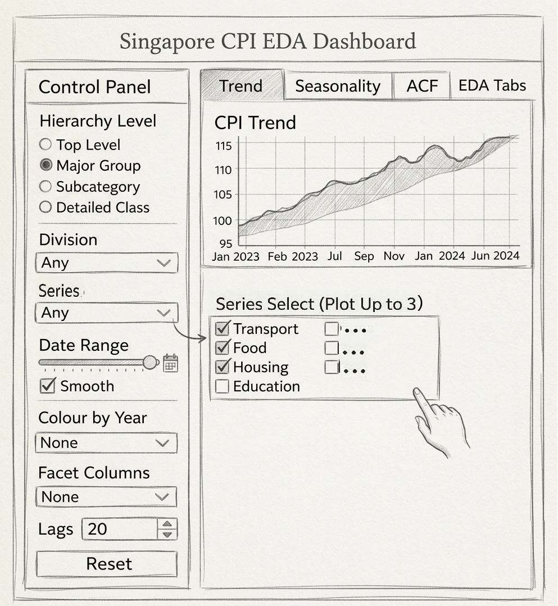
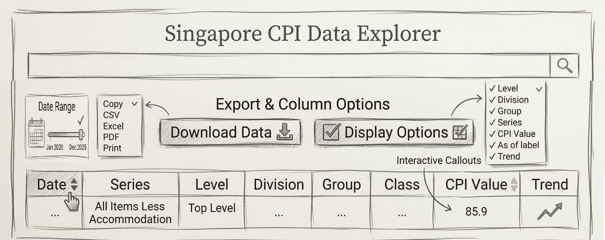
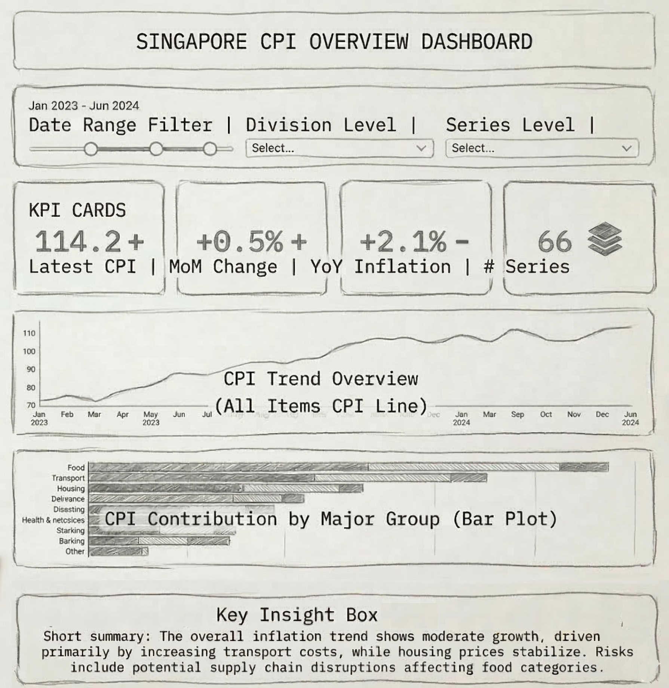

## Introduction

The Consumer Price Index (CPI) is a widely used economic indicator that measures inflation by tracking changes in the price level of a basket of goods and services consumed by households. CPI provides an important reference for economic policy, wage adjustments, and cost of living assessments. In Singapore, CPI statistics are compiled and published by the Singapore Department of Statistics and are structured into 10 expenditure categories such as food, housing, transport, healthcare, and recreation.

The CPI dataset naturally forms a **hierarchical** structure, where detailed consumption items aggregate into broader categories and ultimately contribute to the overall inflation index. For example, individual items such as rice, meat, and vegetables belong to lower level sub categories, which aggregate into food related groups and eventually into the overall CPI.

This study examines monthly Singapore CPI data from 2020 to 2025, covering multiple CPI categories from the overall index to detailed expenditure components. The period from **2020 to 2025** represents an especially meaningful timeframe for inflation analysis. During this period, the global economy experienced significant disruptions due to the COVID 19 pandemic, supply chain constraints, and subsequent economic recovery. These factors contributed to changes in consumption patterns and price volatility across different sectors. Analysing CPI during this period provides insights into how inflation dynamics evolved under these unusual economic conditions. By combining exploratory visualisation and time series forecasting, the study aims to understand the behaviour of inflation across different CPI components and generate forecasts for future price movements.

## Motivation

While headline inflation measures such as the overall CPI provide a broad indication of price changes, they often conceal important differences across consumption categories. Certain components, such as food or energy related items, may experience stronger volatility or seasonal patterns compared with more stable categories such as healthcare or education. Analysing CPI at a more detailed level therefore allows a clearer understanding of which sectors contribute most to inflation changes.

Visualisation plays an important role in exploring CPI data. Time series plots, seasonal visualisations, and autocorrelation analysis help reveal underlying patterns such as trends, seasonal behaviour, and persistence in price movements. These exploratory insights are valuable for understanding the structure of CPI data and informing the selection of appropriate forecasting models.

Another challenge arises from the fact that CPI datasets often contain many related time series across different categories. In this study, multiple CPI components are analysed simultaneously, each representing a separate time series with its own price dynamics. Manually building and evaluating forecasting models for each series would be inefficient and difficult to maintain.

To address this challenge, the study adopts a nested time series forecasting approach using the Modeltime package. Nested forecasting allows each CPI series to be modelled independently within a unified workflow. Multiple forecasting models can be trained, evaluated, and compared automatically across all CPI categories, enabling efficient model selection and scalable forecasting.

This approach offers several advantages. First, it enables systematic modelling of a large number of CPI series while maintaining a consistent workflow. Second, it allows different models to compete for each series, ensuring that the most suitable model is selected based on performance. Finally, it provides a flexible framework that integrates statistical forecasting methods and machine learning techniques within a tidy data workflow.

By combining exploratory data visualisation with nested forecasting techniques, this study aims to provide a comprehensive analysis of Singapore’s CPI dynamics and produce reliable forecasts for its key components.


## Methodology


After completing the hands on exercises [`Extra_01`](https://isss608-ypan.netlify.app/hands-on_ex/hands-on_extra/hands-on_extra_1), [`Extra_02`](https://isss608-ypan.netlify.app/hands-on_ex/hands-on_extra/hands-on_extra_2), and [`Extra_03`](https://isss608-ypan.netlify.app/hands-on_ex/hands-on_extra/hands-on_extra_3), several time series forecasting frameworks were evaluated, including **tidyverts, forecast, timetk, and modeltime**. Each package provides different capabilities for exploratory analysis, modelling, and forecasting workflows.

The **tidyverts ecosystem**, developed by Professor [**Rob Hyndman**](https://tidyverts.org/) and his research team at Monash University, represents a modern replacement for the widely used **forecast** package. It adopts a tidy data framework and integrates several specialised packages, including **feasts** for exploratory time series diagnostics and **fable** for statistical forecasting models such as ARIMA and exponential smoothing. These tools provide a structured workflow for analysing time series data and producing elegant visualisations.

However, some limitations were observed when applying tidyverts in this study. Certain functionality has been distributed across additional packages, such as **ggtime**, which may not integrate smoothly with interactive visualisation tools such as **plotly**. Furthermore, the **fable framework is primarily designed for modelling individual time series**, which can limit flexibility when conducting larger scale model comparison or integrating machine learning approaches.


In contrast, **modeltime**, which is built on the **tidymodels framework**, offers a more flexible and extensible modelling environment. It integrates both **classical statistical models and modern machine learning algorithms** within a unified workflow. In addition, the framework supports **nested forecasting**, which allows multiple models to be trained and evaluated across hierarchical or grouped time series in a scalable manner. When used together with **timetk**, the framework enables efficient time series **feature engineering, preprocessing, model training, and evaluation**. Furthermore, modeltime provides better compatibility with **interactive visualisation tools**, which is particularly useful for developing **interactive dashboards and Shiny applications**.

Therefore, this study primarily adopts the **timetk and modeltime packages** for the forecasting workflow and the subsequent development of the **Shiny application**, as they provide greater flexibility, scalability, and compatibility with modern interactive data visualisation tools.


## Analytical Workflow

To analyse and forecast Singapore’s CPI data, a structured analytical workflow was implemented to ensure systematic exploration, modelling, and evaluation of the time series.

First, data preparation and transformation were conducted to organise the CPI dataset into a tidy time series structure suitable for analysis. Monthly CPI data from 2020 to 2025 was reshaped into a long format so that each CPI category represents an individual time series. This structure enables consistent analysis across multiple CPI components.

Second, exploratory data analysis (EDA) was performed to understand the statistical properties of the CPI series. Time series visualisations were used to examine long term trends and variability across categories. In addition, time series decomposition was applied to separate each series into its trend, seasonal, and irregular components, allowing clearer interpretation of underlying inflation patterns. Autocorrelation and partial autocorrelation analysis were also conducted to assess temporal dependence and provide insights into appropriate model structures.

Third, a nested forecasting workflow was implemented using the Modeltime package. In this approach, each CPI category is treated as an individual time series within a nested data structure. Multiple forecasting models are trained and evaluated automatically across all series, enabling efficient model comparison and scalable forecasting.

## Getting Started

### Installing and Loading the Required Libraries

::: panel-tabset
#### Package Description

There are **13** packages that will be used in this exercise.

| Package | Description |
|------------------------------------|------------------------------------|
| [tidyverse](https://www.tidyverse.org/) | A collection of R packages for data importing, cleaning, transformation, and visualisation (e.g., [readr](https://readr.tidyverse.org/), dplyr, tidyr, [ggplot2](https://ggplot2.tidyverse.org/)). |
| [knitr](https://cran.r-project.org/web/packages/knitr/index.html/) | Provides a general-purpose tool for dynamic report generation in R using Literate Programming techniques. |
| [DT](https://rstudio.github.io/DT/) | Displays data frames as interactive HTML tables with sorting, filtering, and pagination. |
| [scales](https://cran.r-project.org/web/packages/scales/index.html) | Provides graphical scales map data to aesthetics. |
| [ggthemes](https://cran.r-project.org/web/packages/ggthemes/index.html) | Provides 'ggplot2' themes and scales that replicate some of the famous looks. |
| [readxl](https://cran.r-project.org/web/packages/readxl/readxl.pdf) | Imports excel files into R. |
| [rlang](https://cran.r-project.org/web/packages/rlang/index.html) | Tools for working with base types, expressions, environments, and especially “tidy evaluation.|
| [plotly](https://plotly.com/r/) | Creates interactive and publication-ready graphs. |
| [viridis](https://cran.r-project.org/web/packages/gapminder/index.html) | A dataset and visualisation concept popularised by Hans Rosling. In ggplot and gganimate, Gapminder data is often used as an example to demonstrate animated plots over time, such as countries moving across income and life expectancy.Used here solely to apply its country color scheme. |
| [htmltools](https://rstudio.github.io/htmltools/) | Useful tools for creating, manipulating, and writing HTML from R.|
| [timetk](https://github.com/business-science/timetk) | A cutting-edge toolkit for time series preparation and exploration. |
| [stringr](https://cran.r-project.org/web/packages/stringr/index.html) | Provides a consistent and user friendly set of functions for performing common string manipulation tasks, with functions such as `str_detect()`, `str_replace()` and `str_extract()` etc |
| [lubridate](https://cran.r-project.org/web/packages/lubridate/index.html) | A Tidyverse package that handles date-time objects |

The code below installs and loads the required packages into R environment.

#### The Code

```{r}
pacman::p_load(tidyverse, DT, readxl,
             knitr, scales,ggthemes,
               plotly, timetk, lubridate, stringr, htmltools, viridis, rlang)
```
:::

### Importing the Data

The dataset was obtained from the [CEIC Database](https://www.ceicdata.com/en) via the SMU Library. The Excel file contains monthly Consumer Price Index (CPI) data with base year 2024, spanning from January 1961 to January 2026,last updated on 23/02/2026.

The dataset is imported into R using the [`read_excel()`](https://readxl.tidyverse.org/reference/read_excel.html) function from the **readxl** package and stored as a tibble named `df`. The first few rows of the dataset are then displayed using `kable()` for inspection.

```{r}
df <- read_excel("data/Series.xlsx")
```

```{r}
kable(head(df, 10), "html")
```

When downloading the dataset, only the Data Column: **Series Name** option was selected in the output settings. As a result, the metadata rows were not included in the downloaded file. If the metadata rows are present, they could be removed using the `slice()` function, for example `slice(-1:28)`, to exclude the first 28 rows from the dataset.

The dataset contains **208 columns and 781 rows**. The column names are not well structured and contain inconsistent formatting and lengthy labels. Therefore, further cleaning and standardisation are required before the dataset can be used for analysis.

## Data Wrangling

### Renaming Date Column and filtering the Study Period

The code below uses the `rename()` function to replace the unnecessarily long column name with `date`. It also applies the `filter()` function from **dplyr** to keep observations between **2020 and 2025** for exploratory data analysis (EDA). This ensures consistency with the project scope, which focuses on demonstration and forecasting. Although data for January 2026 has already been released, it is excluded at this stage to maintain a consistent analysis period.

```{r}
df <- df %>%
  rename(date = 1) %>%
  mutate(date = as_date(date)) %>%
  filter(date >= "2020-01-01" & date <= "2025-12-31")
```

### Reshaping the Data

Since this project focuses on **time series analysis**, the original CPI dataset in **wide format** was transformed into a **long format** to make it suitable for time series modelling and analysis.

The code below uses the `pivot_longer()` function to transform the dataset from wide format to long format.

```{r}
df_long <- df %>%
  pivot_longer(
    cols = -date,
    names_to = "series",
    values_to = "cpi"
  )
```

### Labelling CPI Levels

The code block below saves and displays all CPI items in order to determine the desired table structure. Here we display the first 20 CPI items.

```{r}
cpi_items <- df %>%
  names() %>%
  setdiff("date")

length(cpi_items)
cpi_items[1:20]
```

To ensure the structure aligns with the official CPI classification, the [**Department of Statistics (DOS) CPI documentation**](https://www.singstat.gov.sg/-/media/files/news/cpijan26.ashx) was used as a reference. All published CPI items and their corresponding hierarchical levels were extracted according to the official structure.

The dataset preserves the full level of granularity defined by the official CPI classification. As a result, some combinations contain **missing values**, which is expected because not every subcategory is reported for all periods.

The code below reveals that we have 2064 missing values in the dataset.

```{r}
sum(is.na(df))
```

After the transformation and extraction process, the CPI items in the dataset now match the official DOS CPI classification structure.

After the transformation, the CPI hierarchy is identified by counting the number of **colon (`:`) occurrences** in the item names by using `str_count()` function from **stringr** package.

A new column called `level` is created to represent the hierarchical structure of the CPI categories. For example:

-   `Consumer Price Index (CPI)` is assigned **level 0**

-   Major groups such as **Food** and **Health** are assigned **level 1**

-   Their subcategories are assigned **level 2**

```{r}
df_long <- df_long %>%
 mutate(
    level = str_count(series, ":")) %>%
  filter(level <= 2)
```

However, several exceptions must be handled after the initial level assignment. While the number of colon occurrences provides a useful starting point for identifying CPI hierarchy levels, it does not fully align with the official DOS classification.

In particular, categories under **Food** require manual adjustment: **Food** is classified as level 1, while `CPI: Food Excl Food & Beverage Serving Services (FFBSS)` and `CPI: Food & Beverage Serving Services (FBSS)` should be reclassified as level 2, with their nested subgroups assigned to level 3.

In addition, categories beginning with **All Items Less** should be treated as level 0. These refinements ensure that the final hierarchy is consistent with the official CPI classification structure.

The code chunk below uses `str_detect()` from the **stringr** package to identify specific CPI categories using regular expressions and revise the assigned CPI levels to match the official published classification structure.

```{r}
df_long <- df_long %>%
  mutate(
    level = case_when(
      str_detect(series, "^CPI: All Items Less") ~ 0,

      series %in% c(
        "CPI: Food Excl Food & Beverage Serving Services (FFBSS)",
        "CPI: Food & Beverage Serving Services (FBSS)"
      ) ~ 2,

      str_detect(series, "^CPI: FFBSS") &
        str_count(series, ":") >= 2 ~ str_count(series, ":") + 1,

      str_detect(series, "^CPI: FBSS") &
        str_count(series, ":") >= 2 ~ str_count(series, ":") + 1,

      TRUE ~ level
    )
  )
```

### Standardising CPI names

We use `str_remove()` to remove the **“CPI:” prefix** from the series names. This helps clean up the labels so the table does not repeatedly display “CPI:” in every series name, making the series easier to read and rename the file to `cpi`.

```{r}
cpi <- df_long %>%
  mutate(series = str_remove(series, "^CPI: "))
```

### Sanity Check

Here, we take a quick look at the structure of the CPI dataset using the `glimpse()` function from the **dplyr** package. We also perform a sanity check to confirm that there are no missing values in the dataset.

```{r}
glimpse(cpi)
```

```{r}
sum(is.na(cpi))
```

### Saving the File

Here we use the `write_rds()` function to save the cleaned CPI dataset. The file can later be reloaded into the system for further analysis.

```{r}
#| eval: false
write_rds(cpi, "data/cpi.rds")
write_csv(cpi, "data/cpi.csv")
```

```{r}
cpi<- read_rds("data/cpi.rds")
```

### Building an Interactive Table

Finally, we create a `DT` table to display the dataset in an interactive tabular format.

::: panel-tabset
#### Step 1: Creating Reference Table and Join

The first step is to build a reference table for the CPI hierarchy. Since the list of CPI series is finite, we first extract the **distinct series names** from the dataset to create a clean list without duplicated monthly records.

Next, we manually assign the hierarchy levels for each series, such as **division, group, and class**, to define the relationships in the CPI structure.

Finally, this annotated hierarchy table is **joined** back to the main dataset, so that each observation inherits the hierarchy columns.

```{r}
#| code-fold: true
#| code-summary: "SHOW"
series_meta <- cpi %>%
  distinct(series, level) %>%
  mutate(
    division = case_when(
      series == "Consumer Price Index (CPI)" ~ NA_character_,
      series == "Food" ~ "Food",
      series == "Clothing and Footwear (C&F)" ~ "Clothing and Footwear (C&F)",
      series == "Housing & Utilities" ~ "Housing & Utilities",
      series == "Household Durables & Services (HDS)" ~ "Household Durables & Services (HDS)",
      series == "Health" ~ "Health",
      series == "Transport" ~ "Transport",
      series == "Information & Communication (InfoComm)" ~ "Information & Communication (InfoComm)",
      series == "Recreation, Sport & Culture (RSC)" ~ "Recreation, Sport & Culture (RSC)",
      series == "Education" ~ "Education",
      series == "Miscellaneous Goods & Services (MG&S)" ~ "Miscellaneous Goods & Services (MG&S)",
      # groups/classes inherit division from their parent:
      grepl("^Food|FFBSS|FBSS", series) ~ "Food",
      grepl("^C&F:", series) ~ "Clothing and Footwear (C&F)",
      grepl("^Housing & Utilities", series) ~ "Housing & Utilities",
      grepl("^HDS:", series) ~ "Household Durables & Services (HDS)",
      grepl("^Health:", series) ~ "Health",
      grepl("^Transport:", series) ~ "Transport",
      grepl("^InfoComm:", series) ~ "Information & Communication (InfoComm)",
      grepl("^RSC:", series) ~ "Recreation, Sport & Culture (RSC)",
      grepl("^Education:", series) ~ "Education",
      grepl("^MG&S:", series) ~ "Miscellaneous Goods & Services (MG&S)",
      TRUE ~ NA_character_
    ),
    group = case_when(
      level == 2 ~ series,  # each level-2 row is a group
      level == 3 & grepl("^FFBSS:", series) ~
        "Food Excl Food & Beverage Serving Services (FFBSS)",
      level == 3 & grepl("^FBSS:", series) ~
        "Food & Beverage Serving Services (FBSS)",
      TRUE ~ NA_character_
    ),
    class = case_when(
      level == 3 ~ series,  # keep full label for classes
      TRUE ~ NA_character_
    )
  )

cpi_h <- cpi %>%
  left_join(series_meta, by = c("series", "level"))

```

#### Step 2: MOdifying the Table for Interactivity

Next we prepares the CPI dataset for display in an interactive table.

First, the data is sorted by `series` and `date`, then grouped by `series` so calculations are applied within each CPI series.

Within `mutate()`:

-   `As_of` keeps the original date for filtering, while `As_of_lab` creates a readable label such as *Jan 2024*.
-   `cpi_change` calculates the **month to month CPI change** using `lag()`.
-   `Trend` converts the change into symbols: ▲ increase, ▼ decrease, ◆ first observation or no change.
-   `level_label` converts numeric hierarchy levels into labels (Top Level, Major Category, Sub Category, Detailed).
-   `major_group` and `display_name` determine which hierarchy name (division, group, or class) should be shown.
-   `cpi_rounded` rounds CPI values to two decimals.

Finally, the dataset is **ungrouped** and selected columns are renamed to produce a clean table ready for interactive display.

```{r}
#| code-fold: true
#| code-summary: "SHOW"
#| 
cpi_h_display <- cpi_h %>%
  arrange(series, date) %>%
  group_by(series) %>%                     # for MoM change
  mutate(
    # raw Date for filtering
    As_of = date,
    As_of_lab = format(date, "%b %Y"),

    # month-on-month change (current - previous month)
    cpi_change = cpi - lag(cpi),

    # Trend symbol based on change
    Trend = case_when(
      is.na(cpi_change) ~ "◆",   # first observation
      cpi_change > 0  ~ "▲",
      cpi_change < 0 ~ "▼",
      TRUE ~ "◆"
    ),

    level_label = case_when(
      level == 0 ~ "Top Level",
      level == 1 ~ "Major Category",
      level == 2 ~ "Sub-Category",
      level == 3 ~ "Detailed",
      TRUE ~ paste("Level", level)
    ),
    major_group = case_when(
      level == 0 ~ NA_character_,
      TRUE       ~ division
    ),
    display_name = case_when(
      level == 0 ~ series,
      level == 1 ~ division,
      level == 2 ~ group,
      level == 3 ~ class,
      TRUE ~ series
    ),
    cpi_rounded = round(cpi, 2)
  ) %>%
  ungroup() %>%
  select(
    Level = level_label,
    Division= major_group,
    Group = group,
    Class = class,
    Series = display_name,
    `CPI Value`= cpi_rounded,
    `As of` = As_of,       # Date for filters
    `As of label` = As_of_lab, # pretty label
    Trend
  )

```

#### Step 3: Defining CSS

Because the table contains many columns and large fonts, it is difficult to display everything clearly on a single screen. To improve readability, we make the table more compact and enable responsive behaviour.

First, we add a small CSS block to **reduce** the font size and cell paddin\* in the DataTable. This allows more information to fit within the visible space without shrinking the entire browser view.

```{r}
#| code-fold: true
#| code-summary: "SHOW"
compact_dt_css <- tags$style(HTML("
  table.dataTable tbody td {
    padding: 4px 6px !important;
    font-size: 13px !important;
  }
  table.dataTable thead th {
    padding: 6px 6px !important;
    font-size: 13px !important;
  }
  div.dataTables_filter input {
    font-size: 13px;
  }
"))


```

#### Step 4: Defining JavaScript Render

First, a **JavaScript renderer (`trend_js`)** is defined. This function colours the trend symbols in the table: ▲ appears in green for an increase, ▼ appears in red for a decrease, and ◆ appears in grey for no change or the first observation. The symbols are also displayed in bold with a larger font size to make the trend visually clear.

```{r}
#| code-fold: true
#| code-summary: "SHOW"
# JS for colored trend symbols
trend_js <- JS(
  "function(data, type, row, meta) {",
  "  if(type === 'display') {",
  "    var color = data === '▲' ? 'green' : (data === '▼' ? 'red' : 'gray');",
  "    return '<span style=\"color:' + color + '; font-weight:bold; font-size:18px;\">' + data + '</span>';",
  "  }",
  "  return data;",
  "}"
)
```

#### Step 5: Putting Everything Together

Finally we builds a compact, interactive CPI table using the `DT` package and custom styling. It combines **JavaScript, HTML layout, and DataTable options** to make the CPI hierarchy easier to explore.

The table layout is created using `div()`. The `compact_dt_css` style is applied to reduce font size and padding so the table can fit more information on the screen. The container also limits the maximum width and centres the table for a cleaner layout.

A **title section** is added at the top to display the dashboard heading (“Singapore Consumer Price Index”) and the latest available data month, which is calculated dynamically from the dataset.

Below the title, a **summary bar** shows three key statistics: the total number of rows in the dataset, the number of distinct CPI divisions, and the latest update date. These values are calculated directly from `cpi_h_display`.

The **main interactive table** is created using `datatable()`. Only the relevant columns are displayed: hierarchy levels (Level, Division, Group, Class, Series), CPI value, date label, and trend indicator. The table includes several features:

The **filter row** at the top allows users to filter values in each column. The **Buttons extension** enables exporting the table to formats such as CSV, Excel, PDF, and Print. The **ColReorder extension** allows users to rearrange column positions. The **Responsive extension** ensures that important columns remain visible while lower priority columns collapse into a details view on smaller screens.

Additional table options control the display behaviour. Pagination is enabled with default page length of 25 rows. The length menu allows users to change the number of rows shown. Automatic column width adjustment helps fit the content neatly.

Column definitions further refine the display. Key columns such as Level, Division, Series, CPI value, date label, and Trend are always visible. Group and Class are given lower priority so they can collapse on smaller screens. All columns are centre aligned, and the Trend column uses the custom JavaScript renderer to display coloured symbols.

Finally, a **footer note** explains the meaning of the trend symbols and shows the CPI base year and data source.

```{r}
#| code-fold: true
#| code-summary: "SHOW"


cpi_h_table <- div(
  compact_dt_css,
  style = "
    width: 100%;
    max-width: 1200px;
    margin: 10px auto;
    overflow-x: hidden;
    font-family: 'Segoe UI', Arial, sans-serif;
  ",

  # Title
  div(
    style = 'text-align: center; margin-bottom: 20px;',
    h2('Singapore Consumer Price Index',
       style = 'color: #2c3e50; margin-bottom: 5px;'),
    h4(paste('Latest Data:',
             format(max(cpi_h_display$`As of`), '%B %Y')),
       style = 'color: #7f8c8d; font-weight: normal; margin-top: 0;')
  ),

  # Summary bar
  div(
    style = 'display: flex; justify-content: space-between; margin-bottom: 15px; padding: 10px; background-color: #f8f9fa; border-radius: 5px;',
    div(
      style = 'text-align: center; flex: 1;',
      div(style = 'font-size: 12px; color: #7f8c8d;', 'Total Rows'),
      div(style = 'font-size: 24px; font-weight: bold; color: #2c3e50;',
          nrow(cpi_h_display))
    ),
    div(
      style = 'text-align: center; flex: 1; border-left: 1px solid #dee2e6; border-right: 1px solid #dee2e6;',
      div(style = 'font-size: 12px; color: #7f8c8d;', 'Divisions'),
      div(style = 'font-size: 24px; font-weight: bold; color: #2c3e50;',
          cpi_h_display %>%
      filter(Level == "Major Category") %>%
      summarise(n = n_distinct(Division)) %>%
      pull(n))
    ),
    div(
      style = 'text-align: center; flex: 1;',
      div(style = 'font-size: 12px; color: #7f8c8d;', 'Last Updated'),
      div(style = 'font-size: 16px; font-weight: bold; color: #2c3e50;',
          format(max(cpi_h_display$`As of`), '%b %Y'))
    )
  ),

  # Main table
  datatable(
    # no more original_* columns to drop
    cpi_h_display %>%
      select(Level, Division, Group, Class, Series,
             `CPI Value`, `As of label`, Trend),
    class = 'cell-border stripe hover',
    filter = 'top',
    extensions = c('Buttons', 'ColReorder', 'Responsive'),
    width = '100%',
    options = list(
      pageLength = 25,
      lengthMenu = list(c(10, 25, 50, 100, -1),
                        c('10', '25', '50', '100', 'All')),
      dom = 'B<"toolbar">lfrtip',
      buttons = list(
        list(
          extend = 'collection',
          text   = 'Export',
          buttons = list(
            list(extend = 'copy', text = 'Copy'),
            list(extend = 'csv',  text = 'CSV'),
            list(extend = 'excel', text = 'Excel'),
            list(extend = 'pdf',  text = 'PDF'),
            list(extend = 'print', text = 'Print')
          )
        ),
        list(extend = 'colvis', text = 'Columns')
      ),
      scrollX = FALSE,
      scrollY = FALSE,
      autoWidth = TRUE,
      responsive = TRUE,
      columnDefs = list(
        # Always show: Level, Division, Series, CPI Value, As of label, Trend
        # column order: 0=Level,1=Division,2=Group,3=Class,4=Series,5=CPI,6=As of label,7=Trend
        list(className = 'all', targets = c(0, 1, 4, 5, 6, 7)),
        # Group & Class lower priority
        list(className = 'min-tablet', targets = c(2, 3)),
        # Center text
        list(className = 'dt-center', targets = '_all'),
        # Trend renderer
        list(
          targets  = 7,
          render = trend_js,
          orderable = FALSE,
          searchable = FALSE
        )
      )
    ),
    selection = 'single',
    rownames  = FALSE
  ),

  # Footer
  div(
    style = 'margin-top: 15px; font-size: 12px; color: #7f8c8d; text-align: center;',
    '▲ = Increase from previous month | ▼ = Decrease from previous month | ◆ = No change', br(),
    'Base Year: 2024 | Source: Singapore Department of Statistics & CEIC Database'
  )
)
```
:::

Here we have an **interactive CPI dashboard** that allows users to filter, explore hierarchy levels, export data, and interpret CPI movements.

```{r}
cpi_h_table
```

```{r}
glimpse(cpi_h)
```

## EDA

In this section, we conduct an **exploratory data analysis (EDA)** of Singapore’s Consumer Price Index (CPI) from 2020 to 2025 from three perspectives: **trend, seasonality, and autocorrelation**. The analysis is performed using functions from the **timetk** package. It begins with the top level series, CPI: All Items, and then progressively examines the major groups and their corresponding detailed classes. This approach allows patterns to be observed across different levels of the CPI hierarchy.

### Trend

In the **trend analysis section**, the temporal behaviour of CPI items is examined through time series visualisation. A custom plotting function is first developed by incorporating `geom_line()` from the **ggplot2** package to produce a **consolidated view of the series**. In addition, `plot_time_series()` from the **timetk** package is used to generate **faceted plots** to have clearer comparisons across multiple CPI categories. This workflow also supports the **early prototyping of visual components for the Shiny application** prior to the full development of the dashboard.

#### Single-view Function

The `create_cpi_plot()` function generates an **interactive** CPI time series visualisation across different levels of the CPI hierarchy. It filters the dataset based on the selected `plot_level` and optional category, and plots the relevant CPI series while optionally including a **reference line** from the higher level CPI index for comparison. The function then converts the ggplot output into an interactive Plotly chart with customised styling, legends, and source annotations for clearer interpretation and potential integration into a Shiny dashboard.

```{r}
#| code-fold: true
#| code-summary: "SHOW"
create_cpi_plot <- function(data, 
                            plot_level,
                            category = NULL,
                            start_date = "2020-01-01",
                            end_date = "2026-01-01",
                            plot_title = NULL,
                            ref_line_color = "black",
                            ref_line_width = 0.9,
                            plot_line_width = 0.6) {
  
  # Validate and format dates
  start_date <- as.Date(start_date)
  end_date <- as.Date(end_date)
  
  if (start_date >= end_date) {
    stop("start_date must be before end_date")
  }
  
  # Setup based on level
  if (plot_level == 0) {
    plot_data <- data %>% filter(level == 0)
    ref_data <- NULL
    ref_label <- NULL
    default_title <- "Signapore CPI Trend"
    color_label <- "Index"
    
  } else if (plot_level == 1) {
    plot_data <- data %>% filter(level == 1)
    ref_data <- data %>% filter(level == 0, series == "Consumer Price Index (CPI)")
    ref_label <- "Overall CPI"
    default_title <- "CPI Major Groups"
    color_label <- "Category"
    
  } else if (plot_level == 2) {
    if (is.null(category)) stop("For level 2, specify a category (division name)")
    plot_data <- data %>% filter(level == 2, division == category)
    ref_data <- data %>% filter(level == 1, series == category)
    ref_label <- category
    default_title <- paste(category, ": Subgroups")
    color_label <- "Subcategory"
    
  } else if (plot_level == 3) {
    if (is.null(category)) stop("For level 3, specify a group")
    plot_data <- data %>% filter(level == 3, group == category)
    ref_data <- data %>% filter(level == 2, series == category)
    ref_label <- category
    default_title <- paste(category, ": Detailed Classes")
    color_label <- "Detailed Class"
    
  } else {
    stop("plot_level must be 0, 1, 2, or 3")
  }
  
  # Check if data exists after filtering
  if (nrow(plot_data) == 0) {
    stop(paste0("No data found for plot_level=", plot_level, 
                ifelse(!is.null(category), paste0(" and category='", category, "'"), "")))
  }
  
  # Use custom or default title
  if (is.null(plot_title)) {
    plot_title <- default_title
  }
  
  has_reference <- !is.null(ref_data) && nrow(ref_data) > 0
  
  # Calculate date breaks safely
  date_breaks_seq <- seq(start_date, end_date, by = "6 months")
  if (length(date_breaks_seq) < 2) {
    date_breaks_seq <- seq(start_date, end_date, by = "2 months")
  }
  
  # Build ggplot
  p <- ggplot(plot_data, aes(x = date, y = cpi, color = series)) +
    geom_line(linewidth = plot_line_width, alpha = 0.7)
  
  if (has_reference) {
    p <- p + geom_line(data = ref_data, aes(x = date, y = cpi),
                       color = ref_line_color, linewidth = ref_line_width,
                       linetype = "solid", inherit.aes = FALSE)
  }
  
  p <- p + labs(
    title = plot_title,
    subtitle = if (has_reference) paste("Black line =", ref_label) else "",
    x = "Date", 
    y = "CPI Index", 
    color = color_label
  ) +
  scale_x_date(
    limits = c(start_date, end_date),
    breaks = date_breaks_seq,  # Use pre-calculated breaks
    date_labels = "%b%y",
    expand = expansion(mult = c(0.01, 0.01)) 
  ) +
  theme_minimal() +
  theme(
    legend.position = "bottom",
    axis.text.x = element_text(hjust = 1),
    plot.title = element_text(face = "bold", size = 14, hjust = 0.5),
    plot.subtitle = element_text(size = 10, hjust = 0.5, color = "gray40")
  )
  
  # Convert to plotly
  ggplotly(p) %>%
    layout(
      title = list(
         text = paste0("<b>", plot_title, ", 2020-2025</b>"), 
        font = list(size = 16, family = "Arial", color = "#2c3e50"),
        x = 0.5, 
        xanchor = "center"
      ),
      legend = list(
        orientation = "h", 
        y = -0.3, 
        x = 0.5, 
        xanchor = "center",
        font = list(family = "Arial", size = 9, color = "#333333"),
        itemsizing = "constant", 
        itemwidth = 35,
        bgcolor = "rgba(255,255,255,0.9)",
        bordercolor = "#cccccc", 
        borderwidth = 1
      ),
      annotations = list(list(
        text = paste0(
          "<b>Source:</b> CEIC Database; Index, 2024 = 100",
          if (has_reference) paste0("; Black line = ", ref_label) else ""
        ),
        x = 1, y = -0.25, 
        xref = "paper", yref = "paper", 
        showarrow = FALSE,
        font = list(family = "Arial", size = 9, color = "#666666"),
        xanchor = "right", 
        align = "right"
      )),
      xaxis = list(
        tickfont = list(size = 9), 
        gridcolor = "#f0f0f0", 
        tickangle = 0
      ),
      yaxis = list(
        tickfont = list(size = 9), 
        gridcolor = "#f0f0f0", 
        zerolinecolor = "#cccccc"
      ),
      hoverlabel = list(
        bgcolor = "white", 
        bordercolor = "#cccccc", 
        font = list(size = 10, family = "Arial")
      ),
      margin = list(b = 150, l = 60, r = 40, t = 60),
      plot_bgcolor = "white", 
      paper_bgcolor = "white"
    )
}

```

#### Facet-view Function

The function generates flexible time series visualisations of CPI data across different levels of the CPI hierarchy. It filters the dataset based on the selected `plot_level` and optional category, and uses the **timetk** `plot_time_series()` function to create either single or faceted plots with various customisation options such as colouring, smoothing, reference lines, and layout settings.

```{r}
#| code-fold: true
#| code-summary: "SHOW"
plot_cpi_time_series <- function(data,
                                 plot_level,
                                 category = NULL,
                                 group_name = NULL,
                                 series_select = NULL, 
                                 use_year_colour = FALSE,
                                 facet_by = TRUE,
                                 facet_ncol = 1,
                                 facet_nrow = 1,
                                 facet_scales = "fixed",
                                 smooth = FALSE,
                                 smooth_period = "auto",
                                 smooth_span = NULL,
                                 smooth_degree = 2,
                                 plotly_slider = FALSE,
                                 interactive = TRUE,
                                 add_caption = TRUE,
                                 caption_text = "Source: CEIC Database | Index, 2024 = 100",
                                 title = NULL,
                                 x_lab = "",
                                 y_lab = "CPI Index",
                                 color_lab = "Year",
                                 line_color = "#2c3e50",
                                 return_plot = TRUE) {
  
  data <- data %>%
    mutate(year = factor(lubridate::year(date)))
  
  if (plot_level == 0) {
    plot_data <- data %>% filter(level == 0)
    default_title <- "CPI Top Level Time Series, 2020-2025"
    facet_col <- "series"
    
  } else if (plot_level == 1) {
    plot_data <- data %>% filter(level == 1)
    default_title <- "CPI Major Groups Time Series, 2020-2025"
    facet_col <- "division"
    
  } else if (plot_level == 2) {
    if (is.null(category)) stop("For plot_level = 2, specify category")
    
    plot_data <- data %>%
      filter(level == 2, division == category)
    
    default_title <- paste(category, "CPI Sub Categories Time Series, 2020-2025")
    facet_col <- "series"
    
  } else if (plot_level == 3) {
    if (is.null(group_name)) stop("For plot_level = 3, specify group_name")
    
    plot_data <- data %>%
      filter(level == 3, group == group_name)
    
    default_title <- paste(group_name, "Detailed CPI Time Series, 2020-2025")
    facet_col <- "series"
    
  } else {
    stop("plot_level must be 0, 1, 2, or 3")
  }
  
  # Apply series selection if specified
  if (!is.null(series_select)) {
    # Check if selected series exist
    available_series <- unique(plot_data$series)
    missing_series <- setdiff(series_select, available_series)
    if (length(missing_series) > 0) {
      stop(
        paste(
          "These series were not found at the specified level:\n",
          paste(missing_series, collapse = ", "),
          "\n\nAvailable series:\n",
          paste(available_series, collapse = "\n")
        )
      )
    }
    
    plot_data <- plot_data %>%
      filter(series %in% series_select)
    
    # Update title to reflect selection
    if (length(series_select) <= 3) {
      series_text <- paste(series_select, collapse = ", ")
      default_title <- paste0(default_title, ": ", series_text)
    } else {
      default_title <- paste0(default_title, " (", length(series_select), " selected series)")
    }
  }
  
  if (nrow(plot_data) == 0) {
    stop("No data found for the specified criteria")
  }
  
  if (is.null(title)) {
    title <- default_title
  }
  
  if (use_year_colour && facet_by) {
    
    p <- timetk::plot_time_series(
      .data = plot_data,
      .date_var = date,
      .value = cpi,
      .color_var = year,
      .facet_vars = tidyselect::all_of(facet_col),
      .facet_ncol = facet_ncol,
      .facet_nrow = facet_nrow,
      .facet_scales = facet_scales,
      .line_color = line_color,
      .smooth = smooth,
      .smooth_period = smooth_period,
      .smooth_span = smooth_span,
      .smooth_degree = smooth_degree,
      .legend_show = TRUE,
      .title = title,
      .x_lab = x_lab,
      .y_lab = y_lab,
      .color_lab = color_lab,
      .interactive = interactive,
      .plotly_slider = plotly_slider
    )
    
  } else if (use_year_colour && !facet_by) {
    
    p <- timetk::plot_time_series(
      .data = plot_data,
      .date_var = date,
      .value = cpi,
      .color_var = year,
      .facet_ncol = facet_ncol,
      .facet_nrow = facet_nrow,
      .facet_scales = facet_scales,
      .line_color = line_color,
      .smooth = smooth,
      .smooth_period = smooth_period,
      .smooth_span = smooth_span,
      .smooth_degree = smooth_degree,
      .legend_show = TRUE,
      .title = title,
      .x_lab = x_lab,
      .y_lab = y_lab,
      .color_lab = color_lab,
      .interactive = interactive,
      .plotly_slider = plotly_slider
    )
    
  } else if (!use_year_colour && facet_by) {
    
    p <- timetk::plot_time_series(
      .data = plot_data,
      .date_var = date,
      .value = cpi,
      .facet_vars = tidyselect::all_of(facet_col),
      .facet_ncol = facet_ncol,
      .facet_nrow = facet_nrow,
      .facet_scales = facet_scales,
      .line_color = line_color,
      .smooth = smooth,
      .smooth_period = smooth_period,
      .smooth_span = smooth_span,
      .smooth_degree = smooth_degree,
      .legend_show = FALSE,
      .title = title,
      .x_lab = x_lab,
      .y_lab = y_lab,
      .interactive = interactive,
      .plotly_slider = plotly_slider
    )
    
  } else {
    
    p <- timetk::plot_time_series(
      .data = plot_data,
      .date_var = date,
      .value = cpi,
      .facet_ncol = facet_ncol,
      .facet_nrow = facet_nrow,
      .facet_scales = facet_scales,
      .line_color = line_color,
      .smooth = smooth,
      .smooth_period = smooth_period,
      .smooth_span = smooth_span,
      .smooth_degree = smooth_degree,
      .legend_show = FALSE,
      .title = title,
      .x_lab = x_lab,
      .y_lab = y_lab,
      .interactive = interactive,
      .plotly_slider = plotly_slider
    )
  }
  
  # Add caption based on interactive mode
  if (add_caption) {
    if (interactive) {
      # For plotly objects, add annotation
      p <- p %>%
        plotly::layout(
          annotations = list(
            list(
              text = caption_text,
              x = 1,
              y = -0.18,
              xref = "paper",
              yref = "paper",
              showarrow = FALSE,
              xanchor = "right",
              font = list(size = 10, color = "gray50")
            )
          ),
          margin = list(b = 90)
        )
    } else {
      # For ggplot objects, use labs()
      p <- p +
        labs(caption = caption_text) +
        theme(
          plot.caption = element_text(
            size = 9,
            colour = "grey40",
            hjust = 1
          )
        )
    }
  }
  
  # Handle return vs printing
  if (return_plot) {
    return(p)
  } else {
    if (interactive) {
      # For plotly objects
      if (isTRUE(getOption('knitr.in.progress'))) {
        # In R Markdown/Quarto
        htmltools::tagList(p)
      } else {
        # In interactive R session
        print(p)
      }
    } else {
      # For static ggplot
      print(p)
    }
  }
}
```

#### Top Level CPIs

There are three top level CPI series at the aggregated level: Overall CPI (Consumer Price Index CPI), All Items Less Accommodation, and All Items Less Imputed Rentals.

##### Single View

All exhibits closely aligned upward trends over the study period. The index rises from approximately 85–86 in January 2020 to around 102 by December 2025. A temporary dip occurs in mid 2020, followed by a period of steady acceleration from mid 2021 through 2023. After mid 2023, the rate of growth begins to moderate, with the three series converging around the 100 index level by 2024. Minor divergences emerge in 2025, where All Items Less Imputed Rentals appears slightly higher than the other two series.

```{r}
create_cpi_plot(cpi_h, plot_level = 0)
```

##### Facet View

The three faceted panels confirm the same pattern seen in the single view. Each series shows an S-shaped trajectory: flat to slightly declining in 2020, accelerating upward through 2021–2023, then levelling off near 100 in 2024. The faceted layout makes it easier to see that each series spans a similar range (85–102) and that within-year variability is relatively small compared to the year-over-year trend.

```{r, fig.width=12, fig.height = 4}
plot_cpi_time_series(
  data = cpi_h,
  plot_level = 0,
  facet_by = TRUE,
  facet_ncol = 3,
  interactive = FALSE,facet_scales = "fixed", use_year_colour = TRUE
)
```


```{r}
plot_cpi_time_series(
  data = cpi_h,
  plot_level = 0,
  series_select = "Consumer Price Index (CPI)",  # Just one series
  facet_by = TRUE,
  facet_ncol = 1,
  interactive = TRUE,
  plotly_slider = TRUE, smooth = TRUE
)
```

```{r}
#| echo: false
#| eval: false
#| code-fold: true
#| code-summary: "SHOW"

## level 0 manual function
p <- cpi_h %>%
  filter(level == 0) %>%
  group_by(series) %>%
  plot_time_series(
    .date_var = date,
    .value = cpi,
    .color_var = series,
    .facet_ncol = 3,
    .facet_scales = "free_y",
    .interactive = TRUE,
    .title = "Singapore CPI Trend, 2020 – 2025",
    .y_lab = "CPI Index",
    .x_lab = "Date",
    .plotly_slider = FALSE,
    .smooth = TRUE
  )

p %>% layout(
  legend = list(
    orientation = "h", # Horizontal
    y = -0.25,         # Below plot
    x = 0.5,              # Center
    xanchor = "center"
  ),
  annotations = list(
    list(
      text = "<b>Source:</b> CEIC Database; Index, 2024 = 100",
      x = 1,           # Right align caption
      y = -0.37,      # Below legend
      xref = "paper",
      yref = "paper",
      showarrow = FALSE,
      font = list(size = 10, color = "gray50"),
      xanchor = "right"
    )
  ),
  margin = list(b = 120)  # Extra bottom space
)

```

#### Major Groups

This section examines the major CPI groups that collectively form the overall Consumer Price Index (CPI). As each group is assigned a **different expenditure weight**, their contributions to the index are not equal.

The list below shows that the overall CPI is composed of ten major groups: - Food (2,042); - Clothing and Footwear (C&F) (165); - Housing and Utilities (2,938); - Household Durables and Services (HDS) (547); - Health (1,008); - Transport (1,307); - Information and Communication (InfoComm) (381); - Recreation, Sport and Culture (RSC) (595); - Education (579); - and Miscellaneous Goods and Services (MG&S) (438).

These weighted components are then aggregated to derive the **overall CPI** (10,000).

```{r}
unique(cpi_h$series[cpi_h$level == 1])
```

##### Single View

The 10 major groups display substantial spread, ranging from below 80 (Transport in early 2020) to above 105 (Clothing & Footwear in 2025). Transport shows the most volatility with a sharp drop in 2020 followed by a steep rise to 2022. InfoComm remains relatively flat. Education and Housing & Utilities show steady upward climbs. The black overall CPI line sits in the middle of the bundle, indicating no single group dominates the aggregate trend.

```{r}

create_cpi_plot(cpi_h, plot_level = 1)
```

##### Facet View

Among the **CPI major groups**, most categories show a clear upward movement over the period. **Food** rises steadily from around **86 in 2020 to about 103 by 2025**. **Health** increases from approximately **89 to around 105**, while **Education** grows gradually from about **91 to 102**. **Transport** records one of the largest increases, climbing from roughly **75 in 2020 to about 105 by 2025**.

**Housing & Utilities** increases from around **87 to about 102**, with visible cyclical fluctuations. **Recreation, Sport & Culture** also rises steadily from approximately **86 to around 101**. **Miscellaneous Goods & Services** shows moderate growth from about **95 to around 100**, before stabilising towards the later period. **Household Durables & Services** increases gradually from around **94 to about 100**, then levels off.

In contrast, **Information & Communication** remains relatively stable, fluctuating around **97–100** throughout the period. **Clothing & Footwear** shows the most variability, moving between approximately **93 and 104** without a clear long term upward trend.


```{r, fig.width=12, fig.height=12}
plot_cpi_time_series(
  data = cpi_h,
  plot_level = 1,
  facet_by = TRUE,
  facet_ncol = 3,
  interactive = FALSE,facet_scales = "fixed"
)
```

```{r}
#| eval: false
#| echo: false
#| code-fold: true
#| code-summary: "SHOW"

## function for time series plot from level 1
make_cpi_plot_improved <- function(data, level_val, 
                          category_filter = NULL, 
                          group_filter = NULL, interactive = FALSE,
                          smooth = FALSE, facet_ncol = 3) {
  
  # Apply category filter (division level) if specified
  if (!is.null(category_filter)) {
    data <- data %>%
      filter(division == category_filter)
  }
  
  # Apply group filter if specified
  if (!is.null(group_filter)) {
    data <- data %>%
      filter(group == group_filter)
  }
  
  # Determine title
  if (!is.null(group_filter)) {
    base_title <- paste(group_filter, "CPI")
  } else if (!is.null(category_filter)) {
    base_title <- paste(category_filter, "CPI")
  } else {
    base_title <- "CPI"
  }
  
  if (level_val == 1) {
    # Level 1: Major groups - facet by division
    data %>%
      filter(level == 1) %>%
      group_by(division) %>%
      plot_time_series(
        .date_var = date,
        .value = cpi,
        .facet_ncol = facet_ncol,
        .facet_scales = "free_y",
        .smooth = smooth,
        .interactive = interactive,
        .title = paste(base_title, "- Major Groups (Level 1)"),
        .y_lab = "CPI Index"
        
        
      )
      
  } else if (level_val == 2) {
    # Level 2: Sub-groups - facet by group
    data %>%
      filter(level == 2) %>%
      group_by(group) %>%
      plot_time_series(
        .date_var = date,
        .value = cpi,
        .facet_ncol = facet_ncol,
        .facet_scales = "free_y",
        .smooth = smooth,
        .interactive = interactive,
        .title = paste(base_title, "- Subgroups (Level 2)"),
        .y_lab = "CPI Index"
      )
      
  } else if (level_val == 3) {
    # Level 3: Detailed classes - facet by class
    data %>%
      filter(level == 3) %>%
      group_by(class) %>%
      plot_time_series(
        .date_var = date,
        .value = cpi,
        .facet_ncol = facet_ncol,
        .facet_scales = "free_y",
        .smooth = smooth,
        .interactive = interactive,
        .title = paste(base_title, "- Detailed Classes (Level 3)"),
        .y_lab = "CPI Index"
      )
      
  } else {
    stop("level_val must be 1, 2, or 3")
  }
}

```

#### Food

Food accounts for 2,042 out of the total CPI weight of 10,000, making it second largest component of the overall CPI basket. It is also the only major group that is further divided into subgroups and detailed classes.

##### Subgroup

The Food category consists of two main subgroups:

- **Food Excluding Food and Beverage Serving Services (FFBSS)** with a weight of 651, 

- and **Food and Beverage Serving Services (FBSS)** with a weight of 1,391.

```{r}
unique(cpi_h$series[cpi_h$division == "Food" & cpi_h$level == 2])
```

###### Single View

FFBSS (light blue) rises faster than FBSS (red) from 2020 to mid 2023, climbing from 87 to 100 with steeper acceleration starting mid-2021. FBSS starts lower (84) and rises more gradually with a notable uptick from mid 2022. By late 2024, both subgroups converge near 100–102. The black reference line (Food) sits between the two. In 2025, FFBSS and FBSS both slightly exceed the Food reference, with FBSS showing a steeper late-period increase.

```{r}
# Level 2: Food subgroups with Food as reference
create_cpi_plot(cpi_h, plot_level = 2, category = "Food")
```

###### Facet View

The two-panel facet confirms FFBSS has a more volatile trajectory with sharper month-to-month fluctuations, while FBSS follows a smoother, more linear upward path. FFBSS shows visible plateaus around mid 2023 to mid 2024 before resuming growth. FBSS accelerates more consistently throughout the period, with its steepest gains occurring in 2022–2023.

```{r, fig.width=8, fig.height=4}
plot_cpi_time_series(
  data = cpi_h,
  plot_level = 2,
  category = "Food",
  facet_by = TRUE,
  facet_ncol = 2,
  interactive = FALSE,facet_scales = "fixed"
)
```

##### FFBSS

Food Excluding Food and Beverage Serving Services (FFBSS) carries a weight of 651 within the CPI basket. Although it has a smaller weight than Food and Beverage Serving Services (FBSS), it includes items related to grocery consumption, which affect the daily spending of most households.

The FFBSS subgroup is further divided into **10** detailed classes, including:

- Rice and Cereals (122)

- Meat (101)

- Fish and Seafood (79

- Milk, Other Dairy Products and Eggs (64)

 - Oils and Fats (12)

- Fruits and Nuts (79)

- Vegetables (82) 

- Sugar, Confectionery and Desserts (27)

- Ready Made and Other Food Products (44)

- and Non Alcoholic Beverages (41).

```{r}
unique(cpi_h$series[cpi_h$group == "Food Excl Food & Beverage Serving Services (FFBSS)" & cpi_h$level == 3])
```

###### Single View

Among the 10 FFBSS classes, Oils & Fats and Vegetables display the highest volatility, with peaks reaching 115–120 around 2022–2023 before declining. Sugar, Confectionery & Desserts rises to the highest level by 2025. Rice & Cereals and Meat show steady upward trends. Fish & Seafood rises sharply in 2021–2022 then stabilises. The black FFBSS reference line follows a moderate middle path. Non-Alcoholic Beverages and Ready-Made Food show gentler upward slopes.

```{r}
# Level 3: FFBSS detailed classes with FFBSS as reference
create_cpi_plot(cpi_h, plot_level = 3, category = "Food Excl Food & Beverage Serving Services (FFBSS)")
```

###### Facet View

Among the ten **FFBSS sub-categories**, **Oils & Fats** and **Vegetables** show the highest volatility, with notable peaks around **2022–2023** before moderating. **Sugar, Confectionery & Desserts** records the largest overall increase, reaching the highest index level by **2025**. **Rice & Cereals** and **Meat** exhibit steady upward trends, while **Fish & Seafood** rises sharply between **2021 and 2022** before stabilising thereafter. **Non-Alcoholic Beverages** and **Ready-Made Food** display more gradual and consistent increases.


```{r, fig.width=12, fig.height = 15}
plot_cpi_time_series(
  data = cpi_h,
  plot_level = 3,
  group_name = "Food Excl Food & Beverage Serving Services (FFBSS)",
  facet_by = TRUE,
  facet_ncol = 3,
  interactive = FALSE
)
```

##### FBSS

The Food and Beverage Serving Services (FBSS) subgroup has a total weight of 1,391 in the CPI basket and consists of four detailed classes:

-   Restaurants, Cafés and Pubs (585),
-   Fast Food (85),
-   Hawker Food including Food Courts (707),
-   and Other Catering Services including Vending Machines (14).

The weights of these classes collectively sum to 1,391, reflecting the overall contribution of food related dining services to the CPI.

```{r}

unique(cpi_h$series[cpi_h$group == "Food & Beverage Serving Services (FBSS)" & cpi_h$level == 3])
```

###### Single View

Four FBSS classes are plotted. Fast Food (red) starts lowest (84) and rises most steeply to 105 by end-2025, surpassing the FBSS reference line (black). Hawker Food (green) and Restaurants, Cafes & Pubs (purple) track closely with the FBSS reference throughout. Other Catering Services (cyan) starts higher (87) but shows limited growth, ending near 100. A clear acceleration across all series begins around mid 2022.

```{r}
create_cpi_plot(cpi_h, plot_level = 3, category = "Food & Beverage Serving Services (FBSS)")
```

###### Facet View

Among the **FBSS service categories**, all four segments show a clear upward trend over the period. **Fast Food** records the strongest increase, with a sharp rise after **2022**. **Hawker Food including Food Courts** shows steady growth with a gradual upward movement. **Restaurants, Cafés & Pubs** also follow a consistent upward trajectory. In contrast, **Other Catering Services including Vending Machines** increases gradually before stabilising around **2024–2025**.


```{r, fig.width=8, fig.height=6}
plot_cpi_time_series(
  data = cpi_h,
  plot_level = 3,
  group_name = "Food & Beverage Serving Services (FBSS)",
  facet_by = TRUE,
  facet_ncol = 2,
  interactive = FALSE
)
```

#### Clothing and Footwear (C&F)

The Clothing and Footwear (C&F) category has a total weight of 165 within the CPI basket and is divided into two detailed classes:

-   Clothing, with a weight of 129,

-   and Footwear, with a weight of 36.

```{r}
unique(cpi_h$series[cpi_h$division == "Clothing and Footwear (C&F)" & cpi_h$level == 2])
```

##### Single View


Within **Clothing & Footwear**, both subgroups display noticeable variability over time. **Clothing** fluctuates roughly between **94 and 104**, while **Footwear** shows wider movements, ranging from about **92 to 105**. The overall **Clothing & Footwear index** (black line) remains relatively stable, generally moving within the **96–103 range** throughout the period.


```{r}
create_cpi_plot(cpi_h, plot_level = 2, category = "Clothing and Footwear (C&F)")
```

##### Facet View


Within the **Clothing & Footwear sub-categories**, both series show noticeable fluctuations without a clear long term upward trend. **Clothing** varies roughly between **94 and 104**, with declines around **2021** and **2024** before partial recoveries. **Footwear** exhibits greater volatility, ranging from approximately **87 to 105**, with a sharp dip around **2022** followed by several rebounds and subsequent fluctuations.


```{r, fig.width=8, fig.height=4}
plot_cpi_time_series(
  data = cpi_h,
  plot_level = 2,
  category ="Clothing and Footwear (C&F)",
  facet_by = TRUE,
  facet_ncol = 2,
  interactive = FALSE
)
```

#### Housing & Utilities

Housing and Utilities carries a total weight of 2,938 in the CPI basket, making it the largest component of the index. It is composed of two detailed classes:

-   Accommodation, with a weight of 2,656,

-   and Utilities and Other Fuels, with a weight of 282.

```{r}
unique(cpi_h$series[cpi_h$division == "Housing & Utilities" & cpi_h$level == 2])
```

##### Single View

Within **Housing & Utilities**, both subcategories show an overall upward trend over the period. **Accommodation** increases steadily from around **88 in 2020 to about 101 by 2025**, with small periodic fluctuations. **Utilities & Other Fuels** shows greater variability, declining from about **84 to around 78 in 2020–2021**, before rising sharply to approximately **100 by 2024** and stabilising thereafter. The overall **Housing & Utilities index** follows a gradual upward path, moving from roughly **87 in 2020 to around 101 by 2025**.


```{r}
create_cpi_plot(cpi_h, plot_level = 2, category = "Housing & Utilities")
```

##### Facet View

Within the **Housing & Utilities sub-categories**, **Accommodation** shows a steady upward trend, increasing from around **87 in 2020 to approximately 101 by 2025**, with regular seasonal fluctuations. In contrast, **Utilities & Other Fuels** exhibits greater variability, declining from about **84 to around 77 in 2020–2021**, before rising sharply to around **100 by 2024** and fluctuating slightly thereafter.


```{r, fig.width=8, fig.height=4}
plot_cpi_time_series(
  data = cpi_h,
  plot_level = 2,
  category = "Housing & Utilities",
  facet_by = TRUE,
  facet_ncol = 2,
  interactive = FALSE
)
```

#### Household Durables & Services (HDS)

Household Durables and Services (HDS) carries a total weight of 547 in the CPI basket.

This category is divided into **6** detailed classes, including:

-   Furniture and Furnishings (128),
-   Household Textiles (17),
-   Household Appliances (101),
-   Glassware, Tableware and Household Utensils (17),
-   Tools and Equipment for House and Garden (5),
-   and Household Services and Supplies (279).

```{r}
unique(cpi_h$series[cpi_h$division=="Household Durables & Services (HDS)"& cpi_h$level==2])
```

##### Single View

The overall Household Durables & Services index (black reference line) increases gradually from about 94 in 2020 to around 100 by 2024–2025, before stabilising thereafter. 

**Furniture & Furnishings** rises steadily from about **92 in 2020 to around 100 by 2024–2025**. **Glassware, Tableware & Household Utensils** fluctuates slightly but generally remains within the **97–101 range**. **Household Appliances** increases from approximately **95 to around 100** before stabilising.

**Household Services & Supplies** shows moderate growth from about **94 to around 100**. **Tools & Equipment for House & Garden** rises more sharply from around **86 to about 100 by 2023**, then fluctuates slightly afterwards. In contrast, **Household Textiles** displays the greatest variability, moving between roughly **90 and 102**, with a noticeable decline towards **2025**.


```{r}

create_cpi_plot(cpi_h, plot_level = 2, category = "Household Durables & Services (HDS)")
```

##### Facet View

Within the **Household Durables & Services sub-categories**, **Furniture & Furnishings** rises from about **92 in 2020 to around 100–101 by 2024**, before fluctuating slightly thereafter. **Glassware, Tableware & Household Utensils** remains relatively stable, moving within the **96–102 range** over the period. **Household Appliances** increases gradually from around **94 to about 100 by 2023**, followed by minor fluctuations.

**Household Services & Supplies** shows a steady upward trend from approximately **94 to around 100–101 by 2025**. **Tools & Equipment for House & Garden** rises sharply from about **86 in 2020 to around 101 by 2023**, before moderating slightly afterwards. In contrast, **Household Textiles** displays the greatest variability, fluctuating around **98–102** before declining to roughly **91–93 by 2025**.


```{r, fig.width=12, fig.height=8}
plot_cpi_time_series(
  data = cpi_h,
  plot_level = 2,
  category = "Household Durables & Services (HDS)",
  facet_by = TRUE,
  facet_ncol = 3,
  interactive = FALSE
)
```

#### Health

Health accounts for a total weight of 1,008 in the CPI basket and consists of the following detailed classes:

-   Medicines and Health Products (94),

-   Outpatient Services (428),

-   Inpatient Services (238),

-   Other Health Services (OHS) (23),

-   Health Insurance (225).

```{r}
unique(cpi_h$series[cpi_h$division=="Health"& cpi_h$level==2])
```

##### Single View

The overall Health index (black reference line) follows a gradual upward path, increasing from about 89 in 2020 to around 105 by 2025.

**Medicines & Health Products** fluctuates within a narrower range, generally between **95 and 101**. **Health Insurance** records the largest rise, increasing from about **88 in 2020 to around 122 by 2025**. **Other Health Services** grows steadily from approximately **89 to around 103**. **Inpatient Services** rises gradually from around **89 to about 100**.  **Outpatient Services** increases gradually from about **88 to around 100** by **2025**.


```{r}

create_cpi_plot(cpi_h, plot_level = 2, category = "Health")

```

##### Facet View

Within the **Health CPI sub-categories**, **Health Insurance** records the largest increase, rising from about **86 in 2020 to around 122 by 2025**. **Other Health Services (OHS)** shows a steady upward trend, increasing from approximately **87 to around 103**. **Outpatient Services** also rises gradually from about **88 to around 100** by **2024–2025**. **Inpatient Services** increases moderately from around **88 to about 100**, with small fluctuations towards the end of the period. In contrast, **Medicines & Health Products** remains relatively stable, fluctuating within the **95–101 range** throughout the period.

```{r, fig.width=12, fig.height=8}
plot_cpi_time_series(
  data = cpi_h,
  plot_level = 2,
  category = "Health",
  facet_by = TRUE,
  facet_ncol = 3,
  interactive = FALSE
)
```

#### Transport

Transport is the third largest category in the CPI basket and consists of the following detailed classes:

-   Private Transport (906),

-   Land Transport Services (262),

-   Other Transport Services (131),

-   Transport Services of Goods (8),

```{r}
unique(cpi_h$series[cpi_h$division=="Transport"& cpi_h$level==2])
```

##### Single View

The overall **Transport index** (black reference line) increases from about **75 in 2020 to around 104 by 2025**, with a noticeable rise between **2021 and 2023**, followed by moderate fluctuations.

**Land Transport Services** increases gradually from about **84 to around 106** by **2025**. **Private Transport** rises from approximately **71 in 2020 to around 105 by 2024–2025**, showing one of the largest increases among the subcategories.

**Other Transport Services** displays greater volatility, fluctuating between roughly **90 and 112**, with several peaks around **2022–2023** before moderating later in the period. **Transport Services of Goods** remains relatively stable, moving within the **88–104 range** with moderate fluctuations.


```{r}
create_cpi_plot(cpi_h, plot_level = 2, category = "Transport")

```

##### Facet View

Within the **Transport CPI sub-categories**, **Land Transport Services** increases steadily from about **84 in 2020 to around 107 by 2025**, with gradual upward movement throughout the period. **Private Transport** shows a stronger increase, rising from approximately **72 in 2020 to around 105 by 2024–2025**, followed by moderate fluctuations.

**Other Transport Services** displays greater volatility, fluctuating roughly between **90 and 112**, with several peaks around **2022–2023** before moderating later in the period. **Transport Services of Goods** declines from about **94 to around 88 during 2020–2021**, then rises gradually to approximately **100 by 2024**, before stabilising with minor fluctuations thereafter.


```{r, fig.width=8, fig.height=8}
plot_cpi_time_series(
  data = cpi_h,
  plot_level = 2,
  category = "Transport",
  facet_by = TRUE,
  facet_ncol = 2,
  interactive = FALSE
)
```

#### Information & Communication (InfoComm)

Information and Communication (InfoComm) carries a total weight of 381 in the CPI basket and consists of the following detailed classes:

-   Information and Communication Equipment (91),

-   Software Excluding Games (3),

-   Information and Communication Services (287).

```{r}
unique(cpi_h$series[cpi_h$division=="Information & Communication (InfoComm)"& cpi_h$level==2])
```

##### Single View

The overall **Information & Communication index** (black reference line) remains relatively stable, fluctuating between approximately **96 and 100** over the period.

**Information & Communication Services** moves within a narrow range of about **95 to 100**, with moderate fluctuations but no clear long term upward trend. **Information & Communication Equipment** shows greater variability, fluctuating between roughly **93 and 103**, with several noticeable peaks and declines throughout the period.

In contrast, **Software Excluding Games** remains largely stable around **103 until 2023**, before declining and stabilising near **100 during 2024–2025**.


```{r}
create_cpi_plot(cpi_h, plot_level = 2, category = "Information & Communication (InfoComm)")
```

##### Facet View

Within the **Information & Communication CPI sub-categories**, **InfoComm Services** fluctuates within a narrow range, moving roughly between **95 and 101** over the period. **Information & Communication Equipment** shows greater variability, fluctuating between approximately **93 and 103**, with several noticeable peaks and declines.

In contrast, **Software Excluding Games** remains stable at around **103 from 2020 to 2023**, before declining to approximately **100 from 2024 onwards** and remaining flat thereafter.


```{r, fig.width=12, fig.height=4}
plot_cpi_time_series(
  data = cpi_h,
  plot_level = 2,
  category = "Information & Communication (InfoComm)",
  facet_by = TRUE,
  facet_ncol = 3,
  interactive = FALSE
)
```

#### Recreation, Sport & Culture (RSC)

Recreation, Sport and Culture (RSC) has a total weight of 595 in the CPI basket and consists of the following detailed classes:

-   Recreational and Cultural Goods (9),

-   Other Recreational Goods (ORG) (33),

-   Garden Products and Pets (27),

-   Recreational Services (144),

-   Cultural Services (52),

-   Newspapers, Books and Stationery (NBS) (20),

-   Holiday Expenses (310).

```{r}
unique(cpi_h$series[cpi_h$division=="Recreation, Sport & Culture (RSC)"& cpi_h$level==2])
```

##### Single View

The overall **Recreation, Sport & Culture index** (black reference line) increases steadily from about **85 in 2020 to around 101 by 2024–2025**, before fluctuating slightly thereafter.

**Cultural Services** rises gradually from approximately **89 to around 101** by **2025**. **Garden Products & Pets** increases from about **87 to around 101**, with moderate fluctuations. **Holiday Expenses** shows greater variability, rising from roughly **84 to around 101**, with noticeable peaks and dips.

**Newspapers, Books & Stationery (NBS)** remains relatively stable, fluctuating around **96–100**. **Other Recreational Goods (ORG)** also stays within a narrow range, generally between **99 and 103**. **Recreational & Cultural Goods** shows moderate growth from around **94 to about 100**, while **Recreational Services** rises from approximately **83 to around 101** by **2025**.


```{r}
create_cpi_plot(cpi_h, plot_level = 2, category = "Recreation, Sport & Culture (RSC)")
```

##### Facet View

Within the **Recreation, Sport & Culture CPI sub-categories**, **Cultural Services** rises steadily from about **88 in 2020 to around 101–102 by 2025**. **Garden Products & Pets** increases from approximately **87 to around 101**, with gradual upward movement.

**Holiday Expenses** shows the greatest volatility, rising from roughly **83 in 2020 to peaks above 103 during 2023–2024**, followed by noticeable fluctuations thereafter. **Newspapers, Books & Stationery (NBS)** remains relatively stable, increasing slightly from about **96 to around 101**.

**Other Recreational Goods (ORG)** fluctuates within a narrow range, generally between **99 and 102**. **Recreational & Cultural Goods** increases from roughly **94 to around 100**, before stabilising with minor fluctuations. **Recreational Services** records one of the largest increases, rising from about **82 in 2020 to around 102 by 2024–2025**.


```{r, fig.width=12, fig.height=12}
plot_cpi_time_series(
  data = cpi_h,
  plot_level = 2,
  category = "Recreation, Sport & Culture (RSC)",
  facet_by = TRUE,
  facet_ncol = 3,
  interactive = FALSE
)
```

#### Education

Education has a total weight of 579 in the CPI basket and consists of the following components:

-   General, Vocational and Higher Education (GVH Edu) (391),

-   Private Tuition and Other Educational Courses (184),

-   School Textbooks and Study Guides (4).

```{r}
unique(cpi_h$series[cpi_h$division=="Education"& cpi_h$level==2])
```

##### Single View

The overall **Education index** (black reference line) increases gradually from about **91 in 2020 to around 101 by 2025**, showing a steady upward trend over the period.

**General, Vocational & Higher Education** rises moderately from approximately **94 to around 101** by **2025**, with gradual increases throughout the period. **School Textbooks & Study Guides** remains relatively stable, moving from about **96 to around 101** with small incremental changes.

In contrast, **Private Tuition & Other Educational Courses** records the largest increase, rising from around **84 in 2020 to approximately 103 by 2025**, with noticeable step increases around **2023–2024**.


```{r}
create_cpi_plot(cpi_h, plot_level = 2, category = "Education")
```

##### Facet View

Within the **Education CPI sub-categories**, **General, Vocational & Higher Education** increases gradually from about **95 in 2020 to around 101 by 2025**, with steady incremental growth over the period.

**Private Tuition & Other Educational Courses** records the largest increase, rising from approximately **84 in 2020 to around 103 by 2025**, with several step increases observed between **2022 and 2024**.

In contrast, **School Textbooks & Study Guides** remains relatively stable, increasing modestly from about **96 to around 101**, with gradual changes throughout the period.


```{r, fig.width=12, fig.height=4}
plot_cpi_time_series(
  data = cpi_h,
  plot_level = 2,
  category = "Education",
  facet_by = TRUE,
  facet_ncol = 3,
  interactive = FALSE
)
```

#### Miscellaneous Goods & Services (MG&S)

Miscellaneous Goods and Services (MG&S) has a total weight of 438 in the CPI basket and consists of the following components:

-   Personal Care (211),

-   Alcoholic Beverages and Tobacco (58),

-   Other Personal Effects (62),

-   Social Services (32),

-   Other Miscellaneous Services (75).

```{r}
unique(cpi_h$series[cpi_h$division=="Miscellaneous Goods & Services (MG&S)"& cpi_h$level==2])
```

##### Single View

The overall **Miscellaneous Goods & Services index** (black reference line) fluctuates slightly but shows a gradual increase from about **96 in 2020 to around 100 by 2024–2025**.

**Alcoholic Drinks & Tobacco** rises from approximately **87 in 2020 to around 101–102 by 2025**, with a noticeable step increase around **2023**. **Other Miscellaneous Services** fluctuates within the **97–105 range**, with higher levels observed in the earlier period before moderating slightly.

**Personal Care** remains relatively stable, moving between roughly **93 and 100** over the period. **Personal Effects** shows moderate variability, fluctuating around **97–103** with several short term peaks. In contrast, **Social Services** remains above **100 for most of the period**, before declining briefly to around **94 in 2025** and partially recovering thereafter.


```{r}
create_cpi_plot(cpi_h, plot_level = 2, category = "Miscellaneous Goods & Services (MG&S)")
```

##### Facet View

Within the **Miscellaneous Goods & Services CPI sub-categories**, **Alcoholic Drinks & Tobacco** rises from about **87 in 2020 to around 101–102 by 2025**, with a noticeable step increase around **2023**. **Other Miscellaneous Services** declines from approximately **104 in 2020 to around 98 by 2022**, before recovering gradually to about **101 by 2025**.

**Personal Care** increases steadily from roughly **96 to around 100–101** by **2024–2025**. **Personal Effects** fluctuates within a moderate range, moving between approximately **95 and 103** throughout the period.

In contrast, **Social Services** remains around **100–103 during 2020–2024**, before dropping sharply to about **94 in 2025**, followed by a partial recovery towards **96–97** thereafter.


```{r, fig.width=12, fig.height=8}
plot_cpi_time_series(
  data = cpi_h,
  plot_level = 2,
  category = "Miscellaneous Goods & Services (MG&S)",
  facet_by = TRUE,
  facet_ncol = 3,
  interactive = FALSE
)
```

### Seasonality

**Seasonality** refers to systematic patterns in a time series that recur over fixed and known intervals, such as hourly, weekly, monthly, quarterly, or yearly cycles. For instance, traffic volume may vary by **hour**, consumer spending may fluctuate by **week or month**, and travel demand may change across **quarters**. Since this study uses **monthly CPI data**, the seasonal analysis focuses on patterns observed at the **monthly, quarterly, and yearly** levels. To visualise these recurring patterns, **boxplots and violin plots** are employed to show the distribution of CPI values across seasonal periods using the `plot_seasonal_diagnostics()` function from the **timetk** package. As in the previous section, a reusable function is first developed to facilitate consistent analysis across the CPI hierarchy.

#### Sesonality Function

The `plot_cpi_seasonal()` function generates seasonal diagnostic plots for CPI series across different levels of the CPIs. Based on the selected `plot_level` and optional category or group, it first identifies the relevant CPI series and then applies `plot_seasonal_diagnostics()` from the **timetk** package to visualise seasonal patterns such as monthly, quarterly, and yearly distributions. The function can display the plots sequentially for interactive output and flexible visualisation settings.

```{r}
#| code-fold: true
#| code-summary: "SHOW"
plot_cpi_seasonal <- function(data, 
                              plot_level,
                              category = NULL,
                              group_name = NULL,
                              series_select = NULL,
                              interactive = FALSE,
                              geom = "boxplot",
                              geom_color = "#2c3e50",
                              feature_set = c("month.lbl", "quarter", "year"),
                              return_plots = FALSE,
                              pause_between = FALSE,
                              add_caption = TRUE,
                              caption_text = "Source: CEIC Database | Index: 2024 = 100") {
  
  # First filter by level to get available series
  if (plot_level == 0) {
    available_series <- data %>% 
      filter(level == 0) %>% 
      distinct(series) %>% 
      pull(series)
    date_range <- "2002-2025"
    level_name <- "Top Level"
    
  } else if (plot_level == 1) {
    available_series <- data %>% 
      filter(level == 1) %>% 
      distinct(series) %>% 
      pull(series)
    date_range <- "2020-2025"
    level_name <- "Major Groups"
    
  } else if (plot_level == 2) {
    if (is.null(category)) stop("For level 2, specify a category (division name)")
    available_series <- data %>% 
      filter(level == 2, division == category) %>% 
      distinct(series) %>% 
      pull(series)
    date_range <- "2020-2025"
    level_name <- category
    
  } else if (plot_level == 3) {
    if (is.null(group_name)) stop("For level 3, specify a group")
    available_series <- data %>% 
      filter(level == 3, group == group_name) %>% 
      distinct(series) %>% 
      pull(series)
    date_range <- "2020-2025"
    level_name <- group_name
    
  } else {
    stop("plot_level must be 0, 1, 2, or 3")
  }
  
  # Apply series selection if specified
  if (!is.null(series_select)) {
    # Check if selected series exist in available series
    missing_series <- setdiff(series_select, available_series)
    if (length(missing_series) > 0) {
      stop(
        paste(
          "These series were not found at the specified level:\n",
          paste(missing_series, collapse = ", "),
          "\n\nAvailable series:\n",
          paste(available_series, collapse = "\n")
        )
      )
    }
    series_list <- series_select
  } else {
    series_list <- available_series
  }
  
  if (length(series_list) == 0) {
    stop("No series found for the specified criteria")
  }
  
  cat("Plotting", length(series_list), "series\n")
  if (!is.null(series_select)) {
    cat("Selected series:", paste(series_list, collapse = ", "), "\n")
  }
  
  plots <- list()
  
  for (s in series_list) {
    plot_data <- data %>% filter(series == s)
    
    # Create title with date range
    if (plot_level == 0) {
      title_text <- paste("Seasonal Diagnostics:", s, "- Top Level (2002-2025)")
    } else if (plot_level == 1) {
      title_text <- paste("Seasonal Diagnostics:", s, "- Major Group (2020-2025)")
    } else if (plot_level == 2) {
      title_text <- paste("Seasonal Diagnostics:", s, "-", category, "Sub-Category (2020-2025)")
    } else {
      title_text <- paste("Seasonal Diagnostics:", s, "-", group_name, "Detailed Class (2020-2025)")
    }
    
    p <- plot_seasonal_diagnostics(
      .data = plot_data,
      .date_var = date,
      .value = cpi,
      .feature_set = feature_set,
      .geom = geom,
      .geom_color = geom_color,
      .title = title_text,
      .x_lab = "Date",
      .y_lab = "CPI Index",
      .interactive = interactive
    )
    
    # Add caption based on interactive mode
    if (add_caption) {
      if (interactive) {
        # For plotly objects, add annotation
        p <- p %>%
          plotly::layout(
            annotations = list(
              list(
                text = caption_text,
                x = 1,
                y = -0.15,
                xref = "paper",
                yref = "paper",
                showarrow = FALSE,
                xanchor = "right",
                font = list(size = 10, color = "gray50")
              )
            ),
            margin = list(b = 80)
          )
      } else {
        # For ggplot objects, use labs()
        p <- p + labs(caption = caption_text)
      }
    }
    
    if (return_plots) {
      plots[[s]] <- p
    } else {
      print(p)
    }
    
    if (pause_between && s != tail(series_list, 1)) {
      readline(prompt = "Press Enter for next plot...")
    }
  }
  
  if (return_plots) invisible(plots)
}
```

#### Top Level CPIs

In this section, CPI: All Items is first used as a demonstration of the cycle plot based on monthly observations.

##### Cycle Plot

The cycle plot shows **overall CPI by month (Jan–Dec)** with separate lines for each year (**2020–2025**). The CPI level increases steadily across years, rising from around **85–86 in 2020** to approximately **101–102 in 2025**.

Within each year, CPI values are generally **lower around April–May** and **higher towards November–December**. The **largest gap between consecutive years occurs between 2021 and 2022**, where the index increases from about **87–88 to around 95–96**, indicating the most pronounced year-over-year increase during the period.


```{r}
#| code-fold: true
#| code-summary: "SHOW"

cpi_cycle <- cpi_h %>%
  # Filter for overall CPI or main category of interest
  filter(series == "Consumer Price Index (CPI)") %>%
  mutate(
    year = year(date),
    month = month(date, label = TRUE, abbr = TRUE),
    month_num = month(date),
    # Create a year label for coloring
    year_label = as.factor(year)
  ) %>%
  # Ensure we have complete years
  group_by(year) %>%
  filter(n() >= 12) %>%
  ungroup()

## 1. Exact replica of example image
exact_replica_plot <- ggplot(cpi_cycle, aes(x = month, y = cpi, group = year, color = year_label)) +
  geom_line(size = 0.8) +
  geom_point(size = 1.5) +
  # Use a blue gradient similar to the image
  scale_color_manual(
    values = c(
      "2020" = "#D4E6F1",
      "2021" = "#A9CCE3",
      "2022" = "#7FB3D5",
      "2023" = "#5499C7",
      "2024" = "#2E86C1",
      "2025" = "#1B4F72"
    ),
    name = "Year"
  ) +
  labs(
    title = "Consumer Price Index (CPI) by Month, 2020-2025",
    x = "",
    y = "CPI Value"
  ) +
  theme_minimal() +
  theme(
    # Remove grid lines except horizontal
    panel.grid.major.x = element_blank(),
    panel.grid.minor.x = element_blank(),
    panel.grid.major.y = element_line(color = "gray90", size = 0.3),
    panel.grid.minor.y = element_blank(),
    # Clean background
    panel.background = element_rect(fill = "white", color = NA),
    plot.background = element_rect(fill = "white", color = NA),
    # Axis lines
    axis.line = element_line(color = "black", size = 0.3),
    axis.ticks = element_line(color = "black"),
    axis.ticks.length = unit(0.2, "cm"),
    # Text formatting
    axis.text.x = element_text(angle = 0, hjust = 0.5, size = 10, color = "black"),
    axis.text.y = element_text(size = 9, color = "black"),
    axis.title.y = element_text(size = 11, face = "plain", margin = margin(r = 10)),
    # Title formatting
    plot.title = element_text(size = 14, face = "bold", hjust = 0.5, margin = margin(b = 10)),
    # Legend
    legend.position = "right",
    legend.title = element_text(size = 10, face = "bold"),
    legend.text = element_text(size = 9),
    # Remove all other grid lines
    panel.border = element_blank()
  ) +
  # Ensure months are in correct order
  scale_x_discrete(limits = month.abb) +
  # Format y-axis with comma for thousands if needed
  scale_y_continuous(labels = scales::number_format(accuracy = 0.1))

# Display the plot
exact_replica_plot
```

##### Sesonal Plot


- Consumer Price Index (CPI)

  - Three boxplot panels show the **CPI distribution by month, quarter, and year**.

  - By **month**, the medians increase gradually from about 92 in January to around 96 in December, while the interquartile ranges remain similar across months.

  - By **quarter**, **Q3 and Q4** have slightly higher medians than **Q1 and Q2**, indicating marginally higher CPI levels in the later part of the year.

  - By **year**, the distributions shift upward steadily from around 85 in 2020 to about 101 in 2025. **2022** shows the **widest spread**, while **2024** has a tighter distribution with a single outlier.
  

- CPI distribution for All Items Less Accommodation

  - By **month**, the medians increase gradually from about 93 in January to around 97–98 in December, while the interquartile ranges remain similar across months.

  - By **quarter**, **Q3 and Q4** have slightly higher medians than **Q1 and Q2**, indicating marginally higher index levels in the later part of the year.

  - By **year**, the distributions shift upward steadily from around 85 in 2020 to about 101 in 2025. **2022** shows the **largest spread**, while **2024** appears relatively tight with a small outlier.


- CPI distribution for All Items Less Imputed Rentals for Housing

  - **By month**, the medians increase gradually from about 93 in January to around 98 in December, while the interquartile ranges remain relatively similar across months.

  - **By quarter**, **Q3 and Q4** show slightly higher medians than **Q1 and Q2**, indicating somewhat higher index levels in the later part of the year.

  - **By year**, the distributions shift upward consistently from around 85 in 2020 to about 101 in 2025. **2022** shows the **widest spread**, while **2024** appears relatively tight with a small outlier.

```{r}
plot_cpi_seasonal(
  data = cpi_h,
  plot_level = 0,
  series_select = c("Consumer Price Index (CPI)"), interactive = TRUE)
```


```{r}
plot_cpi_seasonal(cpi_h, 0, interactive = FALSE)
```

#### Major Groups

To examine the major groups, we first create a calendar heatmap to visualise the high level seasonality across months.

##### Calender Heatmap

The heatmap displays **CPI levels across the 10 major groups over time**, using the **viridis colour scale** where lighter colours indicate lower index values and darker colours represent higher CPI levels.

**Transport** stands out with bright yellow–green tiles in early 2020 (around 72–75), gradually transitioning to **dark purple by 2023–2025 (above 100)**. **Education** and **Clothing & Footwear** remain relatively **dark across the period**, indicating consistently higher CPI levels compared with other groups.

**Food** and **Housing & Utilities** show a clear shift from lighter shades in 2020–2021 to darker tones after 2022, reflecting rising index levels over time. Other groups such as **Health**, **Household Durables & Services**, and **Miscellaneous Goods & Services** also display a gradual colour transition.

Overall, the left-to-right colour gradient across most rows confirms the upward movement of CPI levels across categories during 2020–2025.


```{r}
#| code-fold: true
#| code-summary: "SHOW"

cpi_level1 <- cpi_h %>%
  filter(level == 1)

start_date <- min(cpi_level1$date)
end_date <- max(cpi_level1$date)
date_breaks_seq <- seq(start_date, end_date, by = "6 months")

if (length(date_breaks_seq) < 2) {
  date_breaks_seq <- seq(start_date, end_date, by = "2 months")
}

p <- ggplot(cpi_level1, aes(x = date, y = series, fill = cpi,
                            text = paste0("Major Group: ", series,
                                          "<br>Date: ", format(date, "%b %Y"),
                                          "<br>CPI: ", round(cpi, 2)))) +
  geom_tile(color = "white", linewidth = 0.2) +
  scale_fill_viridis_c(
    option = "viridis",  
    direction = -1,    
    labels = number_format()
  ) +
  scale_x_date(
    limits = c(start_date, end_date),
    breaks = date_breaks_seq,
    date_labels = "%b%y",
    expand = expansion(mult = c(0.01, 0.01))
  ) +
  labs(
    title = "CPI Level by Major Group",
    x = "Date",
    y = "Group",
    fill = "CPI Index"
  ) +
  theme_minimal() +
  theme(
    axis.text.x = element_text(angle = 45, hjust = 1, size = 7),
    axis.text.y = element_text(size = 7),
    axis.title = element_text(size = 8),
    legend.position = "bottom",
    legend.title = element_text(size = 8),
    legend.text = element_text(size = 7),
    panel.grid = element_blank()
  )

ggplotly(p, tooltip = "text") %>%
  layout(
    title = list(
      text = paste0("<b>CPI Level by Category</b><br>",
                    "<sup>CPI Major Groups, ", format(start_date, "%Y"), "-", format(end_date, "%Y"), "</sup>"),
      font = list(size = 14, family = "Arial", color = "#2c3e50"),
      x = 0.5, xanchor = "center"
    ),
    xaxis = list(
      tickangle = 0, 
      tickfont = list(size = 7), 
      titlefont = list(size = 8),
      gridcolor = "#f0f0f0"
    ),
    yaxis = list(
      tickfont = list(size = 7), 
      titlefont = list(size = 8),
      gridcolor = "#f0f0f0"
    ),
    legend = list(
      orientation = "h", 
      y = -0.3, 
      x = 0.5, 
      xanchor = "center",
      title = list(text = "CPI Index", font = list(size = 8)),
      font = list(size = 7)
    ),
    annotations = list(list(
      text = "<b>Source:</b> CEIC Database; Index, 2024 = 100",
      x = 1, y = -0.22, xref = "paper", yref = "paper", showarrow = FALSE,
      font = list(family = "Arial", size = 8, color = "#666666"),
      xanchor = "right", align = "right"
    )),
    margin = list(b = 120, l = 120, r = 40, t = 60),
    plot_bgcolor = "white", 
    paper_bgcolor = "white"
  )

```

##### Seasonal Plot

Each of the 10 major group decomposition plots displays distinct seasonal and trend characteristics. Transport's seasonal component shows the largest amplitude. Education exhibits step-like seasonal patterns. Food and Health show minimal seasonal effects relative to their strong trend components. InfoComm has a relatively flat trend with noticeable seasonal oscillations. The remainder components vary in magnitude across groups.


- Food

  - By **month**, the medians increase gradually from about **92–93 in January** to around **97–98 in December**, while the interquartile ranges remain relatively similar across months.

  - By **quarter**, **Q3** and **Q4** show **slightly higher medians** than **Q1** and **Q2**, indicating **higher CPI values** in the later part of the year.

  - By **year**, the distributions shift upward steadily from around **86 in 2020** to about **102 in 2025**. **2022** shows a wider spread, while **2024–2025** appear relatively tight with smaller variation.


- Clothing & Footwear (C&F)

  - By **month**, the medians remain relatively stable, fluctuating between about **97 and 101** across the year, with similar interquartile ranges across months.

  - By **quarter**, **Q1** shows the **highest median values**, while **Q3** and **Q4** display **slightly lower medians**, indicating marginally lower **CPI values** in the later part of the year.

  - By **year**, the distributions vary within a narrower range, moving from around **100 in 2020** to about **95 in 2021**, before recovering to roughly **101 in 2023–2024** and stabilising near **99–100 in 2025**.


- Housing & Utilities

  - By **month**, the medians increase gradually from about **92–93 in January** to around **98–99 in December**, while the interquartile ranges remain relatively similar across months.

  - By **quarter**, **Q3** and **Q4** show **slightly higher medians** than **Q1** and **Q2**, indicating **higher CPI values** in the later part of the year.

  - By **year**, the distributions shift upward steadily from around **87 in 2020** to about **101 in 2025**. **2022** shows a wider spread, while **2024–2025** appear relatively tight with smaller variation.
  
  

- Household Durables & Services (HDS)

  - By **month**, the medians remain relatively stable, ranging between about **97 and 99**, with similar interquartile ranges across months.

  - By **quarter**, **Q3** and **Q4** show **slightly higher medians** than **Q1** and **Q2**, indicating **higher CPI values** in the later part of the year.

  - By **year**, the distributions shift upward steadily from around **94 in 2020** to about **100 in 2024–2025**, with relatively tight spreads across the later years.
  
  
- Health

  - By **month**, the medians increase gradually from about **93 in January** to around **97 in December**, with relatively similar interquartile ranges across months.

  - By **quarter**, **Q3** and **Q4** show **slightly higher medians** than **Q1** and **Q2**, indicating **higher CPI values** in the later part of the year.

  - By **year**, the distributions shift upward steadily from around **90 in 2020** to about **103 in 2025**, with relatively tight spreads across most years.


- Transport

  - By **month**, the medians increase gradually from about **90 in January** to around **100 in December**, with relatively similar interquartile ranges across months.

  - By **quarter**, **Q3** and **Q4** show **slightly higher medians** than **Q1** and **Q2**, indicating **higher CPI values** in the later part of the year.

  - By **year**, the distributions shift upward steadily from around **75 in 2020** to about **104 in 2025**, with **2022** showing a relatively wider spread compared with the later years.


- Information & Communication (InfoComm)

  -  By **month**, the medians fluctuate within a narrow range, moving between about **97 and 99**, with similar interquartile ranges across months.

  -  By **quarter**, **Q4** shows **slightly higher medians** than **Q1–Q3**, indicating **marginally higher CPI values** in the later part of the year.

  - By **year**, the distributions remain relatively stable, varying between about **97 in 2022** and around **100 in 2024**, with only small differences across years.


- Recreation, Sport & Culture (RSC)

  - By **month**, the medians increase gradually from about **90 in January** to around **97–98 in December**, with similar interquartile ranges across months.

  - By **quarter**, **Q3** and **Q4** show **slightly higher medians** than **Q1** and **Q2**, indicating **higher CPI values** in the later part of the year.

  - By **year**, the distributions shift upward steadily from around **85 in 2020** to about **100 in 2024–2025**, with **2022** showing a wider spread compared with the later years.


- Education

  - By **month**, the medians remain relatively stable, fluctuating between about **94 and 97**, with similar interquartile ranges across months.
 
  - By **quarter**, **Q2** and **Q4** show **slightly higher medians** than **Q1** and **Q3**, indicating **higher CPI values** in those periods.

  - By **year**, the distributions shift upward steadily from around **92 in 2020** to about **100 in 2025**, with relatively tight spreads across the years.


- Miscellaneous Goods & Services (MG&S)

  - By **month**, the medians fluctuate within a narrow range, moving between about **96 and 99**, with similar interquartile ranges across months.

  - By **quarter**, **Q4** shows **slightly higher medians** than **Q1–Q3**, indicating **higher CPI values** in the later part of the year.

  - By **year**, the distributions shift upward gradually from around **96 in 2020** to about **100 in 2024–2025**, with relatively tight spreads across the years.


```{r}
plot_cpi_seasonal(cpi_h, 1,interactive = FALSE)
```

#### Food


- Food Excl Food & Beverage Serving Services (FFBSS)

  - By **month**, the medians increase gradually from about **94 in January** to around **99–100 in December**, with similar interquartile ranges across months.

  - By **quarter**, **Q3** and **Q4** show **slightly higher medians** than **Q1** and **Q2**, indicating **higher CPI values** in the later part of the year.

  - By **year**, the distributions shift upward steadily from around **88 in 2020** to about **101 in 2025**, with **2022** showing a wider spread compared with the later years.
  

- Food & Beverage Serving Services (FBSS)

  - By **month**, the medians increase gradually from about **91–92 in January** to around **97–98 in December**, with similar interquartile ranges across months.

  - By **quarter**, **Q3** and **Q4** show **slightly higher medians** than **Q1** and **Q2**, indicating **higher CPI values** in the later part of the year.

  - By **year**, the distributions shift upward steadily from around **85 in 2020** to about **102 in 2025**, with **2022** showing a relatively wider spread compared with the later years.


```{r}
plot_cpi_seasonal(cpi_h, 2, category = "Food", interactive = FALSE)
```

##### Food: Food Excl Food & Beverage Serving Services (FFBSS)

- FFBSS: Rice & Cereals

  -  By **month**, the medians increase gradually from about **91 in January** to around **97–98 in December**, with similar interquartile ranges across months.

  - By **quarter**, **Q3** and **Q4** show **slightly higher medians** than **Q1** and **Q2**, indicating **higher CPI values** in the later part of the year.

  - By **year**, the distributions shift upward steadily from around **86 in 2020** to about **101 in 2025**, with **2022** showing a wider spread compared with the later years.

  
- FFBSS: Meat

  - By **month**, the medians increase gradually from about **93 in January** to around **100 in December**, while the interquartile ranges remain broadly similar across months.

  - By **quarter**, **Q3** and **Q4** show **higher medians** than **Q1** and **Q2**, indicating **higher CPI values** in the later part of the year.

  - By **year**, the distributions shift upward steadily from around **86 in 2020** and **2021** to approximately **100–101 in 2023–2025**, with **2022** showing the **largest spread** during the transition period.
 
 
- FFBSS: Fish & Seafood

  - By **month**, the medians remain relatively stable, fluctuating around **97–100**, with slightly higher values observed in **January–February** and modestly lower values around **April–May**.

  - By **quarter**, **Q1** shows the **highest median**, while **Q2–Q4** display **slightly lower but similar medians**, indicating mild seasonal variation.

  - By **year**, the distribution increases from around **94 in 2020–2021** to a peak near **104 in 2023**, before easing slightly to about **99–100 in 2024–2025**, suggesting a temporary surge followed by stabilisation.


- FFBSS: Milk, Other Dairy & Eggs

  - By **month**, the medians rise gradually from around **92–93 in January** to about **98–99 in December**, with similar interquartile ranges across months.

  - By **quarter**, **Q3** and **Q4** show **higher medians** than **Q1** and **Q2**, indicating **higher CPI values** in the later part of the year.

  - By **year**, the distributions increase steadily from around **87 in 2020** and **88 in 2021** to approximately **100–101 in 2024–2025**, with **2022** showing a slightly wider spread during the transition period.


- FFBSS: Oils & Fats

  - By **month**, the medians increase gradually from about **91–92 in January** to around **97–98 in December**, with relatively similar interquartile ranges across months.

  - By **quarter**, **Q3** and **Q4** display **higher medians** than **Q1** and **Q2**, indicating **higher CPI values** in the later part of the year.

  - By **year**, the distributions shift upward steadily from around **88 in 2020** to approximately **104–105 in 2025**, with **2022** showing a noticeable increase compared with the earlier years.


-FFBSS: Fruits & Nuts (FN)

  - By **month**, the medians increase gradually from around **94–95 in January** to about **99–100 in December**, with fairly consistent interquartile ranges across months.

  - By **quarter**, **Q3** and **Q4** show **higher medians** than **Q1** and **Q2**, indicating **higher CPI values** in the later part of the year.

  - By **year**, the distributions rise steadily from around **90 in 2020** to approximately **103–104 in 2025**, showing a clear upward shift over time.


- FFBSS: Vegetables

  - By **month**, the medians remain relatively stable, fluctuating around **95–98**, with slightly higher values observed toward **November–December**.

  - By **quarter**, **Q4** shows the **highest median**, followed by **Q3**, while **Q1** and **Q2** are slightly lower, indicating **higher CPI values** in the later part of the year.

  - By **year**, the distributions shift upward steadily from around **88 in 2020** to about **100 in 2025**, showing a consistent increase over time.


- FFBSS: Sugar, Confectionery & Desserts (SCD)

  - By **month**, the medians increase gradually from around **96 in January** to approximately **100–101 in October–December**, with fairly similar interquartile ranges across months.

  - By **quarter**, **Q3** and **Q4** show **higher medians** than **Q1** and **Q2**, indicating **higher CPI values** in the later part of the year.

  - By **year**, the distributions rise steadily from around **93 in 2020** to about **104–105 in 2025**, showing a consistent upward shift over time.


- FFBSS: Ready-Made & Oth. Food Nec

  - By **month**, the medians rise gradually from around **91–92 in January** to approximately **97–98 in November–December**, with relatively similar interquartile ranges across months.

  - By **quarter**, **Q3** and **Q4** display **higher medians** than **Q1** and **Q2**, indicating **higher CPI values** in the later part of the year.

  - By **year**, the distributions shift upward steadily from around **88 in 2020** to about **101 in 2025**, showing a consistent increase over time.


- FFBSS: Non-Alcoholic Beverages

  - By **month**, the medians increase gradually from around **91–92 in January** to approximately **98–99 in November–December**, with fairly consistent interquartile ranges across months.

  - By **quarter**, **Q3** and **Q4** show **higher medians** than **Q1** and **Q2**, indicating **higher CPI values** in the later part of the year.

  - By **year**, the distributions rise steadily from around **87 in 2020** to about **104 in 2025**, showing a clear upward shift over time.


```{r}
plot_cpi_seasonal(cpi_h, 3, group = "Food Excl Food & Beverage Serving Services (FFBSS)", interactive = FALSE)
```

##### Food: Food & Beverage Serving Services (FBSS)

- FBSS: Restaurants, Cafes & Pubs

  - By **month**, the medians increase gradually from around **91–92 in January** to approximately **97–98 in November–December**, with relatively similar interquartile ranges across months.

  - By **quarter**, **Q3** and **Q4** show **higher medians** than **Q1** and **Q2**, indicating **higher CPI values** in the later part of the year.

  - By **year**, the distributions shift upward steadily from around **86 in 2020** to about **101 in 2025**, showing a consistent increase over time.
  
  
- FBSS: Fast Food

  - By **month**, the medians increase gradually from around **90–91 in January** to approximately **96–97 in November–December**, with broadly similar interquartile ranges across months.

  - By **quarter**, **Q3** and **Q4** display **higher medians** than **Q1** and **Q2**, indicating **higher CPI values** in the later part of the year.

  - By **year**, the distributions rise steadily from around **85 in 2020** to about **102 in 2025**, showing a clear upward shift over time.


- FBSS: Hawker Food Incl. Food Courts (HF&FC)

  - By **month**, the medians increase gradually from around **91–92 in January** to approximately **97–98 in November–December**, with similar interquartile ranges across months.

  - By **quarter**, **Q3** and **Q4** show **higher medians** than **Q1** and **Q2**, indicating **higher CPI values** in the later part of the year.

  - By **year**, the distributions shift upward steadily from around **86 in 2020** to about **101 in 2025**, showing a consistent increase over time.


- FBSS: Oth Catering Services, Incl Vending Machines

   - By **month**, the medians increase gradually from around **91–92 in January** to approximately **97–98 in November–December**, with relatively consistent interquartile ranges across months.

  - By **quarter**, **Q3** and **Q4** display **higher medians** than **Q1** and **Q2**, indicating **higher CPI values** in the later part of the year.

  - By **year**, the distributions rise steadily from around **90 in 2020** to about **100–101 in 2024–2025**, showing a clear upward shift over time.


```{r}
plot_cpi_seasonal(cpi_h, 3, group = "Food & Beverage Serving Services (FBSS)", interactive = FALSE)
```

#### Clothing and Footwear (C&F)


- C&F: Clothing

  - By **month**, the medians remain relatively stable around **99–101**, with slightly **higher values in March–April** and **lower values around November**, suggesting mild seasonal variation.

  - By **quarter**, **Q1** and **Q2** show **slightly higher medians** than **Q3** and **Q4**, indicating **slightly higher CPI values** in the earlier part of the year.

  - By **year**, the distributions fluctuate within a narrow range, declining from around **101 in 2020** to about **96 in 2021**, before recovering to around **99–100 in 2023–2025**, suggesting relatively stable long term movement compared with other CPI categories.
  
  
- C&F: Footwear

  - By **month**, the medians fluctuate around **97–101**, with **higher values in January–May** and **lower values around October–November**, suggesting moderate seasonal variation.

  - By **quarter**, **Q1** and **Q2** display **higher medians** than **Q3** and **Q4**, indicating **slightly higher CPI values** in the earlier part of the year.

  - By **year**, the distributions vary within a relatively narrow range, declining from around **99 in 2020** to about **94 in 2021**, before increasing to around **102 in 2023** and stabilising near **99–100 in 2024–2025**.


```{r}
plot_cpi_seasonal(cpi_h, 2, category = "Clothing and Footwear (C&F)", interactive = FALSE)
```

#### Housing & Utilities

- Housing & Utilities: Accommodation

  - By **month**, the medians increase gradually from around **92–93 in January** to approximately **98–99 in November–December**, with fairly consistent interquartile ranges across months.

  - By **quarter**, **Q3** and **Q4** display **higher medians** than **Q1** and **Q2**, indicating **higher CPI values** in the later part of the year.

  - By **year**, the distributions rise steadily from around **89 in 2020** to about **101 in 2025**, showing a clear upward shift over time.


- Housing & Utilities: Utilities & Other Fuels

  - By **month**, the medians increase gradually from around **88–89 in January** to approximately **94–95 in November–December**, with similar interquartile ranges across months.

  - By **quarter**, **Q3** and **Q4** show **higher medians** than **Q1** and **Q2**, indicating **higher CPI values** in the later part of the year.

  - By **year**, the distributions rise markedly from around **82 in 2020–2021** to about **100–101 in 2024–2025**, showing a strong upward shift over time.


```{r}
plot_cpi_seasonal(cpi_h, 2, category = "Housing & Utilities", interactive = FALSE)
```

#### Household Durables & Services (HDS)

- HDS: Furniture & Furnishings

  - By **month**, the medians remain relatively stable, fluctuating around **95–97**, with slightly higher values observed toward **October–November**.

  - By **quarter**, **Q3** and **Q4** show **slightly higher medians** than **Q1** and **Q2**, indicating **slightly higher CPI values** in the later part of the year.

  - By **year**, the distributions shift upward steadily from around **92 in 2020** to about **99–100 in 2024–2025**, showing a gradual upward trend over time.


- HDS: Household Textiles

  - By **month**, the medians remain relatively stable around **98–100**, with minor fluctuations and a few lower outliers appearing in **September–December**.

  - By **quarter**, the medians across **Q1–Q4** are broadly similar, suggesting **limited seasonal variation** in CPI values.

  - By **year**, the distributions fluctuate within a narrow range, remaining around **99–101 from 2020 to 2024**, before declining slightly to about **94–96 in 2025**, indicating a recent moderation in CPI levels.
  
  
- HDS: Household Appliances

  - By **month**, the medians remain relatively stable around **98–100**, with minor fluctuations and occasional lower outliers appearing in **August** and **November**.

  - By **quarter**, the medians across **Q1–Q4** are broadly similar, suggesting **limited seasonal variation** in CPI values.

  - By **year**, the distributions increase from around **95 in 2020** to about **100–101 in 2023–2024**, before easing slightly to around **99 in 2025**, indicating a modest upward trend followed by stabilisation.
  
  

- HDS: Glassware, Tableware & Household Utensils

  - By **month**, the medians remain relatively stable around **98–100**, with small fluctuations and occasional lower outliers around **July** and **November**.

  - By **quarter**, the medians across **Q1–Q4** are broadly similar, indicating **limited seasonal variation** in CPI values.

  - By **year**, the distributions fluctuate within a narrow range, declining slightly from around **98–99 in 2020** to about **97 in 2021**, before increasing to around **101 in 2023** and stabilising near **99–100 in 2024–2025**.


- HDS: Tools & Equipment For House & Garden

  - By **month**, the medians increase gradually from around **92–93 in January** to approximately **97–98 in November–December**, with fairly similar interquartile ranges across months.

  - By **quarter**, **Q3** and **Q4** show **higher medians** than **Q1** and **Q2**, indicating **higher CPI values** in the later part of the year.

  - By **year**, the distributions rise steadily from around **88 in 2020** to about **100 in 2024–2025**, showing a clear upward shift over time.
  


```{r}
plot_cpi_seasonal(cpi_h, 2, category = "Household Durables & Services (HDS)", interactive = FALSE)
```

#### Health

- Health: Medicines & Health Products

  - By **month**, the medians remain relatively stable around **97–99**, with only small fluctuations and similar interquartile ranges across months.

  - By **quarter**, the medians across **Q1–Q4** are broadly similar, though **Q3** appears **slightly higher**, indicating only **mild seasonal variation**.

  - By **year**, the distributions rise gradually from around **96 in 2020–2021** to about **100 in 2024**, before easing slightly to around **99 in 2025**, suggesting a modest upward trend followed by stabilisation.
  
  
- Health: Outpatient Services

  - By **month**, the medians increase gradually from around **92–93 in January** to approximately **95–96 in November–December**, with fairly similar interquartile ranges across months.

  - By **quarter**, **Q3** and **Q4** show **higher medians** than **Q1** and **Q2**, indicating **higher CPI values** in the later part of the year.

  - By **year**, the distributions shift upward steadily from around **89 in 2020–2021** to about **98–99 in 2024–2025**, showing a clear upward trend over time.


- Health: Inpatient Services

  - By **month**, the medians increase gradually from around **91–92 in January** to approximately **95–96 in November–December**, with fairly similar interquartile ranges across months.

  - By **quarter**, **Q3** and **Q4** display **higher medians** than **Q1** and **Q2**, indicating **higher CPI values** in the later part of the year.

  - By **year**, the distributions rise steadily from around **89 in 2020** to about **100 in 2024–2025**, showing a clear upward shift over time.


- Health: Other Health Services

  - By **month**, the medians show a **gradual increase through the year**, starting around **92–93 in the early months** and reaching roughly **96–97 toward November–December**, with fairly consistent variability across months.

  - By **quarter**, **Q3 and Q4** display **slightly higher median CPI values** compared with **Q1 and Q2**, suggesting stronger price levels in the second half of the year.

  - By **year**, the CPI levels increase steadily from around **88–89 in 2020** to approximately **101–102 in 2025**, indicating a **clear long term upward trend** in other health service costs.


- Health: Health Insurance

  - By **month**, the median CPI values remain relatively stable around **93–98**, but several **high outliers** appear from **March onward**, reaching above **110–120**, indicating occasional sharp price adjustments in certain months.

 - By **quarter**, the medians increase slightly from **Q1 to Q4**, while **Q2–Q4** also show wider spreads and occasional extreme values, suggesting intermittent premium adjustments during the year.

  - By **year**, there is a **strong upward shift in the CPI distribution**, rising from about **88 in 2020** to around **110–115 in 2025**, reflecting a **significant increase in health insurance costs over the period**.


```{r}
plot_cpi_seasonal(cpi_h, 2, category = "Health", interactive = FALSE)
```

#### Transport

- Transport: Private Transport

  - By **month**, the median CPI values gradually rise through the year, starting around **85–90 in January** and reaching roughly **95–100 toward October–December**, suggesting a mild upward seasonal pattern in the second half of the year.

  - By **quarter**, the medians increase from **Q1 to Q4**, with **Q3 and Q4 showing higher values** than the earlier quarters, indicating stronger price levels later in the year.

  - By **year**, the CPI distribution shows a **sharp upward shift from 2020 to 2023**, rising from about **70 in 2020** to around **100 in 2023–2025**, reflecting the significant rise in private transport costs over the period.

- Transport: Land Transport Services

  - By **month**, the median CPI values remain relatively stable throughout the year, generally ranging between **90 and 96**, with only slight increases toward the later months.

  - By **quarter**, the medians show a **gradual increase from Q1 to Q4**, suggesting slightly higher transport service costs toward the end of the year.

  - By **year**, the CPI distribution shifts **consistently upward**, rising from about **85 in 2020** to around **105 in 2025**, indicating a clear **long term increase in land transport service prices** over the period.


- Transport: Other Transport Services

  - By **month**, the median CPI values fluctuate modestly across the year, generally ranging between **95 and 105**. Higher values appear in **January and December**, while **May to August** show slightly lower medians, indicating mild seasonal variation.

  - By **quarter**, **Q1 and Q4** tend to have **higher median CPI levels** compared with **Q2 and Q3**, suggesting stronger price levels at the beginning and end of the year.

  - By **year**, the CPI rises from around **92 in 2020** to a **peak around 108 in 2022**, then shows a **slight moderation from 2023 to 2025**, stabilising around **100–102**.


- Transport: Transport Services Of Goods

- By **month**, the median CPI values lie roughly between **95 and 110**, with higher values in **January, March and August**, and slightly lower medians from **April to July** and in **November–December**.  

- By **quarter**, **Q1 and Q4** have **higher median CPI levels** than **Q2 and Q3**, with Q1 showing the widest spread of values and Q3 the narrowest.  

- By **year**, the CPI rises from around **92–95 in 2020** to a **peak near 110 in 2022**, then moderates over **2023–2025**, with medians around **100–104**.


```{r}
plot_cpi_seasonal(cpi_h, 2, category = "Transport", interactive = FALSE)
```

#### Information & Communication (InfoComm)


- InfoComm: Information & Communication Equipment

  - By **month**, the median CPI values are tightly clustered between **about 97 and 102**, with slightly higher medians in **January–March** and **October**, and lower medians in **May–July**.  

  - By **quarter**, **Q1 and Q4** show **higher median CPI levels** than **Q2 and Q3**, with Q1 having a somewhat wider spread and Q3 a more compressed range.  

  - By **year**, the CPI medians move from around **100–101 in 2020**, dip to **about 96–98 in 2021**, rise back to **around 100–101 in 2022–2024**, and edge down slightly to **around 98–99 in 2025**.
  

- InfoComm: Software Excl Games  


  - By **month**, the median CPI values are almost flat, clustered narrowly between about **101 and 103** across all months.  

  - By **quarter**, median CPI levels for **Q1 to Q4** are similarly close, all lying around **101–103** with negligible dispersion.  

  - By **year**, the CPI remains around **103 from 2020 to 2023**, then edges down slightly to about **100–101 in 2024–2025**.
  

- InfoComm: InfoComm Services  

  - By **month**, the median CPI values mostly range between **96 and 101**, with relatively higher medians in **January–February and October–December**, and lower medians in **March–July**.  

  - By **quarter**, **Q1 and Q4** record **higher median CPI levels** than **Q2 and Q3**, with Q1 showing the greatest spread and Q3 a narrower range.  

  - By **year**, the CPI moves from around **97–99 in 2020–2021** to a lower level near **95 in 2022**, then increases to around **100 in 2023–2024**, before easing slightly to about **98–99 in 2025**.


```{r}
plot_cpi_seasonal(cpi_h, 2, category = "Information & Communication (InfoComm)", interactive = FALSE)
```

#### Recreation, Sport & Culture (RSC)

- RSC: Recreational & Cultural Goods  

  - By **month**, the median CPI values are generally between **96 and 101**, with somewhat higher medians in **January–February, May–June and November**, and lower medians in **March–April and September–October**.  

  - By **quarter**, **Q2 and Q3** show **slightly higher median CPI levels** than **Q1 and Q4**, with Q2 having the widest spread and Q4 the narrowest.  

  - By **year**, the CPI rises from around **96–97 in 2020** to about **98–99 in 2021**, increases further to **around 100–101 in 2022–2023**, and then remains close to **99–100 in 2024–2025**.
  

- RSC: Other Recreational Goods (ORG)  

  - By **month**, the median CPI values mostly range between **99 and 104**, with higher medians in **March–April, July–August and October**, and lower medians in **February, June and December**.  

  - By **quarter**, **Q2 and Q3** show **higher median CPI levels** than **Q1 and Q4**, with Q2 exhibiting the widest spread and Q4 a relatively narrower range.  

  - By **year**, the CPI is around **101–102 in 2020**, dips slightly to about **100–101 in 2021**, rises to **around 102–103 in 2022–2023**, and then eases to about **100–101 in 2024–2025**.


- RSC: Garden Products & Pets  

  - By **month**, the median CPI values are relatively stable between **about 90 and 98**, with slightly higher medians in **May–August and December**, and lower medians in **January–March**.  

  - By **quarter**, **Q3 and Q4** record **higher median CPI levels** than **Q1 and Q2**, with Q2 showing the widest spread and Q1 the narrowest.  

  - By **year**, the CPI rises steadily from around **88–89 in 2020** to **about 90–91 in 2021**, then to **around 93–95 in 2022**, and further to **about 97–99 in 2023–2025**.


- RSC: Recreational Services  

  - By **month**, the median CPI values generally range between **86 and 96**, with slightly higher medians in **May–August and December**, and lower medians in **January–March**.  

  - By **quarter**, **Q3 and Q4** record **higher median CPI levels** than **Q1 and Q2**, with Q2 showing the widest spread and Q1 the narrowest.  

  - By **year**, the CPI rises steadily from around **83–85 in 2020–2021** to about **87–89 in 2022**, then to **around 92–94 in 2023**, and further to **about 99–101 in 2024–2025**.


- RSC: Cultural Services  

  - By **month**, the median CPI values mostly range between **90 and 97**, with slightly higher medians in **May–August and December**, and lower medians in **January–March**.  

  - By **quarter**, **Q3 and Q4** show **higher median CPI levels** than **Q1 and Q2**, with Q3 exhibiting the widest spread and Q1 the narrowest.  

  - By **year**, the CPI increases from around **89–90 in 2020–2021** to about **92–93 in 2022**, rises further to **around 96–97 in 2023–2024**, and reaches about **98–99 in 2025**.


RSC: Newspapers, Books & Stationery (NBS)  

  - By **month**, the median CPI values are tightly grouped between **about 97 and 100**, with slightly higher medians in **January–February, May–June and October–December**, and marginally lower medians in **March–April and July–September**.  

  - By **quarter**, **Q2 and Q3** show **slightly higher median CPI levels** than **Q1 and Q4**, though the spreads across quarters are generally narrow.  

  - By **year**, the CPI increases gradually from around **97 in 2020–2021** to about **98 in 2022**, then to **around 99 in 2023–2024**, and reaches **about 100 in 2025**.


- RSC: Holiday Expenses  

  - By **month**, the median CPI values generally range between **87 and 96**, with higher medians in **June–August and December**, and lower medians in **January–April**.  

  - By **quarter**, **Q3 and Q4** show **higher median CPI levels** than **Q1 and Q2**, with Q4 exhibiting a slightly wider spread.  

  - By **year**, the CPI increases from around **83–85 in 2020–2021** to about **87–89 in 2022**, then to **around 93–95 in 2023**, and further to **about 97–99 in 2024–2025**.


```{r}
plot_cpi_seasonal(cpi_h, 2, category = "Recreation, Sport & Culture (RSC)", interactive = FALSE)
```

#### Education

- Education: General, Vocational & Higher Education (GVH Edu)  

- By **month**, the median CPI values are tightly clustered between **about 96 and 100**, with slightly higher medians in **May–August and November–December**, and lower medians in **January–March**.  

- By **quarter**, **Q3 and Q4** show **higher median CPI levels** than **Q1 and Q2**, with Q3 exhibiting a marginally wider spread.  

- By **year**, the CPI rises gradually from around **95–96 in 2020–2021** to about **97–98 in 2022**, then to **around 98–99 in 2023**, and reaches **about 100 in 2024–2025**.


- Education: Private Tuition & Other Educational Courses  

- By **month**, the median CPI values lie between **about 94 and 100**, with higher medians in **February–March, June–July and November–December**, and lower medians in **January, April–May and August–October**.  

- By **quarter**, **Q1 and Q4** record **higher median CPI levels** than **Q2 and Q3**, with Q1 showing a somewhat wider spread.  

- By **year**, the CPI increases steadily from around **84–86 in 2020–2021** to about **88–90 in 2022**, then to **around 94–95 in 2023**, and further to **about 99–101 in 2024–2025**.


- Education: School Textbooks & Study Guides  

- By **month**, the median CPI values are narrowly distributed between **about 97 and 100**, with slightly higher medians in **February, May–June and October–December**, and lower medians in **January–April and July–September**.  

- By **quarter**, **Q2 and Q4** show **slightly higher median CPI levels** than **Q1 and Q3**, with all quarters displaying relatively small spreads.  

- By **year**, the CPI edges up from around **97 in 2020–2022** to about **99 in 2023**, and further to **around 100–101 in 2024–2025**.


```{r}
plot_cpi_seasonal(cpi_h, 2, category = "Education", interactive = FALSE)
```

#### Miscellaneous Goods & Services (MG&S)


- MG&S: Personal Care  

  - By **month**, the median CPI values mostly range between **95 and 100**, with slightly higher medians in **January–March and July–September**, and lower medians in **April–June and October–December**.  

  - By **quarter**, **Q1 and Q3** show **higher median CPI levels** than **Q2 and Q4**, with Q1 exhibiting the widest spread.  

  - By **year**, the CPI moves from around **95–96 in 2020–2021** to about **96–97 in 2022**, then to **around 99 in 2023**, and further to **about 100–101 in 2024–2025**.


-MG&S: Alcoholic Drinks & Tobacco  

  - By **month**, the median CPI values generally range between **90 and 99**, with higher medians in **March–May and July–August**, and lower medians in **January–February and June**.  

  - By **quarter**, **Q1 and Q2** record **higher median CPI levels** than **Q3 and Q4**, with Q1 showing the widest spread.  

  - By **year**, the CPI remains around **88–89 in 2020–2022**, then rises to **about 92–94 in 2023**, and further to **around 99–101 in 2024–2025**.

- MG&S: Personal Effects  

  - By **month**, the median CPI values generally range between **97 and 102**, with higher medians in **January–February, July and October–December**, and lower medians in **March–June and September**.  

  - By **quarter**, **Q1 and Q4** show **higher median CPI levels** than **Q2 and Q3**, with Q4 exhibiting the widest spread.  

  - By **year**, the CPI moves from around **98–99 in 2020–2021** to about **100–101 in 2022–2023**, then increases further to **around 101–102 in 2024**, before edging down slightly to **about 100–101 in 2025**.


- MG&S: Social Services  

  - By **month**, the median CPI values are tightly grouped between **about 99 and 102**, with higher medians in **January–June and November–December**, and lower medians in **July–October**, where several lower outliers appear.  

  - By **quarter**, **Q1 and Q2** record **higher median CPI levels** than **Q3 and Q4**, with Q3 showing the widest spread due to lower observations.  

  - By **year**, the CPI edges down from around **102 in 2020** to about **100–101 in 2021–2022**, then declines further to **around 99 in 2023–2024**, before reaching **about 98–99 in 2025**.


- MG&S: Other Miscellaneous Services  

  - By **month**, the median CPI values mostly range between **100 and 104**, with slightly higher medians in **January–March and August–September**, and lower medians in **April–July and October–December**.  

  - By **quarter**, **Q1 and Q3** show **higher median CPI levels** than **Q2 and Q4**, with Q2 displaying the widest spread.  

  - By **year**, the CPI eases from around **104–105 in 2020–2021** to about **99–101 in 2022–2023**, then rises slightly to **around 101–102 in 2024–2025**.
  
  
```{r}
plot_cpi_seasonal(cpi_h, 2, category = "Miscellaneous Goods & Services (MG&S)", interactive = FALSE)
```

### Autocorrelation

**Autocorrelation** refers to the relationship between a time series and its own past values over different time lags. It helps identify whether observations in one period are correlated with observations in earlier periods, such as the previous month, previous quarter, or previous year. In the context of monthly CPI data, autocorrelation can reveal whether price movements persist over time or follow recurring lagged patterns. In this section, we first create a reusable function based on functions from the **timetk** package, with additional customisable features to support flexible analysis and prepare the visualisation components for the **Shiny** application.

#### Autocorrelation Function

The code below creates a reusable function to plot the **Autocorrelation Function (ACF), Partial Autocorrelation Function (PACF), and Cross Correlation Function (CCF)**.

The **ACF** shows the correlation between a time series and its own lagged values, helping to identify the overall dependence structure across time. The **PACF** measures the direct correlation between a series and a given lag after controlling for the effects of the intermediate lags, which is useful for identifying the most important lag relationships. The **CCF** examines the correlation between two different time series at different lags.

Before computing the CCF, the data is transformed from long format to **wide** format to meet the input structure required by the CCF function, since cross correlation analysis requires the two series to be aligned as separate columns for comparison.

In this analysis, **24** monthly lags are used when computing the ACF, PACF, and CCF. Since the CPI data is recorded monthly, this lag length captures up to two years of past observations, which is sufficient to reveal annual seasonal patterns and medium term dependencies in the series. The lag length can be adjusted depending on the analytical objective or the length of the time series lags.

```{r}
#| code-fold: true
#| code-summary: "SHOW"
plot_cpi_acf <- function(data,
                         plot_level,
                         category = NULL,
                         group_name = NULL,
                         series_select = NULL,  
                         lags = 24,
                         interactive = FALSE,
                         facet_ncol = 3,
                         facet_scales = "fixed",
                         line_color = "#2c3e50",
                         line_size = 0.5,
                         line_alpha = 1,
                         point_color = "#2c3e50",
                         point_size = 1,
                         point_alpha = 1,
                         x_intercept = NULL,
                         x_intercept_color = "#E31A1C",
                         hline_color = "#2c3e50",
                         white_noise_line_type = 2,
                         white_noise_line_color = "#A6CEE3",
                         show_ccf_vars_only = FALSE,
                         show_white_noise_bars = TRUE,
                         plotly_slider = FALSE,
                         ccf_target = NULL,
                         ccf_predictors = NULL,
                         add_caption = TRUE,
                         caption_text = "Source: CEIC Database | Index: 2024 = 100") {
  
  # Step 1: filter hierarchy and get available series
  if (plot_level == 0) {
    plot_data <- data %>% filter(level == 0)
    available_series <- unique(plot_data$series)
    plot_title <- paste("CPI Autocorrelation Diagnostics, 2002-2025 (Lags =", lags, ")")
    
  } else if (plot_level == 1) {
    plot_data <- data %>% filter(level == 1)
    available_series <- unique(plot_data$series)
    plot_title <- paste("CPI Major Groups Autocorrelation Diagnostics, 2020-2025 (Lags =", lags, ")")
    
  } else if (plot_level == 2) {
    if (is.null(category)) {
      stop("For level 2, specify a category")
    }
    plot_data <- data %>% filter(level == 2, division == category)
    available_series <- unique(plot_data$series)
    plot_title <- paste(category, ": Autocorrelation Diagnostics, 2020-2025 (Lags =", lags, ")")
    
  } else if (plot_level == 3) {
    if (is.null(group_name)) {
      stop("For level 3, specify a group_name")
    }
    plot_data <- data %>% filter(level == 3, group == group_name)
    available_series <- unique(plot_data$series)
    plot_title <- paste(group_name, ": Autocorrelation Diagnostics, 2020-2025 (Lags =", lags, ")")
    
  } else {
    stop("plot_level must be 0, 1, 2, or 3")
  }
  
  if (nrow(plot_data) == 0) {
    stop("No data found for the specified criteria")
  }
  
  # Apply series selection if specified
  if (!is.null(series_select)) {
    # Check if selected series exist in available series
    missing_series <- setdiff(series_select, available_series)
    if (length(missing_series) > 0) {
      stop(
        paste(
          "These series were not found at the specified level:\n",
          paste(missing_series, collapse = ", "),
          "\n\nAvailable series:\n",
          paste(available_series, collapse = "\n")
        )
      )
    }
    plot_data <- plot_data %>% filter(series %in% series_select)
    
    # Update title to reflect selection
    if (length(series_select) <= 3) {
      series_text <- paste(series_select, collapse = ", ")
      plot_title <- paste0(plot_title, " | Selected: ", series_text)
    } else {
      plot_title <- paste0(plot_title, " | ", length(series_select), " series selected")
    }
  }
  
  use_ccf <- !is.null(ccf_target) && !is.null(ccf_predictors)
  
  # Step 2A: ACF/PACF mode
  if (!use_ccf) {
    
    # Always group by series for proper faceting at all levels
    acf_data <- plot_data %>% group_by(series)
    
    p <- timetk::plot_acf_diagnostics(
      .data = acf_data,
      .date_var = date,
      .value = cpi,
      .lags = lags,
      .show_white_noise_bars = show_white_noise_bars,
      .facet_ncol = facet_ncol,
      .facet_scales = facet_scales,
      .line_color = line_color,
      .line_size = line_size,
      .line_alpha = line_alpha,
      .point_color = point_color,
      .point_size = point_size,
      .point_alpha = point_alpha,
      .x_intercept = x_intercept,
      .x_intercept_color = x_intercept_color,
      .hline_color = hline_color,
      .white_noise_line_type = white_noise_line_type,
      .white_noise_line_color = white_noise_line_color,
      .title = plot_title,
      .x_lab = "Lag",
      .y_lab = "Correlation",
      .interactive = interactive,
      .plotly_slider = plotly_slider
    )
    
  } else {
    
    # Step 2B: CCF mode
    series_needed <- c(ccf_target, ccf_predictors)
    
    missing_series <- setdiff(series_needed, unique(plot_data$series))
    if (length(missing_series) > 0) {
      stop(
        paste(
          "These series were not found in the filtered data:",
          paste(missing_series, collapse = ", ")
        )
      )
    }
    
    wide_data <- plot_data %>%
      filter(series %in% series_needed) %>%
      select(date, series, cpi) %>%
      distinct() %>%
      pivot_wider(names_from = series, values_from = cpi) %>%
      arrange(date) %>%
      drop_na(all_of(series_needed))
    
    if (nrow(wide_data) == 0) {
      stop("No complete cases available after reshaping to wide format.")
    }
    
    target_sym <- rlang::sym(ccf_target)
    
    p <- timetk::plot_acf_diagnostics(
      .data = wide_data,
      .date_var = date,
      .value = !!target_sym,
      .ccf_vars = all_of(ccf_predictors),
      .lags = lags,
      .show_ccf_vars_only = show_ccf_vars_only,
      .show_white_noise_bars = show_white_noise_bars,
      .facet_ncol = facet_ncol,
      .facet_scales = facet_scales,
      .line_color = line_color,
      .line_size = line_size,
      .line_alpha = line_alpha,
      .point_color = point_color,
      .point_size = point_size,
      .point_alpha = point_alpha,
      .x_intercept = x_intercept,
      .x_intercept_color = x_intercept_color,
      .hline_color = hline_color,
      .white_noise_line_type = white_noise_line_type,
      .white_noise_line_color = white_noise_line_color,
      .title = paste0(
        plot_title,
        " | Target: ", ccf_target,
        " | Predictors: ", paste(ccf_predictors, collapse = ", ")
      ),
      .x_lab = "Lag",
      .y_lab = "Correlation",
      .interactive = interactive,
      .plotly_slider = plotly_slider
    )
  }
  
  # Add caption based on interactive mode
  if (add_caption) {
    if (interactive) {
      # For plotly objects, add annotation
      p <- p %>%
        plotly::layout(
          annotations = list(
            list(
              text = caption_text,
              x = 1,
              y = -0.15,
              xref = "paper",
              yref = "paper",
              showarrow = FALSE,
              xanchor = "right",
              font = list(size = 10, color = "gray50")
            )
          ),
          margin = list(b = 80)
        )
    } else {
      # For ggplot objects, use labs()
      p <- p + labs(caption = caption_text)
    }
  }
  
  # Automatically print based on context
  if (interactive) {
    # For plotly objects
    if (isTRUE(getOption('knitr.in.progress'))) {
      # In R Markdown/Quarto
      htmltools::tagList(p)
    } else {
      # In interactive R session
      print(p)
    }
  } else {
    # For static ggplot
    print(p)
  }
  
  # Return invisibly for potential further use
  invisible(p)
}
```

#### Top Level CPIs

At **lag 24**, the ACF and PACF are essentially near zero for all three CPI series, staying within the significance bands.  

This means that beyond **two years of monthly lags**, there is **no notable remaining linear autocorrelation or partial autocorrelation** visible in these diagnostics.

```{r, fig.width=9, fig.height=6}
plot_cpi_acf(cpi_h, plot_level = 0, lag =24)
```


```{r}
plot_cpi_acf(cpi_h, plot_level = 0, series_select = c("Consumer Price Index (CPI)"),interactive = TRUE)
```

#### Major CPIs

The faceted ACF plot for lag 24 shows all 10 major CPI groups. For most groups, ACF values decline steadily from **1.0 at lag 0** to near zero or slightly negative by around lag 24. Clothing & Footwear decays the fastest, reaching near-zero correlation by about lag 12–15. Transport has a more curved pattern, with the ACF dipping slightly below zero around lag 18 and then hovering close to zero.  

In the PACF panels, each group has a single large spike at **lag 1**, with subsequent lags up to 24 close to zero and within the confidence bands.

```{r, fig.height=6, fig.width=30}
plot_cpi_acf(cpi_h, plot_level = 1)
```

#### Food Subgroups

The faceted plot for lag 24 shows two food subgroups.  

- For **ACF**, both Food excl Food & Beverage Serving Services (FFBSS) and Food & Beverage Serving Services (FBSS) start near **1.0 at lag 0** and decline smoothly toward values close to zero by lag 24, with FFBSS decaying slightly faster than FBSS.  

- For **PACF**, each series has one large spike at **lag 1**, and the remaining lags up to 24 are very small and cluster around zero, with FFBSS showing slightly more fluctuation than FBSS.

```{r, fig.width=6, fig.height=6}
plot_cpi_acf(cpi_h, plot_level = 2, category = "Food")
```

##### Food: Food Excl Food & Beverage Serving Services (FFBSS)


The faceted plot for lag 24 shows the detailed FFBSS food classes.  

- For **ACF**, all classes start near **1.0 at lag 0** and decline smoothly toward values close to zero or slightly negative by around lag 20–24, with Rice & Cereals, Fruits & Nuts and Vegetables decaying a bit faster than categories such as Meat and Non‑Alcoholic Beverages.  

- For **PACF**, each class has one large spike at **lag 1**, while subsequent lags up to 24 are small, oscillating around zero with modest fluctuations across categories.

```{r, fig.height=6, fig.width=30}
plot_cpi_acf(
  cpi_h,
  plot_level = 3,
  group_name = "Food Excl Food & Beverage Serving Services (FFBSS)",
  facet_ncol = 3
)
```

##### Food: Food & Beverage Serving Services (FBSS)

The faceted plot for lag 24 shows the detailed FBSS food classes.  

- For **ACF**, all four classes (Restaurants/Cafes/Pubs, Fast Food, Hawker Food incl. Food Courts, Other Catering Services incl. Vending Machines) start close to **1.0 at lag 0** and decline smoothly toward values near zero by around lag 20–24, with very similar decay profiles across classes.  

- For **PACF**, each class shows one large spike at **lag 1**, while subsequent lags up to 24 are small and fluctuate around zero, indicating limited additional autocorrelation beyond the first lag.

```{r, fig.height=6, fig.width=12}
plot_cpi_acf(
  cpi_h,
  plot_level = 3,
  group_name = "Food & Beverage Serving Services (FBSS)",
  facet_ncol = 3
)
```

#### Clothing and Footwear (C&F)

The faceted plots display the autocorrelation patterns for the Clothing and Footwear (C&F) sub‑categories.  

- For **ACF**, both Clothing and Footwear start near **1.0 at lag 0** and decline more quickly than many other CPI series. Clothing crosses zero around **lag 10–11** and becomes moderately negative between about **lag 12 and lag 17** before moving back toward zero, while Footwear decays more gradually and stays close to zero from roughly **lag 12 onward**.  

- For **PACF**, each sub‑category has a strong spike at **lag 1**, with later lags up to 24 small and oscillating around zero, though Clothing shows somewhat larger fluctuations than Footwear at higher lags.

```{r, fig.height=6, fig.width=8}
plot_cpi_acf(cpi_h, plot_level = 2, category = "Clothing and Footwear (C&F)", lag =24)
```

#### Housing & Utilities

The faceted plots display the autocorrelation patterns for the Housing & Utilities sub‑categories.  

- For **ACF**, both Accommodation and Utilities & Other Fuels start near **1.0 at lag 0** and decline steadily with lag. Accommodation falls more quickly and reaches values close to zero by around **lag 20–22**, while Utilities & Other Fuels decays more gradually and is still slightly positive at **lag 24**.  

- For **PACF**, each series has a strong spike at **lag 1**. Accommodation then shows a sizeable negative bar at about **lag 4** followed by smaller oscillations around zero, whereas Utilities & Other Fuels displays smaller positive and negative bars across higher lags, all relatively close to zero.

```{r, fig.height=6, fig.width=8}
plot_cpi_acf(cpi_h, plot_level = 2, category = "Housing & Utilities")
```

#### Household Durables & Services (HDS)

The faceted plots display the autocorrelation patterns for the Household Durables & Services (HDS) sub‑categories.  

- For **ACF**, all classes begin close to **1.0 at lag 0** and show a steady decline with lag. Furniture & Furnishings, Household Appliances, Tools & Equipment for House & Garden, and Household Services & Supplies retain positive correlations out to around **lag 20–24**, while Household Textiles and Glassware/Tableware/Household Utensils decay more quickly and move slightly below zero by the later lags.  

- For **PACF**, each series has a strong spike at **lag 1**, after which the bars up to lag 24 are relatively small and oscillate around zero, with some classes (such as Household Textiles and Glassware/Tableware/Household Utensils) showing somewhat larger but still modest fluctuations at selected lags.

```{r, fig.height=6, fig.width=18}
plot_cpi_acf(cpi_h, plot_level = 2, category = "Household Durables & Services (HDS)")
```

#### Health

The faceted plots display the autocorrelation patterns for the Health sub‑categories.  

- For **ACF**, all series (Medicines & Health Products, Outpatient Services, Inpatient Services, Other Health Services, Health Insurance) start near **1.0 at lag 0** and decline smoothly with lag. Outpatient, Inpatient and Other Health Services show a near‑linear decay towards values close to zero by around **lag 22–24**, while Medicines & Health Products and Health Insurance drop more quickly and touch or cross zero slightly earlier.  

- For **PACF**, each sub‑category has a strong spike at **lag 1**, with subsequent lags up to 24 small and oscillating around zero, although Medicines & Health Products shows somewhat larger negative bars around **lag 12–14** than the other series.

```{r, fig.height=6, fig.width=15}
plot_cpi_acf(cpi_h, plot_level = 2, category = "Health")
```

#### Transport

The faceted plots display the autocorrelation patterns for the Transport sub‑categories.  

- For **ACF**, Private Transport, Land Transport Services, and Transport Services of Goods all start near **1.0 at lag 0** and decline roughly linearly towards zero, with correlations close to zero by around **lag 22–24**. Other Transport Services decays more quickly, crosses zero at about **lag 10–11**, and becomes modestly negative through the later lags.  

- For **PACF**, each series has a strong spike at **lag 1**, with subsequent lags up to 24 generally small and oscillating around zero. Other Transport Services and Transport Services of Goods show somewhat larger higher‑lag movements than Private Transport and Land Transport Services, but these still remain relatively modest.

```{r, fig.height=6, fig.width=12}
plot_cpi_acf(cpi_h, plot_level = 2, category = "Transport")
```

#### Information & Communication (InfoComm)


The faceted plots display the autocorrelation patterns for the Information & Communication (InfoComm) sub‑categories.  

- For **ACF**, Information & Communication Equipment shows a rapid drop from **1.0 at lag 0** to slightly negative values by about **lag 6–7**, then a modest rebound back towards zero by **lag 20–24**. Software excl Games decays almost linearly towards zero by **lag 22–24**, while InfoComm Services declines more gradually and turns slightly negative between roughly **lag 14 and lag 24**.  

- For **PACF**, all three series have a strong spike at **lag 1**. Higher lags up to 24 are small and fluctuate around zero, with Equipment and Services displaying somewhat more visible oscillation than Software excl Games, whose PACF bars after lag 1 are very close to zero.

```{r, fig.height=6, fig.width=9}
plot_cpi_acf(cpi_h, plot_level = 2, category = "Information & Communication (InfoComm)")
```

#### Recreation, Sport & Culture (RSC)

The faceted plots display the autocorrelation patterns for the Recreation, Sport & Culture (RSC) sub‑categories.  

- For **ACF**, all series start near **1.0 at lag 0** and trend downwards with lag. Recreational & Cultural Goods, Garden Products & Pets, Recreational Services, Cultural Services, Newspapers/Books & Stationery and Holiday Expenses show smooth, near‑linear decays towards values close to zero by around **lag 22–24**. Other Recreational Goods decays faster, crossing zero at about **lag 10–12** and becoming slightly negative at later lags.  

- For **PACF**, each sub‑category has a strong spike at **lag 1**, with subsequent lags up to 24 generally small and oscillating around zero. Other Recreational Goods and Holiday Expenses show somewhat larger higher‑lag movements than the other series, but these remain relatively modest.

```{r, fig.height=6, fig.width=18}
plot_cpi_acf(cpi_h, plot_level = 2, category = "Recreation, Sport & Culture (RSC)")
```

#### Education

The faceted plots display the autocorrelation patterns for the Education sub‑categories.  

- For **ACF**, all three series (General, Vocational & Higher Education; Private Tuition & Other Educational Courses; School Textbooks & Study Guides) start near **1.0 at lag 0** and decline smoothly and almost linearly towards zero, with correlations close to zero by around **lag 22–24**.  

- For **PACF**, each sub‑category has a strong spike at **lag 1**, while subsequent lags up to 24 are small and oscillate around zero, with only minor higher‑lag movements visible across the three series.

```{r, fig.height=6, fig.width=9}
plot_cpi_acf(cpi_h, plot_level = 2, category = "Education")
```

#### Miscellaneous Goods & Services (MG&S)

The faceted plots display the autocorrelation patterns for the Miscellaneous Goods & Services (MG&S) sub‑categories.  

- For **ACF**, Personal Care, Alcoholic Drinks & Tobacco, and Other Miscellaneous Services start near **1.0 at lag 0** and decline smoothly towards zero, with correlations close to zero by around **lag 22–24**. Personal Effects and Social Services decay more quickly: Personal Effects crosses zero around **lag 10–11** and becomes modestly negative at later lags, while Social Services drops sharply to low positive values by about **lag 6–7** and then flattens out.  

- For **PACF**, all sub‑categories show a strong spike at **lag 1**, with higher lags up to 24 small and oscillating around zero. Personal Effects and Social Services exhibit somewhat larger higher‑lag movements than the other series, but these remain relatively modest.

```{r, fig.height=6, fig.width=15}
plot_cpi_acf(cpi_h, plot_level = 2, category = "Miscellaneous Goods & Services (MG&S)")
```

#### CCF
The plot summarises lag diagnostics for the FFBSS detailed classes and their relationship with Vegetables and Meat.  

- For **ACF** (top panel), the aggregate FFBSS index starts near **1.0 at lag 0** and declines smoothly towards values close to zero by around **lag 22–24**, showing persistent but gradually weakening autocorrelation.  

- For **PACF** (second panel), FFBSS has a strong spike at **lag 1**, with subsequent lags up to 24 relatively small and oscillating around zero, indicating limited additional dependence beyond the first lag.  

- For the **cross‑correlations (CCF)**, both Vegetables and Meat show positive correlations with FFBSS at short lags that decline gradually as the lag increases, remaining moderately positive even at longer lags up to **lag 24**.

```{r, fig.height=8, fig.width=10}
plot_cpi_acf(
  cpi_h,
  plot_level = 3,
  group_name = "Food Excl Food & Beverage Serving Services (FFBSS)",
  ccf_target = "FFBSS: Ready-Made & Oth. Food Nec",
  ccf_predictors = c("FFBSS: Vegetables", "FFBSS: Meat"),
  lags = 24,
  facet_ncol = 1
)
```

## Conculsion

This exploratory data analysis begins with **data wrangling**, where the dataset is cleaned and structured into a **hierarchical table** to reflect the CPI classification framework. The analysis then examines the **trend, seasonality, and autocorrelation patterns** of individual CPI series to build a basic understanding of their behaviour and support future forecasting modelling. Rather than focusing on the expenditure weights within the overall CPI index, the study zooms into **individual CPI components** to observe their underlying patterns over time. The dataset used in this study is obtained from the **CEIC database**, which is accessible through the university library. The CPI data is also available as part of Singapore’s **open government data**, which can be downloaded from [data.gov.sg](data.gov.sg). 


In terms of **seasonality**, many CPI series show higher median values in Q4, suggesting stronger price levels toward the end of the year. However, this seasonal pattern is not uniform across all CPI categories, and some series display weaker or less consistent seasonal effects.

For the **autocorrelation** analysis, a lag of 24 months was applied to all CPI series. In general, many series exhibit a repeating pattern around the **24 month lag**, where the autocorrelation gradually declines and approaches zero. However, the initial autocorrelation magnitudes differ across CPI categories, and the rate at which the autocorrelation decays also varies. For example, the **Transport** category returns to near zero autocorrelation at around 24 months, whereas the detailed component Other Transport Services reaches near zero autocorrelation earlier, at approximately 15 months, indicating a faster decay in temporal dependence for this series.


One limitation of this analysis is that it focuses mainly on exploring the CPI series itself. Future research could incorporate **external explanatory variables**, such as foreign exchange rates, to further investigate potential relationships and drivers of CPI movements.

In addition, alternative visualisation techniques, such as **horizon plots** introduced in **Hands on Exercise Extra_01** using the **ggHoriPlot** package, could also be explored to represent time series patterns in a more compact form. However, to maintain visual consistency across the analysis, and because horizon plots are generally more suitable for **high level overviews rather than detailed granularity**, they were not applied in this study.


Overall, this study demonstrates how publicly available statistical data can be transformed into useful insights that support a clearer understanding of CPI trends and patterns for broader users.

## Shiny App Prototype

In this section, we create several design sketches for the group project to support the implementation of the **Shiny application**. Due to limited drawing skills, the final illustrations were generated with the assistance of AI tools, based on initial **hand drawn sketches** prepared by human. For the Shnny app inputId and outputID, to avoid poientl bugs we plan to follow aa,bb,cc prefix for EDA, decomstiption and forcsgintd 


For the Shiny application, the **inputId** and **outputId** naming conventions are carefully structured to reduce potential coding errors. To avoid possible bugs and improve code organisation, we plan to adopt a **prefix** based naming scheme, such as **`aa_`**, **`bb_`**, and **`cc_`**, representing the **EDA**, **decomposition**, and **forecasting** modules respectively.


### Overview Dashboard Tab



The **Overview Dashboard** presents a high level summary of the CPI dataset through key performance indicators and aggregated visualisations. It highlights **metrics** such as latest CPI value, month on month change, year on year inflation, and number of CPI series. Supporting charts display the **overall CPI trend and the contribution of major CPI groups**, providing a quick overview of price movements across the CPI basket.

### Data Explorer Tab



The **Data Explorer** tab allows users to browse the Singapore CPI dataset in a structured table format. Users can filter by date range and hierarchy levels, customise which columns are displayed, and export the dataset in formats such as **CSV, Excel, PDF, or print view**. Interactive sorting and callouts help users quickly inspect CPI values and trends across different series.

### EDA Dashboard Tab



The **EDA Dashboard** provides interactive visual tools for exploring CPI behaviour across different hierarchy levels. Users can analyse **trend, seasonality, and autocorrelation** patterns by selecting divisions, series, and date ranges from the control panel. The dashboard also supports options such as `smoothing`, `colour by year`, `faceting`, and `lag` selection to facilitate flexible exploratory analysis.

### Code

```{r}
#| eval: false
library(shiny)
library(plotly)  

ui <- fluidPage(
  titlePanel("Singapore CPI explorer"),
  sidebarLayout(
    sidebarPanel(
      selectInput(
        "level", "Detail level",
        choices = c("Divisions" = 1, "Groups" = 2, "Classes" = 3),
        selected = 1
      )
    ),
    mainPanel(
      plotlyOutput("cpi_plot", height = "700px")
    )
  )
)

server <- function(input, output, session) {
  output$cpi_plot <- renderPlotly({
    make_cpi_plot(cpi_h, as.integer(input$level))
  })
}
shinyApp(ui, server)
```

```{r}
#| eval: false
output$acf_plot <- renderPlotly({
  cpi_h %>%
    filter(series == input$acf_series) %>%  # e.g. 'Consumer Price Index (CPI)'
    plot_acf_diagnostics(
      date, cpi,
      .lags = 36,
      .interactive = FALSE
    )
})

```

## Reference

Kam, Tin Seong (2026), [R for Visual Analytics](https://r4va.netlify.app)

Rob J Hyndman and George Athanasopoulos (2022) [Forecasting: Principles and Practice (3rd ed)](https://otexts.com/fpp3/), online version.
